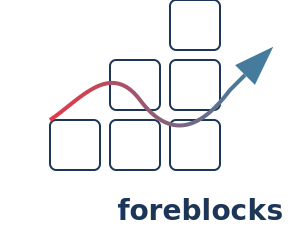

# ForeBlocks: Modular Seq2Seq Library



ForeBlocks is a flexible, modular deep learning framework for time series forecasting built on PyTorch. It offers various neural network architectures and forecasting strategies to tackle complex time series prediction problems.

## Table of Contents

- [Installation](#installation)
- [Key Features](#key-features)
- [Quick Start](#quick-start)
- [Architecture Overview](#architecture-overview)
- [Forecasting Models](#forecasting-models)
- [Advanced Usage](#advanced-usage)
- [Documentation](#documentation)
- [Examples](#examples)
- [Troubleshooting](#troubleshooting)

## Installation

```bash
git clone https://github.com/lseman/foreblocks
cd foreblocks
pip install -e .
```

## Key Features

- **Multiple Forecasting Strategies**: Seq2Seq, Autoregressive, and Direct approaches  
- **Modular Architecture**: Easily customize and extend components  
- **Advanced Models**: LSTM, GRU, Transformer, and VAE-based architectures  
- **State-of-the-Art Preprocessing**: Adaptive data preprocessing with automatic configuration  
- **Attention Mechanisms**: Various attention modules for improved performance  
- **Multi-Feature Support**: Specialized architectures for multivariate time series  
- **Training Utilities**: Built-in trainer with callbacks, metrics, and visualizations  
- **Transparent API**: Intuitive interface with extensive documentation  

## Quick Start

```python
from foreblocks import TimeSeriesSeq2Seq, ModelConfig, TrainingConfig
import torch
import pandas as pd

# Load your time series data
data = pd.read_csv('your_data.csv')
X = data.values

# Create model configuration
model_config = ModelConfig(
    model_type="lstm",
    input_size=X.shape[1],
    output_size=1,
    hidden_size=64,
    target_len=24,  # Forecast horizon
    teacher_forcing_ratio=0.5
)

# Create training configuration
training_config = TrainingConfig(
    num_epochs=100,
    learning_rate=0.001,
    patience=10
)

# Initialize model
model = TimeSeriesSeq2Seq(
    model_config=model_config,
    training_config=training_config,
    device="cuda" if torch.cuda.is_available() else "cpu"
)

# Preprocess data with automatic configuration
X_train, y_train, processed_data = model.preprocess(X, self_tune=True)

# Convert to DataLoader
from torch.utils.data import TensorDataset, DataLoader
train_dataset = TensorDataset(torch.tensor(X_train, dtype=torch.float32), 
                            torch.tensor(y_train, dtype=torch.float32))
train_loader = DataLoader(train_dataset, batch_size=32, shuffle=True)

# Train the model
history = model.train_model(train_loader)

# Make predictions
with torch.no_grad():
    predictions = model.predict(X_test)

# Visualize results
model.plot_prediction(X_test, y_test)
```

## Architecture Overview

ForeBlocks follows a modular design pattern with these key components:

1. **Core Components**:
   - `ForecastingModel`: The main model class integrating encoders, decoders, and forecasting strategies
   - `TimeSeriesSeq2Seq`: High-level interface for building and training forecasting models

2. **Neural Network Modules**:
   - Encoders: LSTM, GRU, Transformer encoders
   - Decoders: Corresponding decoder architectures
   - Attention: Various attention mechanisms

3. **Preprocessing Pipeline**:
   - `TimeSeriesPreprocessor`: Advanced data preparation with automatic feature detection

4. **Training Utilities**:
   - `Trainer`: Manages training, evaluation, and visualization
   - Metrics: MAE, RMSE, MAPE, and other forecasting metrics

## Forecasting Models

### Sequence-to-Sequence (Seq2Seq)

The default and most versatile approach, using an encoder-decoder architecture with optional attention:

```python
model_config = ModelConfig(
    model_type="lstm",
    strategy="seq2seq",
    input_size=3,
    output_size=1,
    hidden_size=64,
    num_encoder_layers=2,
    num_decoder_layers=2,
    target_len=24
)
```

### Autoregressive Models

Generate predictions recursively, feeding each output back as input:

```python
model_config = ModelConfig(
    model_type="lstm",
    strategy="autoregressive",
    input_size=1,
    output_size=1,
    hidden_size=64,
    target_len=12
)
```

### Direct Forecasting Models

Predict all future steps at once:

```python
model_config = ModelConfig(
    model_type="lstm",
    strategy="direct",
    input_size=5,
    output_size=1,
    hidden_size=128,
    target_len=48
)
```

### Transformer-based Models

Leverage self-attention for capturing long-range dependencies:

```python
model_config = ModelConfig(
    model_type="transformer",
    strategy="transformer_seq2seq",
    input_size=4,
    output_size=4,
    hidden_size=128,
    dim_feedforward=512,
    nheads=8,
    num_encoder_layers=3,
    num_decoder_layers=3,
    target_len=96
)
```

## Advanced Usage

### Multi-Encoder-Decoder Architecture

Process different features with separate encoders and decoders:

```python
model_config = ModelConfig(
    multi_encoder_decoder=True,
    input_size=5,  # 5 features
    output_size=1,
    hidden_size=64,
    model_type="lstm",
    target_len=24
)
```

### Attention Mechanisms

Add attention for improved performance:

```python
from foreblocks.attention import AttentionLayer

attention_module = AttentionLayer(
    method="dot",
    attention_backend="self",
    encoder_hidden_size=64,
    decoder_hidden_size=64
)

model = TimeSeriesSeq2Seq(
    model_config=model_config,
    attention_module=attention_module
)
```

### Customizing Preprocessing

Fine-tune the preprocessing pipeline:

```python
X_train, y_train, processed_data = model.preprocess(
    X,
    normalize=True,
    differencing=True,
    detrend=True,
    apply_ewt=True,
    window_size=48,
    horizon=24,
    remove_outliers=True,
    outlier_method="iqr",
    self_tune=True
)
```

### Teacher Forcing and Scheduled Sampling

Control the learning process:

```python
def scheduled_sampling_fn(epoch):
    return max(0.0, 1.0 - 0.1 * epoch)  # Linear decay

model = TimeSeriesSeq2Seq(
    model_config=model_config,
    scheduled_sampling_fn=scheduled_sampling_fn
)
```

## Documentation

➡️ [Preprocessing Guide](docs/preprocessor.md)  
➡️ [Custom Blocks Guide](docs/custom_blocks.md)

## Examples

We provide various examples for different forecasting scenarios:

### LSTM-based Seq2Seq with Attention

```python
import torch
import torch.nn as nn
from foreblocks import (
    TimeSeriesSeq2Seq, 
    ModelConfig, 
    TrainingConfig, 
    AttentionLayer
)

# Model configuration
model_config = ModelConfig(
    model_type="lstm",
    input_size=3,
    output_size=1,
    hidden_size=64,
    num_encoder_layers=2,
    num_decoder_layers=2,
    target_len=24
)

# Create attention module
attention = AttentionLayer(
    method="dot",
    encoder_hidden_size=64,
    decoder_hidden_size=64
)

# Create model
model = TimeSeriesSeq2Seq(
    model_config=model_config,
    attention_module=attention,
    output_block=nn.Sequential(
        nn.Dropout(0.1),
        nn.ReLU()
    )
)

# Training (assuming data is prepared)
model.train_model(train_loader, val_loader)
```

### Transformer-based Model

```python
from foreblocks import (
    TimeSeriesSeq2Seq, 
    ModelConfig, 
    TrainingConfig
)

# Model configuration
model_config = ModelConfig(
    model_type="transformer",
    input_size=4,
    output_size=4,
    hidden_size=128,
    dim_feedforward=512,
    nheads=8,
    num_encoder_layers=3,
    num_decoder_layers=3,
    target_len=96
)

# Training configuration
training_config = TrainingConfig(
    num_epochs=100,
    learning_rate=0.0001,
    weight_decay=1e-5,
    patience=15
)

# Create and train model
model = TimeSeriesSeq2Seq(
    model_config=model_config,
    training_config=training_config
)

model.train_model(train_loader, val_loader)
```

## Troubleshooting

### Common Issues and Solutions

1. **Dimensionality Mismatch**:
   If you encounter dimension errors, check that your encoder and decoder have compatible hidden sizes, and that the output_size parameter matches your target dimensions.

2. **Memory Issues**:
   For long sequences or large batch sizes, you might encounter memory issues. Try reducing batch size or sequence length, or use gradient accumulation.

3. **Poor Performance**:
   - Try different forecasting strategies
   - Adjust teacher forcing ratio
   - Add attention mechanism
   - Experiment with different architectures (LSTM vs Transformer)
   - Tune hyperparameters like hidden size and number of layers

4. **Slow Training**:
   If training is slow, consider using a simpler model or reducing the target sequence length. For transformer models, you might need to optimize the d_model and number of layers.

5. **Vanishing/Exploding Gradients**:
   Use techniques like gradient clipping and proper initialization to mitigate these issues.

```python
# Example of gradient clipping
optimizer = torch.optim.Adam(model.parameters(), lr=0.001)
torch.nn.utils.clip_grad_norm_(model.parameters(), max_norm=1.0)
```

### Tips for Better Performance

1. **Data Normalization**: Always normalize your input data to improve model convergence.

2. **Learning Rate Scheduling**: Use learning rate scheduling to improve convergence.

3. **Evaluation Metrics**: Use appropriate metrics for time series forecasting (MAE, RMSE, MAPE).

4. **Multi-Step Validation**: Validate on multi-step predictions, not just one-step-ahead forecasts.

5. **Model Ensembling**: Combine predictions from multiple models for better performance.

Remember that time series forecasting is challenging, and different problems might require different approaches. Experiment with the various features of the `ForecastingModel` class to find what works best for your specific problem.