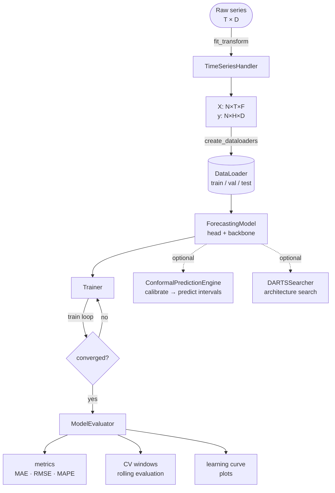

# Forecasting Pipeline

This page describes the main execution flow for a typical `foreblocks` forecasting workload.

## End-to-end flow

## Pipeline stages

1. **Data preparation** — raw series or pre-windowed arrays
2. **Dataloader construction** — `create_dataloaders` or manual `TimeSeriesDataset`
3. **Model assembly** — `ForecastingModel` with head + optional backbone
4. **Training** — `Trainer` with early stopping, scheduler, and optional MLTracker
5. **Evaluation** — `ModelEvaluator` for metrics, CV, and plots
6. **Optional branches** — conformal intervals, DARTS search, synthetic data

## Data preparation

You can start from either:

- pre-windowed tensors or NumPy arrays (`[N, T, F]` + `[N, H, D]`)
- a raw multivariate time series shaped `[T, D]`

If you start from raw series data, `TimeSeriesHandler` handles:

- windowing and horizon slicing
- scaling (StandardScaler / RobustScaler)
- outlier handling and imputation
- optional time features

## Model assembly

The central abstraction is `ForecastingModel`. Common paths:

### Direct

A single `head` module maps from flattened input to the forecast horizon. Simplest path.

### Seq2Seq (recurrent)

LSTM or GRU encoder produces a context vector; a separate decoder generates horizon steps.

### Transformer

`TransformerEncoder` + `TransformerDecoder` with patching, attention-type selection, MoE feedforward, and skip connections.

### Hybrid Mamba

`HybridMambaBlock` or `HybridMamba2Block` as backbone - SSM dynamics with optional sliding-window attention.

## Training

`Trainer` orchestrates:

- optimiser and scheduler stepping
- validation loop and early stopping
- optional MLTracker integration (`auto_track=True` by default)
- optional NAS hooks for DARTS
- optional conformal machinery during training

::: tip
Pass `auto_track=False` for local smoke tests to skip MLTracker initialisation.
:::

## Evaluation

`ModelEvaluator` provides batched prediction, rolling cross-validation, and plots.
See [Evaluation & Metrics](../evaluation.md) for the full API.

## Optional branches

::: info Conformal prediction intervals
After training, use `ConformalPredictionEngine` to attach coverage-guaranteed prediction bands to any model, using only a held-out calibration set. See [Uncertainty Quantification](../uncertainty.md).
:::

::: info Neural architecture search
Replace the manual model-assembly step with `DARTSSearcher`. The searcher handles zero-cost screening, bilevel search, and final retraining. See [DARTS Guide](../darts.md).
:::

::: info Synthetic datasets
Use `foretools.tsgen` to generate controlled AR, seasonal, trend, and noise series for benchmarking or ablation studies. See [Time Series Generator](../foretools/tsgen.md).
:::

## Related pages

- [Train A Direct Model](../tutorials/train-direct-model.md)
- [Preprocessor Guide](../preprocessor.md)
- [DARTS Guide](../darts.md)
