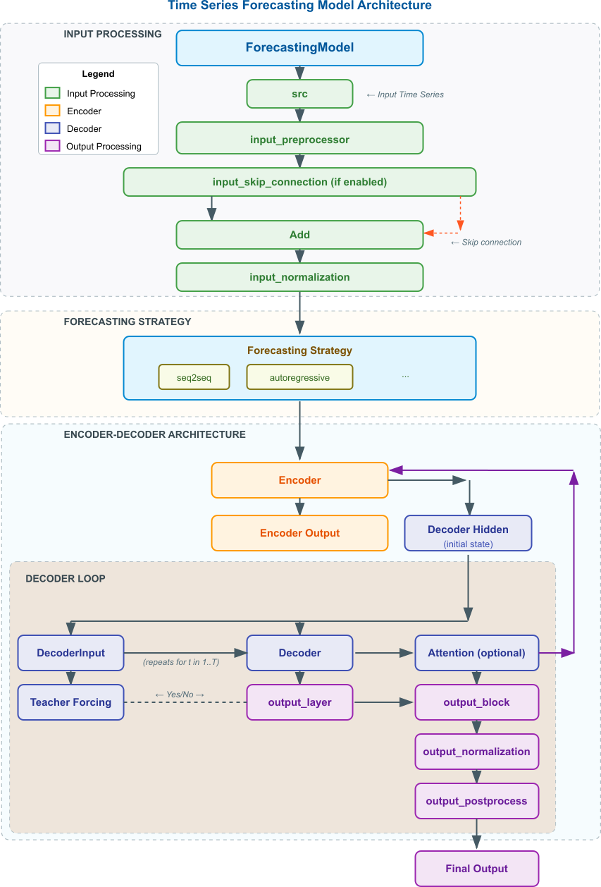

# ForeBlocks Architecture and Custom Blocks

## Overview

The `ForecastingModel` class provides a flexible architecture for time series forecasting that supports multiple strategies and customizable processing blocks. This document explains the key components and how they interact with each other.

## Architecture Design Philosophy

ForeBlocks is designed around these core principles:

1. **Modularity**: All components can be replaced or customized
2. **Transparency**: Clear data flow between components
3. **Flexibility**: Multiple forecasting strategies supported in a unified framework
4. **Extensibility**: Easy to add new components and architectures

## Custom Processing Blocks

The ForecastingModel uses several custom processing blocks that can be configured or replaced:

| Block | Description |
|-------|-------------|
| `input_preprocessor` | Custom neural network module for transforming input features |
| `input_normalization` | Standardizes or normalizes input data |
| `output_normalization` | Normalizes the decoder outputs |
| `output_block` | Additional transformations applied to decoder outputs before normalization |
| `output_postprocessor` | Final transformation applied to the model predictions |
| `input_skip_connection` | When True, adds the original input to the preprocessed input |

## Data Flow Architecture

The data flows through the ForeBlocks as follows:



## Detailed Explanation of Custom Blocks

### Input Processing Flow

1. **input_preprocessor**:
   - A neural network module transforming input features before the encoder
   - Examples: convolutional layers, fully connected layers, or specialized time series preprocessing
   - Purpose: Feature extraction or transformation to create better representations

2. **input_skip_connection**:
   - When True, adds the original input to the preprocessed input (preprocessed + original)
   - Similar to residual connections in deep networks
   - Helps with gradient flow and preserves original information
   - Especially useful when the preprocessor might lose some important original features

3. **input_normalization**:
   - Standardizes input data to make training more stable
   - Typically a standardization (zero mean, unit variance) or min-max scaling (0-1)
   - Applied after preprocessing and skip connection
   - This helps the model converge faster and prevents numerical issues

### Output Processing Flow

1. **output_block**:
   - Applied to the decoder output before normalization
   - Can include activation functions, dropout, etc.
   - Purpose: Additional transformation of decoder outputs

2. **output_normalization**:
   - Standardizes the outputs from the decoder/output layer
   - Similar to input normalization, but for outputs
   - Helps stabilize training when the output range varies

3. **output_postprocessor**:
   - Final transformation applied to the forecasting results
   - Can be used for specific post-processing needs like quantization, constraint application, etc.
   - Applied after all other processing steps
   - Example use: converting normalized outputs back to original scale

## Forecasting Strategies

The architecture accommodates different forecasting strategies:

### 1. seq2seq (Sequence-to-Sequence)
- Uses full encoder-decoder architecture
- All preprocessing and postprocessing blocks are used
- Can include attention mechanism between encoder and decoder
- Sequential generation of outputs, one step at a time

```python
# Example seq2seq implementation
def _forward_seq2seq(self, src, targets, epoch):
    # Encode input sequence
    encoder_outputs, encoder_hidden = self.encoder(src)
    
    # Initialize decoder
    decoder_hidden = self._prepare_decoder_hidden(encoder_hidden)
    decoder_input = torch.zeros(batch_size, 1, self.output_size, device=device)
    outputs = torch.zeros(batch_size, self.target_len, self.output_size, device=device)
    
    # Generate sequence step by step
    for t in range(self.target_len):
        decoder_output, decoder_hidden = self.decoder(decoder_input, decoder_hidden)
        
        # Apply attention if used
        if self.use_attention:
            query = self._get_attention_query(decoder_output, decoder_hidden)
            context, _ = self.attention_module(query, encoder_outputs)
            decoder_output = self.output_layer(torch.cat((decoder_output, context), dim=-1))
        else:
            decoder_output = self.output_layer(decoder_output)
        
        # Apply output transformations
        decoder_output = self.output_block(decoder_output)
        decoder_output = self.output_normalization(decoder_output)
        outputs[:, t:t+1] = decoder_output.unsqueeze(1)
        
        # Teacher forcing
        if targets is not None:
            use_tf = torch.rand(1).item() < self.teacher_forcing_ratio
            decoder_input = targets[:, t:t+1] if use_tf else decoder_output.unsqueeze(1)
        else:
            decoder_input = decoder_output.unsqueeze(1)
    
    # Apply postprocessing and return
    return self.output_postprocessor(outputs)
```

### 2. autoregressive
- Uses decoder only (encoder is bypassed)
- Input and output processing still apply
- Each output is fed back as input for the next prediction

```python
# Example autoregressive implementation
def _forward_autoregressive(self, src, targets, epoch):
    batch_size, _, _ = src.shape
    # Start with last time step of input
    decoder_input = src[:, -1:, :]
    outputs = []
    
    # Generate predictions sequentially
    for t in range(self.target_len):
        decoder_output = self.decoder(decoder_input)
        decoder_output = self.output_normalization(decoder_output)
        outputs.append(decoder_output)
        
        # Teacher forcing or use previous prediction
        if targets is not None:
            use_tf = torch.rand(1).item() < self.teacher_forcing_ratio
            decoder_input = targets[:, t:t+1] if use_tf else decoder_output
        else:
            decoder_input = decoder_output
    
    # Concatenate all outputs and apply postprocessing
    return self.output_postprocessor(torch.cat(outputs, dim=1))
```

### 3. direct
- Simplest approach, uses decoder to predict all future steps at once
- Still utilizes the normalization and post-processing components
- No sequential dependencies in the prediction

```python
# Example direct implementation
def _forward_direct(self, src):
    # Generate all outputs at once
    output = self.decoder(src)
    output = self.output_normalization(output)
    return self.output_postprocessor(output)
```

### 4. transformer_seq2seq
- Uses a transformer architecture with self-attention mechanisms
- Handles sequential generation with causal masking in the decoder
- Supports both teacher forcing and autoregressive modes

```python
# Simplified transformer_seq2seq implementation
def _forward_transformer_seq2seq(self, src, targets, epoch):
    # Encode source sequence
    enc_out = self.enc_embedding(src)
    enc_out = self.encoder(enc_out)
    
    if self.training and targets is not None:
        # Determine whether to use teacher forcing
        use_tf = torch.rand(1).item() < self.teacher_forcing_ratio
        
        if use_tf:
            # Teacher forcing approach
            x_dec = torch.cat([src[:, -self.label_len:, :], targets_padded], dim=1)
            tgt_mask = self._generate_square_subsequent_mask(x_dec.size(1))
            dec_out = self.dec_embedding(x_dec)
            output = self.decoder(dec_out, enc_out, tgt_mask=tgt_mask)
            return output[:, -self.pred_len:, :]
        else:
            # Autoregressive generation
            preds = []
            x_dec_so_far = src[:, -self.label_len:, :]
            
            for step in range(self.pred_len):
                tgt_mask = self._generate_square_subsequent_mask(x_dec_so_far.size(1))
                dec_embed = self.dec_embedding(x_dec_so_far)
                out = self.decoder(dec_embed, enc_out, tgt_mask=tgt_mask)
                pred_t = self.output_layer(out[:, -1:, :])
                preds.append(pred_t)
                x_dec_so_far = torch.cat([x_dec_so_far, pred_t_padded], dim=1)
                
            return torch.cat(preds, dim=1)
    else:
        # Inference mode - always autoregressive
        # Similar to the autoregressive branch above
        return self._generate_autoregressive_predictions(src, enc_out)
```

## Multi-Encoder-Decoder Architecture

When `multi_encoder_decoder=True`, the model creates a separate encoder-decoder pair for each input feature:

1. Each feature gets its own encoder and decoder
2. All decoders produce forecasts for their respective features
3. The `decoder_aggregator` combines these individual forecasts into a final prediction

This approach can capture feature-specific patterns better than a single encoder-decoder.

```python
# Multi-encoder-decoder implementation
def _forward_seq2seq_multi(self, src, targets, epoch):
    batch_size, seq_len, input_size = src.shape
    device = src.device
    
    # List to store outputs from all feature-specific decoder pairs
    decoder_outputs_list = []
    
    # Process each input feature separately
    for i in range(input_size):
        # Extract single feature
        x_i = src[:, :, i].unsqueeze(-1)  # [B, T, 1]
        encoder_i = self.encoder[i]
        decoder_i = self.decoder[i]
        
        # Encode single feature
        encoder_outputs, encoder_hidden = encoder_i(x_i)
        decoder_hidden = self._prepare_decoder_hidden(encoder_hidden)
        
        # Feature-specific decoding
        decoder_input = torch.zeros(batch_size, 1, self.output_size, device=device)
        feature_outputs = torch.zeros(batch_size, self.target_len, self.output_size, device=device)
        
        # Generate predictions for this feature
        for t in range(self.target_len):
            # Similar to seq2seq but with feature-specific encoder/decoder
            decoder_output, decoder_hidden = decoder_i(decoder_input, decoder_hidden)
            # ... apply attention, output layer, normalization ...
            feature_outputs[:, t:t+1] = decoder_output.unsqueeze(1)
            # ... teacher forcing logic ...
        
        # Store outputs from this feature's decoder
        decoder_outputs_list.append(feature_outputs)
    
    # Aggregate predictions from all features
    stacked = torch.stack(decoder_outputs_list, dim=0).permute(1, 2, 0, 3).squeeze(3)
    outputs = self.decoder_aggregator(stacked).squeeze(1)
    
    # Apply postprocessing and return
    return self.output_postprocessor(outputs)
```

## Attention Mechanisms

The framework supports various attention mechanisms to help the model focus on relevant parts of the input sequence:

1. **General Attention**: Computes a weighted sum of encoder outputs based on their relevance to the current decoder state
2. **Dot Product Attention**: Uses dot product between query and key for computing attention scores
3. **Additive Attention**: Uses a feed-forward network to compute attention scores

```python
# Attention usage in sequence generation
if self.use_attention:
    query = self._get_attention_query(decoder_output, decoder_hidden)
    context, attention_weights = self.attention_module(query, encoder_outputs)
    decoder_output = self.output_layer(torch.cat((decoder_output, context), dim=-1))
```

## Implementation Notes

1. **Default Blocks**: If not specified, each block defaults to `nn.Identity()`, which passes the input through unchanged.

2. **Skip Connection**: If `input_skip_connection=True`, the original input is added to the preprocessed input. This is common in deep networks to improve gradient flow.

3. **Model Type**: The parameter `model_type` ("lstm", "gru", "transformer") determines architecture details and how certain functions behave.

4. **Teacher Forcing**: During training, `teacher_forcing_ratio` controls how often to use ground truth as input to the decoder instead of previous predictions.

5. **Scheduled Sampling**: The `scheduled_sampling_fn` can be used to gradually decrease the teacher forcing ratio during training, helping the model become more robust to its own errors.

## Custom Implementation Examples

### Input Preprocessing with CNN

```python
class CNNPreprocessor(nn.Module):
    def __init__(self, input_size, hidden_size):
        super(CNNPreprocessor, self).__init__()
        self.conv1 = nn.Conv1d(input_size, hidden_size, kernel_size=3, padding=1)
        self.conv2 = nn.Conv1d(hidden_size, hidden_size, kernel_size=3, padding=1)
        self.relu = nn.ReLU()
    
    def forward(self, x):
        # x shape: [batch_size, seq_len, input_size]
        x = x.transpose(1, 2)  # [batch_size, input_size, seq_len]
        x = self.relu(self.conv1(x))
        x = self.relu(self.conv2(x))
        return x.transpose(1, 2)  # [batch_size, seq_len, hidden_size]

# Usage with ModelConfig and TimeSeriesSeq2Seq
model_config = ModelConfig(
    model_type="lstm",
    input_size=input_size,
    output_size=output_size,
    hidden_size=hidden_size
)

model = TimeSeriesSeq2Seq(
    model_config=model_config,
    input_preprocessor=CNNPreprocessor(input_size, hidden_size),
    input_skip_connection=True
)
```

### Custom Output Postprocessor

```python
class ConstrainedOutputPostprocessor(nn.Module):
    def __init__(self, min_value=0, max_value=100):
        super(ConstrainedOutputPostprocessor, self).__init__()
        self.min_value = min_value
        self.max_value = max_value
    
    def forward(self, x):
        # Constrain outputs to specified range
        return torch.clamp(x, min=self.min_value, max=self.max_value)

# Usage with TimeSeriesSeq2Seq
model = TimeSeriesSeq2Seq(
    model_config=model_config,
    output_postprocessor=ConstrainedOutputPostprocessor(min_value=0, max_value=100)
)
```

### Using Output Normalization

```python
# Standardize outputs with Batch Normalization
model = TimeSeriesSeq2Seq(
    model_config=model_config,
    output_normalization=nn.BatchNorm1d(output_size)
)
```

### Custom Fourier Feature Encoder

```python
from foreblocks.modules import FourierFeatures

# Create a Fourier feature preprocessor
fourier_preprocessor = FourierFeatures(
    input_size=3,
    output_size=64,
    num_frequencies=10,
    use_gaussian=True,
    scale=10.0
)

# Use it as input preprocessor
model = TimeSeriesSeq2Seq(
    model_config=model_config,
    input_preprocessor=fourier_preprocessor
)
```

## Integration with TimeSeriesSeq2Seq

The high-level `TimeSeriesSeq2Seq` class integrates the `ForecastingModel` with configuration objects and training utilities:

```python
# Define configurations using dataclasses
model_config = ModelConfig(
    model_type="lstm",
    input_size=10,
    output_size=5,
    hidden_size=64,
    target_len=24,
    strategy="seq2seq",
    teacher_forcing_ratio=0.5
)

training_config = TrainingConfig(
    num_epochs=100,
    learning_rate=0.001,
    patience=10
)

# Create model with custom components
model = TimeSeriesSeq2Seq(
    model_config=model_config,
    training_config=training_config,
    input_preprocessor=custom_preprocessor,
    attention_module=attention_layer,
    device="cuda"
)

# Train with built-in trainer
model.train_model(train_loader, val_loader)
```

## Conclusion

The ForecastingModel's architecture provides a flexible framework for implementing different time series forecasting approaches with customizable processing blocks. This design makes it easy to experiment with various model configurations while maintaining a consistent interface.