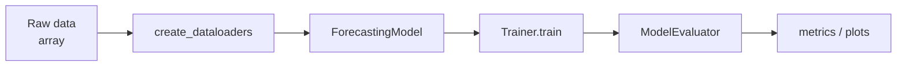

# Getting Started

This guide gives you the shortest reliable path to a working `foreblocks` training loop, then points you to the right extras and guides when you want preprocessing, search, or richer tooling.

If you want the broader map first, start from [Overview](overview.md).

## Install

=== "PyPI (stable)"

    ```bash
    pip install foreblocks
    ```

=== "Editable / dev"

    ```bash
    git clone https://github.com/lseman/foreblocks.git
    cd foreblocks
    pip install -e ".[dev]"
    ```

=== "With extras"

    | Workflow | Extra |
    |---|---|
    | Plotting helpers | `pip install "foreblocks[plotting]"` |
    | Preprocessing / scientific | `pip install "foreblocks[preprocessing]"` |
    | DARTS training + search | `pip install "foreblocks[darts]"` |
    | DARTS analyzer (pandas/seaborn) | `pip install "foreblocks[darts-analysis]"` |
    | MLTracker API + TUI | `pip install "foreblocks[mltracker]"` |
    | Everything | `pip install "foreblocks[all]"` |

## Training pipeline at a glance



## Minimal training example

```python
import numpy as np
import torch
import torch.nn as nn

from foreblocks import (
    ForecastingModel,
    ModelEvaluator,
    Trainer,
    TrainingConfig,
    create_dataloaders,
)

seq_len = 24
horizon = 6
n_features = 4

rng = np.random.default_rng(0)
X_train = rng.normal(size=(64, seq_len, n_features)).astype("float32")
y_train = rng.normal(size=(64, horizon)).astype("float32")
X_val   = rng.normal(size=(16, seq_len, n_features)).astype("float32")
y_val   = rng.normal(size=(16, horizon)).astype("float32")

train_loader, val_loader = create_dataloaders(
    X_train, y_train, X_val, y_val, batch_size=16
)

head = nn.Sequential(
    nn.Flatten(),
    nn.Linear(seq_len * n_features, 64),
    nn.GELU(),
    nn.Linear(64, horizon),
)

model = ForecastingModel(
    head=head,
    forecasting_strategy="direct",
    model_type="head_only",
    target_len=horizon,
)

trainer = Trainer(
    model,
    config=TrainingConfig(num_epochs=5, batch_size=16, patience=3, use_amp=False),
    auto_track=False,  # (1)
)

history = trainer.train(train_loader, val_loader)

evaluator = ModelEvaluator(trainer)
metrics = evaluator.compute_metrics(torch.tensor(X_val), torch.tensor(y_val))

print("final_train_loss:", history.train_losses[-1])
print("metrics:", metrics)
```

1. Disable MLTracker during smoke tests. Remove this line to enable experiment tracking.

!!! note "What this validates"
    - Your `foreblocks` import path is correct
    - Dataloaders are shaped correctly
    - The trainer loop runs without error
    - Evaluation works on held-out data

## Shape expectations

=== "Direct forecasting"

    | Tensor | Shape |
    |---|---|
    | `X` | `[N, T, F]` — samples × input timesteps × features |
    | `y` | any shape matching your head's output |

=== "Encoder / decoder"

    | Tensor | Shape |
    |---|---|
    | `X` | `[N, T, F]` |
    | `y` | `[N, H, D]` — samples × horizon × output channels |

    Decoder-based models have stricter dimension contracts — read the [Custom Blocks](custom_blocks.md) guide before customising.

## Starting from raw series

When your starting point is a `[T, D]` array, use `TimeSeriesHandler` instead of building windows manually:

```python
import numpy as np
from foreblocks import TimeSeriesHandler

raw = np.random.randn(240, 3)  # 240 timesteps, 3 channels

pre = TimeSeriesHandler(
    window_size=24,
    horizon=6,
    normalize=True,
    generate_time_features=False,
    verbose=False,
)

X, y, processed, time_feat = pre.fit_transform(raw)
```

!!! tip "Extra required"
    ```bash
    pip install "foreblocks[preprocessing]"
    ```

## DARTS architecture search

If the baseline path works and you want to search architectures instead of hand-picking them:

```bash
pip install "foreblocks[darts]"
```

??? note "Also want richer result plots?"
    ```bash
    pip install "foreblocks[darts-analysis]"
    ```

Then continue with:

- [DARTS Guide](darts.md)
- [Run A DARTS Search](tutorials/darts-multifidelity-search.md)
- [DARTS Search Pipeline](architecture/darts-pipeline.md)

## Where to go next

- Raw series preprocessing → [Preprocessor Guide](preprocessor.md)
- Model composition and injection points → [Custom Blocks Guide](custom_blocks.md)
- Transformer backbones → [Transformer Guide](transformer.md)
- Expert routing → [MoE Guide](moe.md)
- SSM / Mamba-style blocks → [Hybrid Mamba Guide](hybrid-mamba.md)
- Post-hoc prediction intervals → [Uncertainty Quantification](uncertainty.md)
- Evaluation and cross-validation → [Evaluation & Metrics](evaluation.md)
- Import errors or shape mismatches → [Troubleshooting](troubleshooting.md)

## Notes

- `Trainer` initialises MLTracker automatically. Pass `auto_track=False` during local smoke tests.
- `TrainingConfig` includes conformal options, but you do not need them for the basic path above.
- `TimeSeriesDataset` is also available if you want to build PyTorch dataloaders manually.
- The direct strategy is the best first step. Move to seq2seq, transformer, or DARTS workflows once the baseline loop is already running.
