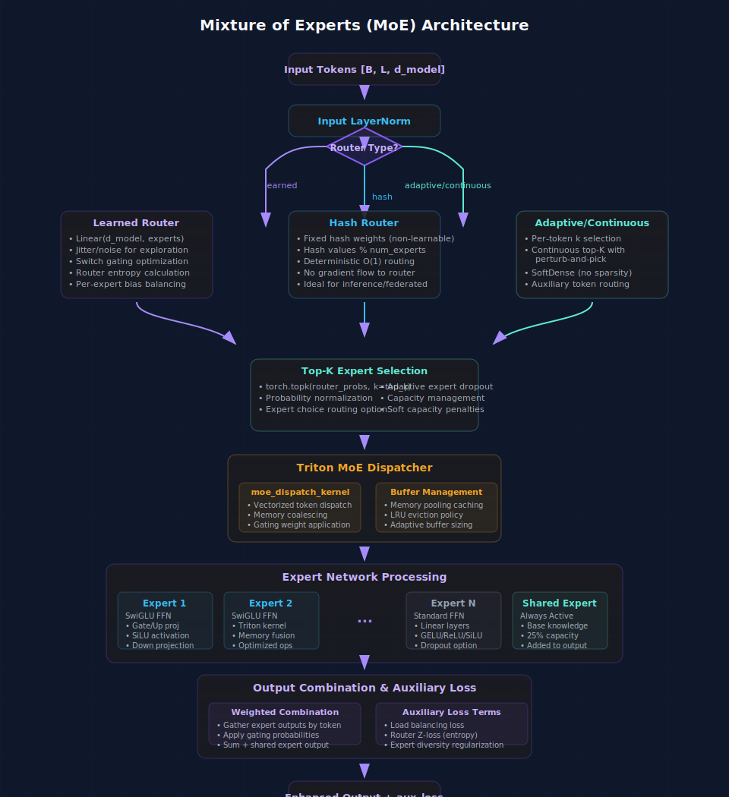

# MoE Guide

Mixture-of-Experts (MoE) support in ForeBlocks is integrated into transformer feedforward blocks.

This page reflects the current implementation centered on `MoEFeedForwardDMoE` (used internally when `use_moe=True`).

Related docs:
- [Transformer](transformer.md)
- [Custom Blocks](custom_blocks.md)



---

## How MoE is enabled

MoE is configured through transformer arguments (encoder/decoder/base transformer), not by directly instantiating a separate public top-level MoE model.

```python
from foreblocks import TransformerEncoder, TransformerDecoder

encoder = TransformerEncoder(
    input_size=8,
    d_model=256,
    nhead=8,
    num_layers=4,
    use_moe=True,
    num_experts=8,
    top_k=2,
)

decoder = TransformerDecoder(
    input_size=1,
    output_size=1,
    d_model=256,
    nhead=8,
    num_layers=4,
    use_moe=True,
    num_experts=8,
    top_k=2,
)
```

---

## Core MoE controls

### Capacity and routing
- `use_moe`: enable MoE feedforward path
- `num_experts`: total experts
- `top_k`: active routed experts per token
- `moe_capacity_factor`: dispatch capacity multiplier
- `routing_mode`: `"token_choice"` or `"expert_choice"`

### Router behavior
- `router_type`: e.g. `"noisy_topk"`, `"adaptive_noisy_topk"`, `"linear"`, `"hash_topk"`
- `router_temperature`
- `router_perturb_noise`

### Auxiliary losses
- `load_balance_weight`
- `z_loss_weight`
- model-level scaling in transformer stack: `moe_aux_lambda`

### Expert structure
- `use_swiglu`
- `dropout`
- `expert_dropout`
- shared-expert controls: `num_shared`, `d_ff_shared`, `shared_combine`

---

## Recommended presets

### Balanced baseline

```python
encoder = TransformerEncoder(
    input_size=8,
    d_model=256,
    nhead=8,
    num_layers=4,
    use_moe=True,
    num_experts=8,
    top_k=2,
    routing_mode="token_choice",
    router_type="noisy_topk",
    load_balance_weight=1e-2,
    z_loss_weight=1e-3,
    moe_aux_lambda=1.0,
)
```

### Efficiency-oriented

```python
encoder = TransformerEncoder(
    input_size=8,
    d_model=192,
    nhead=6,
    num_layers=3,
    use_moe=True,
    num_experts=6,
    top_k=1,
    use_gradient_checkpointing=False,
    load_balance_weight=5e-3,
)
```

### Higher-capacity research setup

```python
encoder = TransformerEncoder(
    input_size=8,
    d_model=384,
    nhead=8,
    num_layers=6,
    use_moe=True,
    num_experts=16,
    top_k=2,
    routing_mode="expert_choice",
    moe_capacity_factor=1.5,
    load_balance_weight=1e-2,
    z_loss_weight=1e-3,
    use_gradient_checkpointing=True,
)
```

---

## Integration with `ForecastingModel`

```python
from foreblocks import ForecastingModel

model = ForecastingModel(
    encoder=encoder,
    decoder=decoder,
    forecasting_strategy="transformer_seq2seq",
    model_type="transformer",
    target_len=24,
    output_size=1,
)
```

---

## Practical tuning order

1. Start with `num_experts=8`, `top_k=2`.
2. Tune `load_balance_weight` to prevent expert collapse.
3. If routing is unstable, increase `z_loss_weight` slightly.
4. Only then scale experts (`num_experts`) or switch routing mode.

---

## Troubleshooting

- **Expert collapse (few experts active):** increase `load_balance_weight`, consider `routing_mode="expert_choice"`.
- **High memory usage:** reduce `num_experts` or `d_model`; enable `use_gradient_checkpointing=True`.
- **Noisy validation curves:** lower router noise/temperature and verify `top_k` is not too large.
- **Slow training:** use smaller `top_k`, fewer experts, and shorter sequence length while tuning.

---

## Notes

- Under the hood, ForeBlocks uses an optimized dMoE-style feedforward path and supports additional performance/logging options in lower-level MoE modules.
- For most workflows, configure MoE from transformer constructors and keep defaults for low-level kernel knobs until needed.
