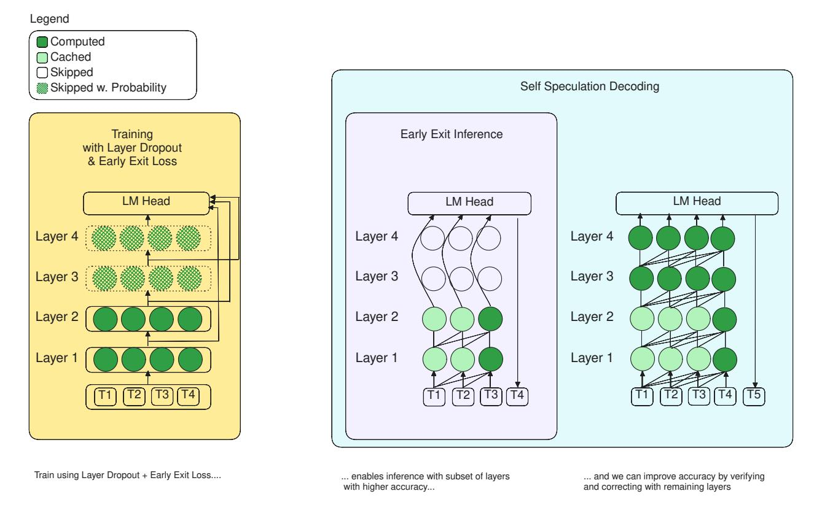
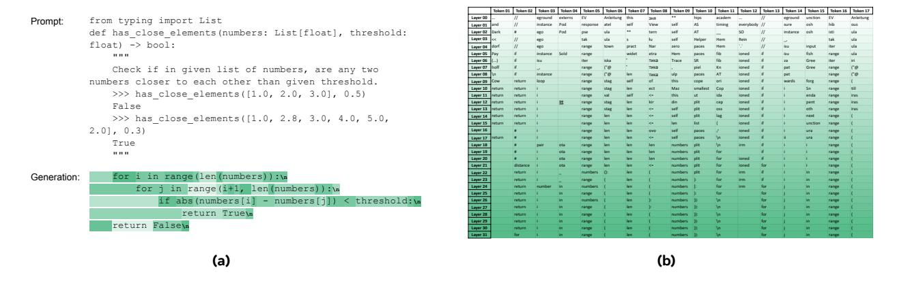
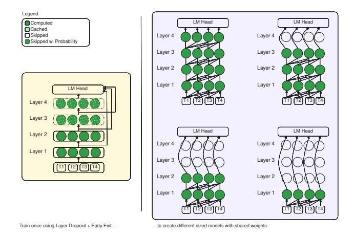
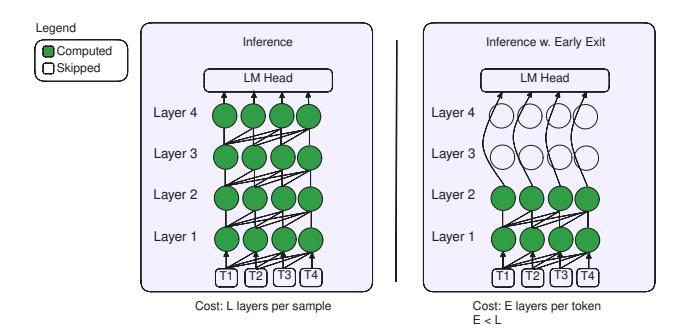
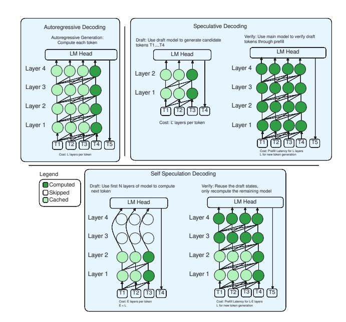
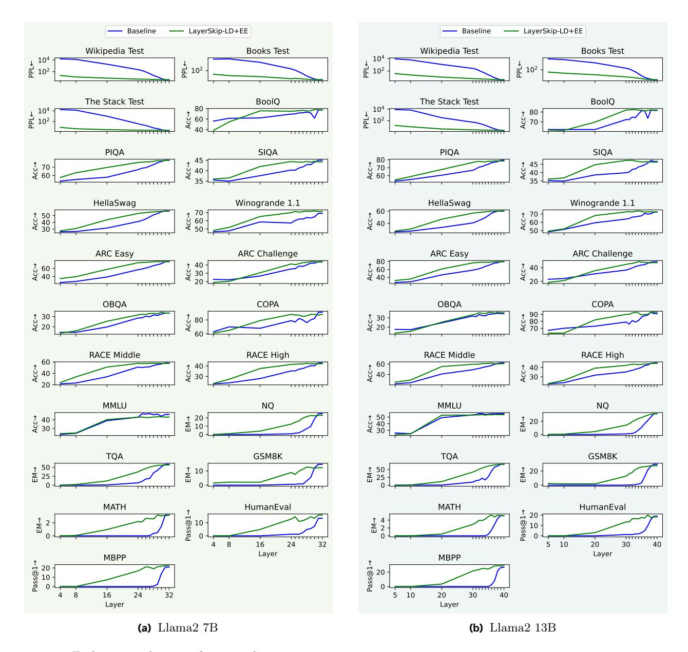
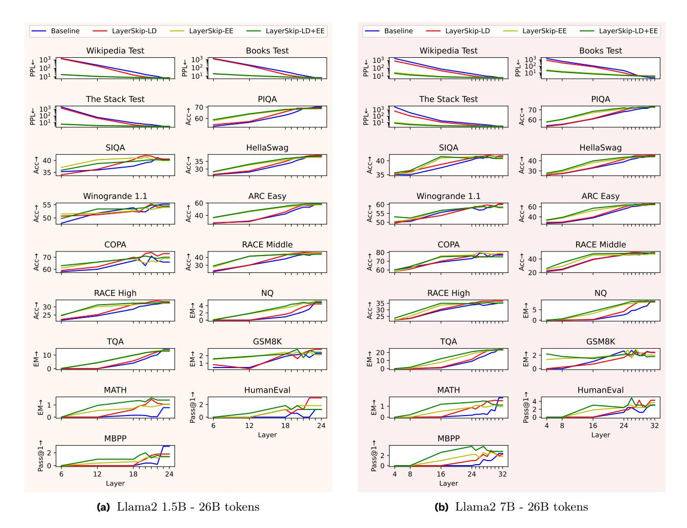
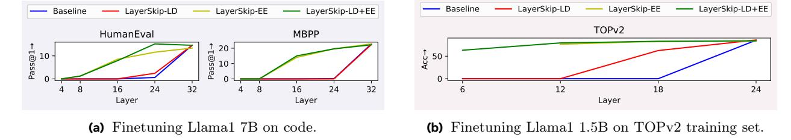
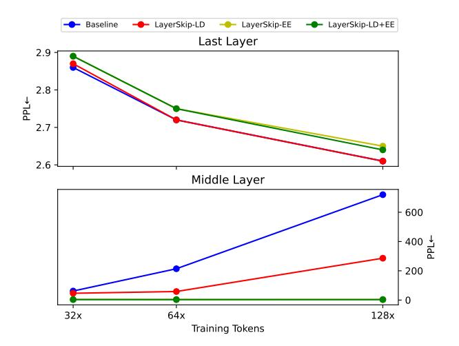
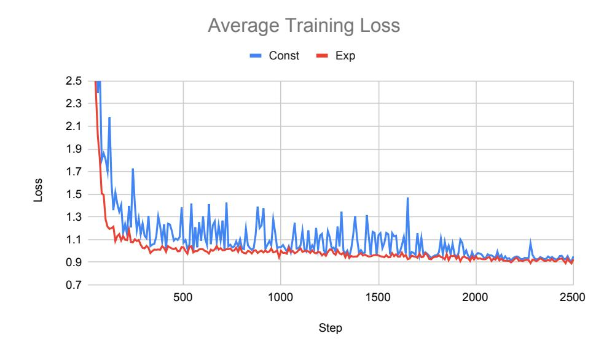

# LayerSkip: Enabling Early Exit Inference and Self-Speculative Decoding

Mostafa Elhoushi1,†,<sup>∗</sup> , Akshat Shrivastava1,†,<sup>∗</sup> , Diana Liskovich2,† , Basil Hosmer<sup>1</sup> , Bram Wasti<sup>2</sup> , Liangzhen Lai<sup>3</sup> , Anas Mahmoud<sup>4</sup> , Bilge Acun<sup>1</sup> , Saurabh Agrawal<sup>6</sup> , Ahmed Roman<sup>7</sup> , Ahmed A Aly<sup>3</sup> , Beidi Chen1,<sup>5</sup> , Carole Jean-Wu<sup>1</sup>

<sup>1</sup>FAIR at Meta, <sup>2</sup>GenAI at Meta, <sup>3</sup>Reality Labs at Meta, <sup>4</sup>University of Toronto, <sup>5</sup>Carnegie Mellon University, <sup>6</sup>University of Wisconsin-Madison, <sup>7</sup>Dana-Farber Cancer Institute

<sup>∗</sup>Equal Contribution, †Core Contributor

We present LayerSkip, an end-to-end solution to speed-up inference of large language models (LLMs). First, during training we apply layer dropout, with low dropout rates for earlier layers and higher dropout rates for later layers, and an early exit loss where all transformer layers share the same exit. Second, during inference, we show that this training recipe increases the accuracy of early exit at earlier layers, without adding any auxiliary layers or modules to the model. Third, we present a novel self-speculative decoding solution where we exit at early layers and verify and correct with remaining layers of the model. Our proposed self-speculative decoding approach has less memory footprint than other speculative decoding approaches and benefits from shared compute and activations of the draft and verification stages. We run experiments on different Llama model sizes on different types of training: pretraining from scratch, continual pretraining, finetuning on specific data domain, and finetuning on specific task. We implement our inference solution and show speedups of up to 2.16× on summarization for CNN/DM documents, 1.82× on coding, and 2.0× on TOPv2 semantic parsing task.

Date: October 21, 2024

Correspondence: Mostafa Elhoushi, Akshat Shrivastava at [melhoushi@meta.com](mailto:melhoushi@meta.com), [akshats@meta.com](mailto:akshats@meta.com)

Code: <https://github.com/facebookresearch/LayerSkip>


# 1 Introduction

Large Language Models (LLMs) have been deployed to many applications, yet their high compute and memory requirements lead to high financial and energy costs when deployed to GPU servers [Samsi et al.](#page-20-0) [\(2023\)](#page-20-0). Acceleration solutions do exist to deploy to commodity GPUs on laptops but they suffer from significant drop in accuracy [Zhu et al.](#page-22-0) [\(2023\)](#page-22-0). Accelerating LLMs further to mobile or edge devices is still an active research area [Çöplü et al.](#page-22-1) [\(2023\)](#page-22-1); [Liu et al.](#page-20-1) [\(2024\)](#page-20-1). While a large portion of LLM acceleration approaches reduce number of non-zero weights [Xia et al.](#page-21-0) [\(2023\)](#page-21-0) (a.k.a. sparsity), number of bits per weight [Xiao et al.](#page-21-1) [\(2023\)](#page-21-1) (a.k.a. quantization), number of heads per layer [Shim et al.](#page-21-2) [\(2021\)](#page-21-2) (a.k.a. head pruning), a smaller portion of approaches focus on reducing number of layers [Fan et al.](#page-19-0) [\(2020\)](#page-19-0); [Elbayad et al.](#page-19-1) [\(2020\)](#page-19-1). In this paper, we explore reducing the number of layers required for each token by exiting early during inference. Unlike quantization or sparsity, acceleration by reducing number of layers does not require specialized hardware or software kernels.

Moreover, a popular research trend in LLM acceleration is speculative decoding [Leviathan et al.](#page-19-2) [\(2023\)](#page-19-2); [Chen](#page-18-0) [et al.](#page-18-0) [\(2023\)](#page-18-0) that has no drop in accuracy, where a large model, referred to as the main model, is accompanied with a faster model, referred to as the draft model. The advantage of speculative decoding is that it leads to faster inference compared to the main model, but requires a larger memory footprint and complexity in implementation to maintain key-value (KV) cache in two different models. In addition to exiting early, this paper also proposes combining exiting early with speculative decoding to propose a self-speculative decoding approach that does not require an additional model or auxiliary layers.

<span id="page-1-0"></span>

Figure 1 Overview of our end-to-end solution, LayerSkip, showing its 3 components.

The contribution of this paper is an end-to-end solution:

- a training recipe that combines layer dropout and early exit loss, that leads to,
- inference that is more robust to exiting at earlier layers of the model, essentially creating different sized sub-models within the same model, and
- a self-speculative decoding solution that decodes with earlier layers and verifies and corrects with later layers.

The solution achieves speedups between 1.34× and 2.16× depending on the task. We provide an overview of the solution in Figure [1.](#page-1-0)

# 2 Motivation

#### 2.1 Exiting Earlier in LLMs

To motivate our approach, we investigate, with an example prompt, what happens in each layer in a LLM. In Figure [2a,](#page-2-0) we provide the first prompt from the HumanEval coding dataset [Chen et al.](#page-18-1) [\(2021\)](#page-18-1) to a pretrained Llama1 7B model [Touvron et al.](#page-21-3) [\(2023a\)](#page-21-3). The prompt consists of a Python function header and a docstring, and the model autocompletes it by defining the function body. When generating each token, we probe each transformer layer in the LLM by projecting its output embeddings on the language model (LM) head (that consists of the model's final layer normalization and linear layer), applying softmax, and then obtaining the index of the output element with highest value. The resulting index corresponds to the predicted token at this layer. This operation is referred to in some literature as the unembedding operation [Phuong and Hutter](#page-20-2) [\(2022\)](#page-20-2); [Cancedda](#page-18-2) [\(2024\)](#page-18-2), as it converts an embedding to an index. Unembedding at each layer is equivalent to early-exit at that layer, i.e., it is equivalent to skipping the remaining transformer layers to the model's LM head.

<span id="page-2-0"></span>

Figure 2 (a) A prompt from the HumanEval dataset Chen et al. (2021) and corresponding text generated by Llama1 7B. The color of each generated token corresponds to the earliest layer in the model that predicted it. (b) Token prediction at each layer in Llama1 7B.

The token predictions across layers in Figure 2b illustrate the evolution of embeddings from an input token fed to the model to the predicted next token by the model. When analyzing the token prediction in each layer in Figure 2b, we make a few observations. First, token predictions in earlier layers appear to be irrelevant as they correspond to the previous token projected on the model's embedding layer's weights, which are different from the weights of the LM head. In later layers, token predictions converge to the final prediction. Second, we do not always need all the layers to predict the correct token. In fact, most of the time, the final token prediction is predicted fewer layers before the end. We also notice that intermediate layers are sometimes hesitant and "change their minds", e.g., for Token 05, the model was predicting "range" as early as Layer 07, but changed its mind between Layer 22 and Layer 26, before settling again on "range".

Similar analysis was done in Nostalgebraist (2020) and Geva et al. (2022) on a GPT2 model Radford et al. (2019) as it developed predictors to estimate when prediction saturates to exit early. For the particular example we present in Figure 2, we find, on average, a token requires 23.45 layers out of the model's 32 layers. Hence, even if we have a perfect predictor that has zero compute overhead, we can only save up to 26% of computation. Therefore, there is a need to make LLM models require fewer layers to predict each token, and spend less compute being hesitant or "changing its mind". By default, deep learning models are not motivated to predict their final output early and instead spread their compute across all layers Voita et al. (2019, 2023). We see in Figure 2b, that tokens we would consider easy or straightforward to predict, e.g., Token 02 that starts a for-loop, required all 32 layers to predict "for". We would like our model to be less reliant on later layers and only use later layers for harder tokens. We would like our models to be more reliant on earlier layers than later layers. To do that, we propose skipping layers during training, which we refer to as layer dropout. However, we use higher dropout rates for later layers and lower dropout rates for earlier layers, to make the model less reliant on later layers.

Moreover, LM heads in LLMs are trained to unembed embeddings from the last transformer layer. They were not trained to unembed from earlier layers. Therefore, our solution also adds a loss function during training to make LM heads better "understand" embeddings of earlier layers. While most papers that explored early exit Schuster et al. (2022); Elbayad et al. (2020) trained a dedicated LM head for each transformer layer, and some have introduced additional modules for each early exit Zhang et al. (2019), we chose to have a shared LM head for all transformer layers in the model. This makes training faster, require less memory consumption for both training and inference, and eases deployment and maintenance. Hence, as shown in Figure 3, we train a deep learning model that is equivalent to an ensemble of models of various depths, capable of skipping from different transformer layers to the LM head.

#### 2.2 Correcting if we Exit Too Early

Regardless if we use heuristics or predictors (as Schuster et al. (2022); Geva et al. (2022)) to exit early, or if we modify the training procedure to make models predict early (as Elbayad et al. (2020); Zhang et al. (2019)

<span id="page-3-0"></span>

Figure 3 We propose using layer dropout and early exit loss during training to create a model that is equivalent to an ensemble of models of various depths.

and this paper as well), it is likely that exiting early during inference will lead to a reduction in accuracy. It will be ideal if there is a way to verify if an early prediction is accurate, and correct it by executing remaining layers. Some approaches like [Zhang et al.](#page-22-2) [\(2019\)](#page-22-2) proposed a confidence heuristic to decide after executing an early exit if the remaining layers are needed. Here, we leverage speculative decoding techniques to verify the early exit prediction and correct it. Speculative decoding benefits from the fact that verifying the prediction of a group of tokens is faster than generating each token auto-regressively. Hence, we present a self-speculative decoding approach where we use early exit to generate each token auto-regressively, and use the remaining layers to verify a group of tokens in parallel, and correct them.

# 3 Related Work

Dropout: Dropout was first introduced by [Srivastava et al.](#page-21-7) [\(2014\)](#page-21-7) and involved stochastically replacing a portion of output elements of fully-connected layers with zeros during training. We refer to this variant of dropout as unstructured dropout. It presented a regularization effect for training, with the purpose of reducing over-fitting. Unstructured dropout was commonly used in convolutional neural networks (CNNs) before batch normalization [Ioffe and Szegedy](#page-19-4) [\(2015\)](#page-19-4) replaced it as a means to improve generalization. However, the introduction of transformers brought it back to light as [Vaswani et al.](#page-21-8) [\(2017\)](#page-21-8) used a dropout rate of 0.1. However, dropout faded again when pretraining dataset sizes increased, e.g., large scale models like Llama [Touvron et al.](#page-21-3) [\(2023a\)](#page-21-3) and GPT3 [Brown et al.](#page-18-3) [\(2020\)](#page-18-3) do not mention dropout in their papers, and PaLM [Chowdhery et al.](#page-18-4) [\(2022\)](#page-18-4) used a dropout of 0 for pre-training on its large corpus but 0.1 for fine-tuning on small datasets.

The intuition behind dropout's regularization effect in [Srivastava et al.](#page-21-7) [\(2014\)](#page-21-7) was that it enabled training to learn across an ensemble of many models, and avoiding co-adaptation between the model's nodes. Another intuition is that dropout induces multiplicative noise into node's activations [Goodfellow et al.](#page-19-5) [\(2016\)](#page-19-5), and training a model with noise makes it more robust to the distribution shift between training and validation data. [Liu et al.](#page-20-5) [\(2023\)](#page-20-5) showed that dropout induces noise to mini-batch gradients and makes them more aligned to the full dataset gradient in the early epochs of training, and hence showed that applying dropout either early in training or late in training is better than applying dropout throughout training.

Layer Dropout: Skipping layers stochastically during training is referred to in literature with different terms such as stochastic depth or layer dropout. It was first explored in ResNets by [Huang et al.](#page-19-6) [\(2016\)](#page-19-6). ConvNext [Liu](#page-20-6) [et al.](#page-20-6) [\(2022\)](#page-20-6) used higher layer dropout rates for larger models: 0.1/0.4/0.5/0.5 for ConvNeXt-T/S/B/L respectively when trained on ImageNet [Deng et al.](#page-19-7) [\(2009\)](#page-19-7). However, when training on the larger ImageNet-22K dataset, ConvNeXt used smaller layer dropout rates: 0.0/0.0/0.1/0.1/0.2. In language models, LayerDrop [Fan](#page-19-0) [et al.](#page-19-0) [\(2020\)](#page-19-0) applied dropout to every other transformer layer, which increased its robustness to pruning layers

at inference time. [Zhang and He](#page-22-3) [\(2020\)](#page-22-3) increased the pretraining speed of BERT by applying a dropout rate that progressively increased every iteration as well as every layer. To the best of our knowledge, layer dropout for training decoder-only models, or scaling language models to large model sizes or large datasets has not been explored. Moreover, our paper is the first to propose using layer dropout to improve early exit inference.

Early Exit: Exiting early in deep learning has first been explored in CNNs [Panda et al.](#page-20-7) [\(2016\)](#page-20-7); [Teerapittayanon](#page-21-9) [et al.](#page-21-9) [\(2017\)](#page-21-9). They added branch modules at different exit points in a deep learning network and introduced additional loss functions during training to improve the accuracies of those early exits. In language models, early exit was explored in encoder-only models by BERxiT [Xin et al.](#page-21-10) [\(2021\)](#page-21-10) and BE3R [Mangrulkar et al.](#page-20-8) [\(2022\)](#page-20-8), in encoder-decoder models by [Elbayad et al.](#page-19-1) [\(2020\)](#page-19-1) and CALM [Schuster et al.](#page-21-6) [\(2022\)](#page-21-6), and in decoder-only models by SkipDecode [Geva et al.](#page-19-3) [\(2022\)](#page-19-3); [Corro et al.](#page-18-5) [\(2023\)](#page-18-5).

[Elbayad et al.](#page-19-1) [\(2020\)](#page-19-1) added a dedicated LM head for each decoder layer in an encoder-decoder translation model, and explored different early exit granularities (per token as well as per sequence) in both training and inference, and explored exiting early both statically and dynamically, using auxiliary layers that learned during training when to exit. CALM [Schuster et al.](#page-21-6) [\(2022\)](#page-21-6) built upon [Elbayad et al.](#page-19-1) [\(2020\)](#page-19-1) and started with a model pretrained with early exit losses, and focused on finding optimal criteria to decide which layer to exit at during inference. SkipDecode [Corro et al.](#page-18-5) [\(2023\)](#page-18-5) fine-tuned a decoder-only model to skip more layers for later tokens within a sequence. [Din et al.](#page-19-8) [\(2023\)](#page-19-8) started with pretrained models and finetuned auxiliary fully-connected layers to map the embeddings outputted by earlier layers to later layers. [Zeng et al.](#page-22-4) [\(2023\)](#page-22-4) and [Raposo et al.](#page-20-9) [\(2024\)](#page-20-9) added trainable routers to determine which layers to skip during inference during pretraining. In our proposed solution, we do not introduce any additional modules or linear layers for early exit, and instead used a shared exit for all layers.

Speculative Decoding: Speculative decoding [Leviathan et al.](#page-19-2) [\(2023\)](#page-19-2); [Chen et al.](#page-18-0) [\(2023\)](#page-18-0) is a popular acceleration technique for language models. It is based on the fact that auto-regressive decoding of decoder models are slow as they generate one token a time, while measuring the likelihood of a group of generated tokens in parallel is faster. It uses a fast, less accurate model, referred to as the draft model, to generate multiple tokens auto-regressively, and a large, slower, more accurate main model, to verify the tokens in parallel, and correct them when needed. The draft model could have the same or different architecture as the main model, or could be a compressed version of the model. [Zhang et al.](#page-22-5) [\(2023\)](#page-22-5) recently proposed a self-speculative decoding approach where the draft model is the same as the main model, but with a group of intermediate attention and feed forward network (FFN) layers skipped. The advantage of our proposed solution compared to [Zhang](#page-22-5) [et al.](#page-22-5) [\(2023\)](#page-22-5) is that verification and correction stages can reuse the activation and KV cache from the draft stage as both stages execute the same early layers in the same order, while [Zhang et al.](#page-22-5) [\(2023\)](#page-22-5) can not reuse them as it skips intermediate layers. [Hooper et al.](#page-19-9) [\(2024\)](#page-19-9) used shared transformer layer groups and a shared LM head to exit each token at a different layer and execute different layer groups in a pipeline fashion.

# 4 Proposed Solution

Our approach has three different stages:

- 1. Training using Layer Dropout & Early Exit Loss
- 2. Inference using Early Exit
- 3. Verification and Correction using Speculative Decoding

We explain each stage in the following sub-sections.

### 4.1 Training using Layer Dropout & Early Exit Loss

We denote the input tokens to a transformer model as X and its output as Y , with an embedding layer that maps the token indices to token embeddings, x0, and a transformer model with L transformer layers, where transformer layer l evolves embeddings outputted from its previous layer, xl+1 = x<sup>l</sup> + fl(xl), and a final LM head that maps the embedding outputs of the last layer, x<sup>L</sup> to logits, e<sup>L</sup> = g(xL). We denote the cross entropy loss function that is usually used to train language models as JCE(eL, Y ).

#### 4.1.1 Layer Dropout

The first modification we apply to common training recipes, is to apply layer dropout. Hence the transformer layer operation at layer l and training iteration t changes to:

$$x_{l+1,t} = x_{l,t} + M(p_{l,t})f_l(x_{l,t}) \tag{1}$$

where  $p_{l,t}$  is the dropout rate of layer l at iteration t, M(p) is a Bernoulli function that returns 0 with probability p and returns 1 with probability 1-p. We apply the dropout operation on each sample separately within a batch. We remove the dropped samples from a batch, apply the transformer operation  $f_l$  on the remaining samples, and then concatenate the output with the dropped samples. To ensure higher speedup during training, we seed the random number generator for each GPU with the same seed, so that each transformer layer at each iteration will drop the same number of samples.

The dropout rate can be different at each layer l and training iteration t,  $p_{l,t}$ :

$$p_{l,t} = S(t)D(l)p_{max} (2)$$

where  $p_{max}$  is a hyperparameter that sets the maximum dropout rate in the model during training, D(l) is a per-layer scaling function, and S(t) is a per-time step scaling function. We found that the best per-layer scaling is to increase dropout rate exponentially across layers from 0.0 in layer 0, to 1.0 in last layer, L-1:

$$D(l) = e^{\frac{\ln 2}{L-1}} - 1 \tag{3}$$

For scaling across time, S(t), we found that if we start with a pre-trained model and perform continual pre-training or finetuning, it is best to not scale across time and hence set S(t) = 1. However, for pretraining from scratch, we found that an exponential curriculum,  $S_{exp}(t)$ , lead to best accuracies for T training steps:

$$S_{exp}(t) = e^{\frac{t \ln 2}{T - 1}} - 1 \tag{4}$$

#### 4.1.2 Early Exit Loss

To boost prediction accuracy of lower layers, we need to ensure that the model's LM head, g, is capable of unembedding outputs of different layers. Hence, during training, we augment layer dropout with early exit loss at each layer. During training we supervise the model directly to connect the early exit layers to the LM head, this enables us to directly supervise the lower layers for the language modeling task. The total loss of the model at iteration t is:

$$J(X,Y,t) = \sum_{l=0}^{l=L-1} \tilde{e}(t,l) J_{CE}(g(x_{l+1}),Y)$$
(5)

Where  $\tilde{e}(t,l)$  is a normalized per-layer loss scale, whose sum across all layers is equal to 1:

$$\tilde{e}(t,l) = \frac{C(t,l)e(l)}{\sum_{i=0}^{i=L-1} C(t,i)e(i)}$$
(6)

C(t, l) is a binary curriculum function that determines if we enable early exit of layer l at iteration t. We build upon Elbayad et al. (2020) and set a scale that increases across layers, such as the scale at one layer is proportional to the sum of the scales of all previous layers:

$$e(l) = \begin{cases} e_{scale} \sum_{i=0}^{i=l} i, & \text{if } 0 \le l < L-1 \\ L - 1 + e_{scale} \sum_{i=0}^{i=L-2} i, & \text{if } l = L-1 \end{cases}$$

This way, we penalize later layers with quadratically higher weight, as predicting in later layers is easier.  $0 \le e_{scale} \le 1$  is a hyperparameter that controls the scale of early exit loss.

Note that we do not add additional LM heads as proposed in other early exit papers Elbayad et al. (2020); Schuster et al. (2022), as we essentially use the same LM head for all layers.



Figure 4 Early exit inference.

Early Exit Loss Curriculum: We find that adding early exit loss of all layers at all iterations during training slows down training and reduces the accuracy of the last layer. To overcome this, we introduce a curriculum, C(t, l). We have explored 2 different curricula. First, we explored a rotational early exit curriculum, Crot,R, where we enable early exit at every R layers, and perform circular rotation at each iteration. This way, the early exit at each layer is enabled once every R iterations. Hence, at each training iteration, only ⌈L/R⌉ unembedding operations are applied. Second, we explored a gradual early exit curriculum, Cgrad, where we gradually enable early exit loss from layers L − 1 to 0, one layer at a time every T /2L iterations.

Overall, to summarize, the hyperparameters of our training recipe:

- Layer Dropout:
  - pmax: maximum dropout rate of last layer of the model,
  - S(t): layer dropout curriculum. We use either no curriculum S(t) = 1 for finetuning or continual pretraining, or an exponential curriculum, S(t) = Sexp(t) for pretraining from scratch,
- Early Exit Loss:
  - escale: scalar scale of loss of earlier layers,
  - C(t, l): early exit loss curriculum, either rotational, Crot,R(t, l), or gradual, Cgrad(t, l)
    - ∗ R: is a dilation across layers for rotational early exit loss curriculum

#### 4.2 Inference using Early Exit

When generating each token during autoregressive decoding, we run the first E transformer layers in a model, and skip to the model's LM head, i.e., the model's final output becomes g(xE). We explore with different values of E and provide the accuracies in the Results section.

#### <span id="page-6-1"></span>4.3 Inference using Self-Speculative Decoding

With layer dropout and early exit loss in training, we show it is possible to speedup autoregressive generation by exiting early, but this comes at an accuracy cost compared to using the full model. Speculative decoding [Leviathan et al.](#page-19-2) [\(2023\)](#page-19-2); [Chen et al.](#page-18-0) [\(2023\)](#page-18-0) is able to leverage a faster yet less accurate model to speedup generation without accuracy cost. However, this requires storing and training 2 models, increasing memory and training requirements.

<span id="page-6-0"></span>We introduce a novel self-speculative decoding algorithm built on top of early exit, enabling us to reduce memory through the use of a single model and latency of traditional speculative decoding through re-using hidden states in draft and verify steps. As shown in Figure [5,](#page-7-0) our self-speculation algorithm consists of 2 key steps (1) Self-Drafting, using the early exit to draft tokens from the same model (2) Self-Verification, using the remaining layers to validate the prediction. To enable re-use in (1) and (2), we develop a novel Cache Reuse technique that unifies the KV cache and storing the exit query. We provide a high level description of the algorithm in sections [§4.3.1](#page-6-0) and [4.3.2](#page-7-1) and provide pseudo code in [A.4.](#page-26-0)

<span id="page-7-0"></span>

Figure 5 Comparison between autoregressive decoding, speculative decoding, and our proposed self-speculative decoding.

#### 4.3.1 Self-Drafting

The first step in speculative decoding is to define a set of draft tokens D0...d−1. In our algorithm, we compute the first d draft tokens through early exit. We refer to d as the number of speculations. We leverage a subset of the LLM and conduct auto-regressive inference exiting at layer E.

Our training recipe enabled us to train the model once to get an ensemble of different candidate draft models at each layer depth. We can evaluate exiting at different layers and observe a trade off between latency and accuracy.

#### <span id="page-7-1"></span>4.3.2 Self-Verification

The next step in speculative decoding is verification. Verification leverages the full LLM to predict the next token for each draft token in a single forward pass. We then assess to see where the draft tokens and verified tokens agree. All the draft tokens up till the disagreement point are added to the output along with the next verified token and the process continues from the draft stage.

In our self-speculative decoding algorithm, the self-verification stage critically only requires computing the remaining layers of the model that were not used in the draft stage. For a model with L layers, the number of verification layers is L − E. In order to re-use the first E layers from the draft stage we employ some modifications to the KV cache as we show in the subsequent subsection.

#### <span id="page-7-2"></span>4.3.3 Reusing the Cache

In autoregressive transformers, the KV cache is a critical component of efficient generation, allowing us to avoid recomputing prior KV pairs in each transformer layer.

As our draft stage uses the first E layers of the model and the verification stage uses the remaining L − E layers, we are able to re-use a significant amount of compute between the 2 stages:

• Single KV Cache As the draft model and verification model operate on the same model using the same order of layers, the first E layers are shared in both steps. Hence, in the draft stage, the KV cache in the first E layers are already computed, so we are able to effectively maintain a single KV cache for the draft and verify steps, reducing memory and latency.

• Exit Query Cache: To further reduce computation of the first E layers, we introduce an exit query cache that saves the query vector of exit layer E − 1 for verification to directly continue from layer E to last layer L. Critically note that we need to save only the query for the exit layer. We term the union of the KV cache and the exit query as KVQ cache.

# 5 Experiments

We would like to evaluate our training recipe on different types of training, whether pretraining from scratch or finetuning. To verify our approach, we run different types of training experiments:

- Continual Pretraining: start with a pretrained model and continue pretraining on 52B tokens from a corpus of diverse data containing natural language text and code. We experiment using pretrained Llama2 7B (32 layers), with pmax = 0.1, escale = 0.2, Crot,R=8, and Llama2 13B (40 layers), with pmax = 0.1, escale = 0.1, Crot,R=39. We later continually pretrained Llama3 8B on 419B tokens with pmax = 0.1, escale = 0.1, Crot,R=8, and and Llama3.2 1B on 839B tokens with pmax = 0.1, escale = 0.1, Crot,R=8.
- Pretraining from Scratch: start with randomly initialized model and pretrain on 26B tokens from a corpus of diverse data containing natural language text and code. We experiment with Llama2 1.5B (a custom small Llama-like model with 24 layers) (see [A.1.1](#page-23-0) for architecture details) with pmax = 0.1, escale = 0.2, Crot,R=23 and Llama2 7B (32 layers) with pmax = 0.2, escale = 0.2, Crot,R=31. Following [Srivastava et al.](#page-21-7) [\(2014\)](#page-21-7) we use higher learning rates when layer dropout is greater than 0.0.
- Finetuning on Code Data: start with pretrained Llama1 7B model [Touvron et al.](#page-21-3) [\(2023a\)](#page-21-3) and finetune on 5.2B tokens of CodeLlama [Rozière et al.](#page-20-10) [\(2023\)](#page-20-10) data mix. We use pmax = 0.1, escale = 1.0, Crot,R=16.
- Finetuning on Task-Specific Dataset: start with a pretrained Llama 1.5B (24 layers) and finetune on TOPv2 [Chen et al.](#page-18-6) [\(2020\)](#page-18-6), a multi-domain task-oriented compositional semantic parsing dataset. We post processed the dataset into a JSON format to be more aligned with code pre-training. We report our results on the TOPv2 evaluation set. We use pmax = 0.2, escale = 1.0, Cgrad.

We try different variants of LayerSkip: layer dropout only (LD), early exit loss only (EE), and both layer dropout and early exit loss (LD+EE). We provide more details about training hyperparameters in Appendix [A.1.](#page-23-1)

# 6 Results

### <span id="page-8-0"></span>6.1 Early Exit Inference Results

After training each model configuration, we evaluate accuracy of exiting early at different layers.

Continual Pretraining In Figure [6,](#page-9-0) we present our results for Llama2 7B and 13B on a diverse set of evaluation tasks (see § [A.1.2](#page-23-2) for task details) and compare with the baseline model from [Touvron et al.](#page-21-11) [\(2023b\)](#page-21-11). In Table [1](#page-10-0) we zoom in and show the specific values of accuracies for the last layer and middle layer of each model. In Figure [7](#page-12-0) we show sample text generations for exiting at earlier layers for both models with and without continual pretraining with LayerSkip. Overall, for earlier layers, LayerSkip is clearly better than the baseline. For last layer accuracy, LayerSkip has minimal drop in accuracy compared to baseline.

It is noteworthy that some "classification" tasks, i.e., multiple choice question or true/false question tasks, maintain relatively decent accuracy on earlier layers on the baseline model, while open-ended "generation" tasks drop drastically. Surprisingly, MMLU [Hendrycks et al.](#page-19-10) [\(2021a\)](#page-19-10) which is considered a challenging task, only drops from 55.2% to 49.2% on Llama2 13B baseline from the last to the middle layer. This could be because classification tasks are evaluated on generating one token only while generation tasks are evaluated on the accuracy of many tokens, and an error in one token may have a compounding effect when generating later tokens. Moreover, classification tasks evaluate a token out of 4 or 2 possible outcomes, while generation tasks evaluate each token out of thousands of possible entries in the LLM's dictionary. We observe LayerSkip's significant importance on generation tasks, e.g., NaturalQuestions [Kwiatkowski et al.](#page-19-11) [\(2019\)](#page-19-11) drops from 25.1% to 0% when exiting in middle layers of Llama2 7B, but jump to 4% when using LayerSkip.

For Llama3 8B and Llama 3.2 1B, we notice a larger drop in last layer accuracy when continually pretraining

<span id="page-9-0"></span>

Figure 6 Early exit evaluation of continual pretraining.

with LayerSkip, despite training on more tokens. The perplexity of earlier layers of the baseline Llama3 models are 2 or 3 orders of magnitude higher than their Llama2 counterparts. Reducing such high perplexity of earlier layers while maintaining accuracy of last layer is more challenging and could be the cause of the drop in last layer accuracy. The increase in perplexity of earlier layers of Llama3 compared to Llama2 could be due to the increase of number of pretraining tokens (8T for Llama3 versus 2T for Llama2), as the ablation in Section 7 confirms. This could be a motivation to consider our LayerSkip recipe in pretraining future LLMs from scratch.

Pretraining from Scratch In Figure 8, we present our results for Llama2 1.5B and 7B pretrained from scratch on 26B tokens using LayerSkip on a diverse set of evaluation tasks (see § A.1.2 for task details) and compare with the same models pretrained on the same number of tokens from scratch without LayerSkip. In Figure 9 we show sample text generations for exiting at earlier layers. The results show that introducing our proposed layer dropout configuration and/or early exit loss leads to higher accuracy than the baseline on earlier layers. On the last layer, in some downstream tasks, we do see a slight drop in accuracy compared to baseline,

<span id="page-10-0"></span>

|                                                                                      |                          |           | Llama2 7B | Llama2 13B                 |          |                          |          |                            |
|--------------------------------------------------------------------------------------|--------------------------|-----------|-----------|----------------------------|----------|--------------------------|----------|----------------------------|
|                                                                                      | Last Layer<br>(Layer 32) |           |           | Middle Layer<br>(Layer 16) |          | Last Layer<br>(Layer 40) |          | Middle Layer<br>(Layer 20) |
|                                                                                      | Baseline                 | LayerSkip | Baseline  | LayerSkip                  | Baseline | LayerSkip                | Baseline | LayerSkip                  |
| Eval Perplexity ↓                                                                    |                          |           |           |                            |          |                          |          |                            |
| Wikipedia                                                                            | 4.32                     | 4.3       | 1900      | 8.12                       | 3.97     | 3.98                     | 507      | 10.5                       |
| Selected Books                                                                       | 1.60                     | 1.06      | 4390      | 6.53                       | 1.40     | 1.40                     | 1170     | 11.9                       |
| The Stack                                                                            | 2.15                     | 2.14      | 968       | 2.99                       | 2.05     | 2.06                     | 65.8     | 3.71                       |
| Common Sense Reasoning Tasks ↑<br>(Multiple Choice Questions / True False Questions) |                          |           |           |                            |          |                          |          |                            |
| BoolQ                                                                                | 77.4                     | 77.8      | 62.2      | 75.7                       | 81.6     | 82.0                     | 62.2     | 69.7                       |
| PIQA                                                                                 | 78.0                     | 77.9      | 57.9      | 69.5                       | 79.3     | 78.5                     | 62.8     | 67.8                       |
| SIQA                                                                                 | 44.7                     | 44.2      | 37.8      | 42.0                       | 46.7     | 46.3                     | 40.7     | 44.7                       |
| HellaSwag                                                                            | 57.0                     | 56.6      | 31.5      | 43.8                       | 60.1     | 60.3                     | 35.6     | 46.8                       |
| WinoGrande                                                                           | 69.8                     | 71.4      | 58.6      | 65.2                       | 72.3     | 72.5                     | 59.4     | 68.1                       |
| ARC-e                                                                                | 76.5                     | 76.5      | 38.6      | 57.5                       | 79.4     | 79.2                     | 48.8     | 61.1                       |
| ARC-c                                                                                | 43.8                     | 43.6      | 26.8      | 30.6                       | 48.3     | 47.3                     | 31.9     | 35.6                       |
| OBQA                                                                                 | 33.4                     | 33.4      | 19.6      | 25.4                       | 34.4     | 35.4                     | 23.8     | 25.4                       |
| COPA                                                                                 | 90                       | 88        | 68        | 79                         | 91       | 93                       | 73       | 82                         |
| Reading Comprehension ↑<br>(Multiple Choice Questions)                               |                          |           |           |                            |          |                          |          |                            |
| RACE Middle                                                                          | 58.2                     | 57.4      | 34.0      | 51.1                       | 62.0     | 60.7                     | 40.9     | 55.1                       |
| RACE High                                                                            | 42.9                     | 42.2      | 28.0      | 37.6                       | 44.9     | 44.5                     | 31.8     | 39.3                       |
| MMLU ↑<br>(Multiple Choice Questions)                                                |                          |           |           |                            |          |                          |          |                            |
|                                                                                      |                          |           |           |                            |          |                          |          |                            |
| MMLU                                                                                 | 46.0                     | 43.1      | 38.9      | 40.2                       | 55.2     | 53.7                     | 49.2     | 52.9                       |
| Question Answering ↑<br>(Open Ended Answers)                                         |                          |           |           |                            |          |                          |          |                            |
| NaturalQuestions                                                                     | 25.1                     | 23.2      | 0.0554    | 4.07                       | 31.5     | 31.8                     | 0.609    | 4.43                       |
| TriviaQA                                                                             | 58.5                     | 56.8      | 0.619     | 11.8                       | 66.2     | 66.3                     | 4.36     | 11.4                       |
| Mathematics ↑<br>(Open Ended Answers)                                                |                          |           |           |                            |          |                          |          |                            |
| GSM8K                                                                                | 14.3                     | 12.2      | 0         | 2.05                       | 29.3     | 27.4                     | 0.0758   | 1.74                       |
| MATH                                                                                 | 3.22                     | 3.16      | 0         | 0.96                       | 5.06     | 5.16                     | 0        | 0.46                       |
| Code Generation ↑<br>(Open Ended Answers)                                            |                          |           |           |                            |          |                          |          |                            |
| HumanEval                                                                            | 13.4                     | 15.9      | 0         | 4.88                       | 18.9     | 18.3                     | 0        | 3.05                       |

Table 1 Evaluation of continual pretraining of Llama2 7B and Llama2 13B.

while in other tasks we see our layer dropout and/or early exit configuration leading to higher accuracy. Note that since the models were pretrained on relatively small number of tokens, the evaluation results on some classification tasks were close to random guesses, whether we used LayerSkipor not, and hence we have removed them from the results.

Finetuning on Code Data In Figure [10a,](#page-14-2) we present our results on 2 coding tasks and compare accuracy to Llama1 7B finetuned on the same number of code tokens without LayerSkip. For earlier layers, LayerSkip is

|                                                                                      |          |            | Llama3 8B  |              | Llama3.2 1B |            |            |              |  |
|--------------------------------------------------------------------------------------|----------|------------|------------|--------------|-------------|------------|------------|--------------|--|
|                                                                                      |          | Last Layer |            | Middle Layer |             | Last Layer |            | Middle Layer |  |
|                                                                                      |          | (Layer 32) |            | (Layer 16)   |             | (Layer 16) |            | (Layer 8)    |  |
|                                                                                      | Baseline | LayerSkip  | Baseline   | LayerSkip    | Baseline    | LayerSkip  | Baseline   | LayerSkip    |  |
| Eval Perplexity ↓                                                                    |          |            |            |              |             |            |            |              |  |
| Wikipedia                                                                            | 5.63     | 5.38       | 1.10 × 105 | 12.2         | 8.52        | 8.38       | 2.18 × 105 | 22.1         |  |
| Selected Books                                                                       | 1.05     | 1.05       | 2.69 × 105 | 8.86         | 1.23        | 2.39       | 1.86 × 105 | 15.3         |  |
| The Stack                                                                            | 2.56     | 2.37       | 2.95 × 105 | 3.75         | 3.34        | 2.95       | 2.71 × 105 | 5.76         |  |
| Common Sense Reasoning Tasks ↑<br>(Multiple Choice Questions / True False Questions) |          |            |            |              |             |            |            |              |  |
| BoolQ                                                                                | 83.3     | 84.0       | 62.3       | 79.5         | 64.2        | 63.5       | 62.2       | 57.7         |  |
| PIQA                                                                                 | 79.0     | 79.0       | 59.9       | 71.3         | 75.0        | 72.9       | 56.7       | 62.8         |  |
| SIQA                                                                                 | 45.5     | 45.0       | 35.7       | 42.0         | 42.0        | 42.3       | 33.8       | 37.2         |  |
| HellaSwag                                                                            | 60.0     | 59.2       | 28.0       | 44.8         | 47.2        | 45.5       | 26.5       | 31.7         |  |
| WinoGrande                                                                           | 72.8     | 71.7       | 55.4       | 65.8         | 61.3        | 60.2       | 50.0       | 51.9         |  |
| ARC-e                                                                                | 78.7     | 79.4       | 33.9       | 62.7         | 67.1        | 66.8       | 28.3       | 41.7         |  |
| ARC-c                                                                                | 51.0     | 48.2       | 27.2       | 31.9         | 33.0        | 32.3       | 23.9       | 20.2         |  |
| OBQA                                                                                 | 34.0     | 33.6       | 19.0       | 21.6         | 28.2        | 26.6       | 19.6       | 18.4         |  |
| COPA                                                                                 | 89       | 87         | 58         | 81           | 79          | 79         | 58         | 62           |  |
| Reading Comprehension ↑<br>(Multiple Choice Questions)                               |          |            |            |              |             |            |            |              |  |
| RACE Middle                                                                          | 62.3     | 61.1       | 25.9       | 51.5         | 51.6        | 52.5       | 22.7       | 32.1         |  |
| RACE High                                                                            | 44.9     | 43.1       | 24.8       | 36.6         | 36.7        | 37.1       | 33.8       | 37.2         |  |
| MMLU ↑<br>(Multiple Choice Questions)                                                |          |            |            |              |             |            |            |              |  |
| MMLU                                                                                 | 66.5     | 60.5       | 27.6       | 38.1         | 31.2        | 24.8       | 25.8       | 25.9         |  |
| Question Answering ↑                                                                 |          |            |            |              |             |            |            |              |  |
| (Open Ended Answers)                                                                 |          |            |            |              |             |            |            |              |  |
| NaturalQuestions                                                                     | 30.3     | 27.5       | 0.00       | 4.63         | 11.9        | 9.06       | 0.00       | 1.08         |  |
| TriviaQA                                                                             | 65.5     | 62.5       | 0.00       | 14.8         | 36.1        | 31.3       | 0.00       | 1.95         |  |
| Mathematics ↑<br>(Open Ended Answers)                                                |          |            |            |              |             |            |            |              |  |
| GSM8K                                                                                | 54.2     | 45.0       | 0.00       | 2.27         | 5.84        | 3.79       | 0.00       | 2.05         |  |
| MATH                                                                                 | 17.3     | 12.3       | 0.00       | 0.72         | 1.70        | 1.78       | 0.00       | 0.04         |  |
| Code Generation ↑<br>(Open Ended Answers)                                            |          |            |            |              |             |            |            |              |  |
| HumanEval                                                                            | 37.8     | 28.7       | 0.00       | 7.32         | 17.7        | 9.15       | 0.00       | 1.22         |  |

Table 2 Evaluation of continual pretraining of Llama3 8B and Llama3.2 1B.

clearly better than the baseline, with layer dropout combined with early exit loss showing a big improvement on one of the 2 tasks. For last layer accuracy, LayerSkip with both layer dropout and early exit loss has almost the same accuracy as baseline. Note that since this experiment finetuned on specific domain data, we were able to increase escale to 1.0 (as opposed to escale = 0.1 or 0.2 in the previous two configurations).

Finetuning on Task-Specific Dataset In Figure [10b,](#page-14-2) we compare results of fine-tuning our Llama 1.5B model on TOPv2 training set with and without LayerSkip. In semantic parsing, correctness requires an exact match

```
The capital of Egypt is Egyptian Egyptian Egyptian Egyptian Egyptian Egyptian 
Egyptian Egyptian Egyptian Egyptian Egyptian Egyptian Egyptian Egyptian Egyptian 
Egyptian Egyptian Egyptian Egyptian Egyptian Egyptian Egyptian Egyptian Egyptian 
Egyptian Egyptian Egyptian Egyptian Egyptian Egyptian Egyptian Egyptian Egyptian 
Egyptian Egyptian Egyptian Egyptian Egyptian Egyptian Egyptian Egyptian Egyptian 
Egyptian Egyptian Egyptian Egyptian Egyptian Egyptian Egyptian Egyptian Egyptian 
Egyptian Egyptian Egyptian Egyptian Egyptian Egyptian Egyptian Egyptian Egyptian 
Egyptian Egyptian Egyptian Egyptian Egyptian Egyptian Egyptian Egyptian Egyptian 
Egyptian Egyptian Egyptian Egyptian Egyptian Egyptian Egyptian Egyptian Egyptian 
Egyptian Egyptian Egyptian Egyptian Egyptian Egyptian Egyptian Egyptian Egyptian 
Egyptian Egyptian Egyptian Egyptian Egyptian Egyptian Egyptian Egyptian Egyptian 
Egyptian Egyptian Egyptian Egyptian Egyptian Egyptian Egyptian Egyptian Egyptian 
Egyptian Egyptian Egyptian Egyptian Egyptian Egyptian Egyptian Egyptian Egyptian 
Egyptian Egyptian Egyptian Egyptian Egyptian Egyptian Egyptian Egyptian Egyptian 
Egyptian Egyptian Egyptian Egyptian Egyptian
                                                                           The capital of Egypt is a big city with a large number of tourist attractions. Growing to 
                                                                           be one of the most famous cities in the world, it attracts more than 10 million people a 
                                                                           year. At the heart of the city is a complex of ancient monuments, buildings, and 
                                                                           wonders. The Egyptian capital is a wonderful city where the history of Egypt is spread 
                                                                           out like a palette of colors.
                                                                           The most famous of all Egyptian monuments is the Pyramid of Giza, which is located 
                                                                           at the end of the Giza boulder. It is the only one of three great pyramids that survived 
                                                                           the centuries. It is the oldest of the three pyramids and the only one that has three 
                                                                           tiers.
                                                                           Many tourists visit Egypt to see the pyramids of Giza. They are not the only 
                                                                           attractions in the city, however. The oldest of the three great pyramids of Giza, which 
                                                                           is the oldest of the three great pyramids, has three tiers. Many tourists visit the 
                                                                           pyramids of Giza to see the pyramids of Giza. They are not the only attractions in the 
                                                                           city, however.
                                                                           The oldest of the three great pyramids of
from typing import List
def add_two_lists(A: List[float], B: List[float]) -> List:
hw genuineershipomy twitch channelрдчиngdompairing桥� 
bridgebridge bridge bridge bridge bridge bridge bridge bridge 
bridge bridge bridgebridge bridge bridge bridge bridgebridge 
bridge bridge bridge bridge bridgebridge bridge bridgebridge 
bridge bridgebridgebridge bridge bridge bridgebridge bridge 
bridge bridge bridgebridge bridge bridgebridgebridge bridge 
bridgebridge bridge bridge bridge bridgebridgebridge bridge 
bridgebridge bridgebridge bridgebridge bridge bridge 
bridgebridge bridgebridge bridgebridge bridge bridge bridge 
bridge bridge bridgebridgebridge bridgebridge bridge 
bridgebridge bridge bridgebridge bridge bridge 
bridgebridgebridge bridgebridge bridge bridgebridgebridge 
bridge bridge bridge bridgebridgebridge bridgebridge bridge 
bridge bridgebridgebridge bridgebridgebridge bridgebridge 
bridge bridgebridgebridge Bridge bridge bridgebridge bridge 
bridge bridge bridge bridge bridge bridge bridge 
bridgebridgebridgebridge bridgebridge bridgebridge bridge 
bridgebridgebridge bridge bridge bridgebridge bridgebridge 
bridgebridge Bridgebridge bridge bridge bridgebridge 
bridgebridge bridgebridge bridgebridge bridgebridge 
bridgebridgebridgebridge bridge bridgebridge Bridge
                                                                           from typing import List
                                                                           def add_two_lists(A: List[float], B: List[float]) -> List:
                                                                            A_sorted = sorted(A)
                                                                            B_sorted = sorted(B)
                                                                            new_list = []
                                                                            for A_item, B_item in zip(A_sorted, B_sorted):
                                                                            new_list.append(A_item + B_item)
                                                                            return new_list
                                                                           def main():
                                                                            listA = [1, 2, 3, 4, 5, 6]
                                                                            listB = [7, 8, 9, 10, 11, 12]
                                                                            listC = add_two_lists(listA, listB)
                                                                            print(listC)
                                                                           if __name__ == "__main__":
                                                                            main()
                          (a) Llama2 7B (that has 32 layers) exiting at layer 20.
                               Baseline LayerSkip-LD+EE
The capital of New York State is Alb Alb Alb Alb Alb Alb Alb Alb Alb Alb Alb Alb Alb 
Alb Alb Alb Alb Alb Alb Alb Alb Alb Alb Alb Alb Alb Alb Alb Alb Alb Alb Alb Alb Alb Alb 
Alb Alb Alb Alb Alb Alb Alb Alb Alb Alb Alb Alb Alb Alb Alb Alb Alb Alb Alb Alb Alb Alb 
Alb
                                                                           The capital of New York State is Albany. It is also the capital of Albany County. It was 
                                                                           founded on Albany Albany River. The city is situated at the Albany Albany River and 
                                                                           is surrounded by Albany Albany River, the Albany Albany River and the Albany 
                                                                           Albany River. It is also surrounded by Albany Albany State Forest and Albany Albany 
                                                                           State Park. The city has 24 neighborhoods, and the population is about 45,000. There 
                                                                           are many clubs, clubs and clubs. There are many clubs, clubs and clubs. There are 
                                                                           many clubs, clubs and clubs.
def bubble_sort(list_a):
konnichiya gentlemen ladies gentlemen ladies welcome welcome 
welcome welcome welcome welcome welcome welcome welcome welcome 
welcome welcome welcome welcome welcome welcome welcome welcome 
welcome welcome welcome welcome welcome welcome welcome welcome
                                                                           def bubble_sort(list_a):
                                                                            i = len(list_a)
                                                                            for i-1:
                                                                            for i-1:
                                                                            if list_a[i] > list_a[i-1]:
                                                                            swap = list_a[i]
                                                                            list_a[i] = list_a[i-1]
                                                                            list_a[i-1] = swap
                                                                            i = i - 1
                                                                            return list_a
```

**Baseline LayerSkip-LD+EE**

(b) Llama2 13B (that has 40 layers) exiting at layer 24.

Figure 7 Early exit text generation examples for models continually pretrained with LayerSkip. Blue: The prompt fed into the model. Red: incorrect phrases or words generated by the model (whether factually or grammatically wrong, or hallucinations). With self-speculative decoding, we fix those incorrect phrases by verifying with remaining layers.

(EM) between generated sequence and annotated parse. We find that when removing layers from the baseline model, the model is not able to generate complete and accurate parses resulting in 0 EM. However, with LayerSkip, early exit inference improves to 77% at layer 12. We notice a regression in the final layer reducing accuracy by 3%. Again, as this configuration finetuned data on a specific task, we were able to set escale = 1.0.

### <span id="page-12-1"></span>6.2 Self-Speculative Decoding Results

We evaluate the self-speculative decoding algorithm introduced in [§4.3](#page-6-1) on the different trained models. We report quality metrics, EM (exact match) and ROUGE-2 [Ganesan](#page-19-12) [\(2018\)](#page-19-12) implemented in torchmetrics [Nicki](#page-20-11) [Skafte Detlefsen et al.](#page-20-11) [\(2022\)](#page-20-11), token acceptance rate for the self speculation algorithm (how often verification accepts each of the draft tokens), throughput measured as tokens per second averaged over the sampled dataset, and finally a speed up compared to autoregressive decoding. For our early exit and our self-speculative decoding experiments, we specify the layer we exit at in the E column in each table below. We compare with Draft & Verify [Zhang et al.](#page-22-5) [\(2023\)](#page-22-5) on common models and tasks evaluated in both papers. All experiments were performed with greedy decoding and generated a maximum of 512 tokens for each sample. Following [Zhang et al.](#page-22-5) [\(2023\)](#page-22-5), speedup is calculated as the acceleration of average inference time per token compared to the "Autoregressive" baseline on the same setting. "Autoregressive" experiments use baseline models that were

<span id="page-13-0"></span>

Figure 8 Early exit evaluation of pretraining from scratch on 26B tokens.

pretrained or finetuned without LayerSkip, while "Early Exit" and "Self Speculative" experiments use our models trained or finetuned with LayerSkip. Our implementation leverages HuggingFace Wolf et al. (2020).

Continual Pretraining In Table 3, we evaluate the continual pre-training of Llama2 7B and 13B with and without LayerSkip on various tasks: CNN/DM Nallapati et al. (2016), XSUM Narayan et al. (2018) abstractive summarization tasks, and HumanEval Chen et al. (2021) coding task. The experiments were performed on NVIDIA H100 GPUs. The number of speculations, i.e., the number of tokens generated in the draft stage in self-speculation, is specified in the d column. We follow Zhang et al. (2023) and perform CNN/DM with 1-shot abstractive summarization, and XSUM with 0-shot. We obtain speedups between  $1.34 \times$  and  $2.16 \times$  depending on the model or the task. In general, we observe higher speedups for the smaller Llama2 7B compared to the larger Llama2 13B model. When comparing with Draft & Verify Zhang et al. (2023) on the common model and tasks of both approaches, we are significantly faster on CNN/DM ( $1.81 \times$  vs.  $1.5 \times$ ) and slightly slower on XSUM ( $1.34 \times$  vs.  $1.48 \times$ ).

**Pretraining from Scratch** Our results are presented in Table 4. The experiments were performed on NVIDIA H100 GPUs. We found that an opposite trend to continual pretraining: the bigger model has a bigger speedup than the smaller model, reaching  $2.16 \times$  speedup, which exceeds traditional speculative decoding.

Finetuning on Code Data In Table 5, we evaluate our code-finetuned Llama1 7B on HumanEval using 12 speculations, and exit at layer 6 for self speculation & early exit. The experiments were performed on NVIDIA A100 GPUs. We show speedup of upto  $1.82 \times$  with no accuracy drop.

Finetuning on Task-Specific Dataset In Table 6 we show results for Llama 1.5B finetuned on TOPv2's training

<span id="page-14-1"></span>

(a) Llama2 7B (that has 32 layers) pretrained from scratch on 26B tokens only, exiting at layer 24.

Figure 9 Early exit text generation examples for models pretrained from scratch on 26B tokens with and without LayerSkip. Blue: The prompt fed into the model. Red: incorrect phrases or words generated by the model (whether factually or grammatically wrong, or hallucinations). With self-speculative decoding, we fix those incorrect phrases by verifying with remaining layers.

<span id="page-14-2"></span>

Figure 10 Early exit evaluation of finetuning on domain-specific or task-specific data.

dataset and evaluated on TOPv2 test set. The experiments were performed on NVIDIA H100 GPUs. We present the EM (exact match) on the fully TOPv2 test set, further we sample 1000 samples for latency experiments where we leverage 8 speculations, and generate the next 80 tokens with greedy decoding. With self-speculation, the model was able to achieve high token acceptance rate, (E=6:76.0%, E=12:97.2%, E=18:98.9%) reaching  $2.0\times$  speedup.

#### <span id="page-14-0"></span>7 Ablation Studies

Scaling with Pretraining Tokens In order to understand how the accuracy of last and middle layers change across time when pretraining from scratch, we ran 3 training experiments with different number of tokens on Llama 1.5B and show the results in Figure 11. Each experiment trained for 50,000 steps, per device batch size of 4, context window of 4096, but changed the number of GPUs to 32, 64, 128. We plotted the perplexity of a held out split of The Stack dataset on the last layer (layer 24) and the middle layer (layer 12). As expected, perplexity on last layer decreases as we train on more tokens. However, surprisingly, we discover that perplexity on middle layer increases drastically by default in training, unless we apply early exit loss. Layer dropout reduces the increase as well. This could open the door to more research on the dynamics of transformers and the evolution of embeddings in earlier layers to understand why embeddings across layers are close to each other early on in training but diverge drastically as training progresses. This could also present a motivation for our training recipe that has minimal drop in last layer accuracy while significantly improves accuracy of earlier layers.

<span id="page-15-0"></span>

|                                    | Llama2 7B |     |         |               |                    |         |    |    | Llama2 13B |               |                    |         |
|------------------------------------|-----------|-----|---------|---------------|--------------------|---------|----|----|------------|---------------|--------------------|---------|
| Generation                         | E         | d   | ROUGE-2 | Token<br>Acc. | Tokens<br>per Sec. | Speedup | E  | d  | ROUGE-2    | Token<br>Acc. | Tokens<br>per Sec. | Speedup |
| CNN-DM                             |           |     |         |               |                    |         |    |    |            |               |                    |         |
| One-Shot Abstractive Summarization |           |     |         |               |                    |         |    |    |            |               |                    |         |
| Autoregressive                     | -         | -   | 0.079   | -             | 62.7               | 1.00×   | -  | -  | 0.098      | -             | 37.2               | 1.00×   |
| Early Exit                         | 8         | -   | 0.012   | -             | 232.4              | -       | 15 | -  | 0.016      | -             | 105.5              | -       |
| Self Speculative                   | 8         | 12  | 0.078   | 68.9%         | 127.9              | 1.86×   | 15 | 12 | 0.098      | 74.5%         | 70.2               | 1.81×   |
| Draft and Verify                   | n/a       | n/a | n/a     | n/a           | n/a                | n/a     | -  | -  | 0.107      | n/a           | n/a                | 1.56×   |
| XSUM                               |           |     |         |               |                    |         |    |    |            |               |                    |         |
| Abstractive Summarization          |           |     |         |               |                    |         |    |    |            |               |                    |         |
| Autoregressive                     | -         | -   | 0.073   | -             | 63.4               | 1.00×   | -  | -  | 0.124      | -             | 43.8               | 1.00×   |
| Early Exit                         | 8         | -   | 0.002   | -             | 228.0              | -       | 15 | -  | 0.009      | -             | 110.6              | -       |
| Self Speculative                   | 8         | 12  | 0.073   | 54.6%         | 104.7              | 1.54×   | 15 | 4  | 0.124      | 67.7%         | 60.5               | 1.34×   |
| Draft and Verify                   | n/a       | n/a | n/a     | n/a           | n/a                | n/a     | -  | -  | 0.126      | n/a           | n/a                | 1.48×   |
| HumanEval<br>Coding                |           |     |         |               |                    |         |    |    |            |               |                    |         |
| Autoregressive                     | -         | -   | 0.041   | -             | 62.9               | 1.00×   | -  | -  | 0.055      | -             | 48.9               | 1.00×   |
| Early Exit                         | 8         | -   | 0.003   | -             | 225.4              | -       | 15 | -  | 0.0005     | -             | 244.3              | -       |
| Self Speculative                   | 8         | 6   | 0.042   | 67.1%         | 122.8              | 1.83×   | 7  | 4  | 0.055      | 57.0%         | 84.2               | 1.66×   |

<span id="page-15-1"></span>Table 3 Generation results for Llama2 continually pretrained with and without LayerSkip.

|                                              | Llama2 1.5B - 26B Tokens |                |               |                    |                | Llama2 7B - 26B Tokens |                |               |                    |                |
|----------------------------------------------|--------------------------|----------------|---------------|--------------------|----------------|------------------------|----------------|---------------|--------------------|----------------|
| Generation                                   | E                        | ROUGE-2        | Token<br>Acc. | Tokens<br>per Sec. | Speedup        | E                      | ROUGE-2        | Token<br>Acc. | Tokens<br>per Sec. | Speedup        |
| CNN-DM<br>One-Shot Abstractive Summarization |                          |                |               |                    |                |                        |                |               |                    |                |
| Autoregressive<br>Self Speculative           | -<br>8                   | 0.063<br>0.063 | -<br>77.4%    | 91.6<br>167.4      | 1.00×<br>1.76× | -<br>8                 | 0.060<br>0.067 | -<br>77.8%    | 64.5<br>145.6      | 1.00×<br>2.16× |

<span id="page-15-2"></span>Table 4 Generation results for Llama2 pretrained from scratch on 26B tokens with and without LayerSkip.

|                  |   |         | Token | Tokens   |         |
|------------------|---|---------|-------|----------|---------|
| Generation       | E | ROUGE-2 | Acc.  | per Sec. | Speedup |
| Autoregressive   | - | 0.0513  | -     | 34       | 1.0×    |
| Early Exit       | 6 | 0.0035  | -     | 170      | -       |
| Self Speculative | 6 | 0.0513  | 45%   | 62       | 1.82×   |

Table 5 Generation results on HumanEval for Llama 7B finetuned on code

| Generation       | E  | EM    | Token<br>Acc. | Time per<br>Token (ms) | Speedup |
|------------------|----|-------|---------------|------------------------|---------|
| Autoregressive   | -  | 85.9% | -             | 36                     | 1.00×   |
| Early Exit       | 18 | 83.3% | -             | 28                     | -       |
| Early Exit       | 12 | 79.4% | -             | 19                     | -       |
| Early Exit       | 6  | 62.9% | -             | 10                     | -       |
| Self Speculative | 18 | 82.9% | 98.9%         | 29                     | 1.24×   |
| Self Speculative | 12 | 82.9% | 97.6%         | 22                     | 1.64×   |
| Self Speculative | 6  | 82.9% | 76.0%         | 18                     | 2.0×    |

Table 6 Generation results on TOPv2 task for Llama 1.5B finetuned on TOPv2 training data.

KV Cache in Self-Speculation In [§4.3.3](#page-7-2) we introduced the re-use of KV cache as a method for improving model generation speed. We measure its effect in Table [7.](#page-16-1) We follow the same inference setup as described in [§6.2.](#page-12-1) We find that the use of KV cache is able to consistently save us 9-20 ms per token depending on the task.

<span id="page-16-0"></span>

<span id="page-16-1"></span>Figure 11 Perplexity on The Stack [Kocetkov et al.](#page-19-13) [\(2022\)](#page-19-13) test set when pretraining Llama 1.5B from scratch with different number of tokens.

| Generation               | TOPv2 ms/t | CNN/DM ms/t |
|--------------------------|------------|-------------|
| Self Speculation(E = 18) | 134        | 166         |
| w.o KVQ Reuse            | 143        | 182         |
| Self Speculation(E = 12) | 104        | 165         |
| w.o KVQ Reuse            | 110        | 185         |

Table 7 Ablation on re-use of the KV cache and exit query cache. Results are presented on CPU inference.

# 8 Limitations

- Our self-speculative decoding solution requires finetuning a model or pretraining it with our recipe, while the self-speculative decoding approach propoposed in [Zhang et al.](#page-22-5) [\(2023\)](#page-22-5) does not require changing a model's weights.
- The introduced hyperparameters, pmax for layer dropout, escale and R for early exit, requires tuning in order to avoid a drop in last layer accuracy.
- When pretraining with layer dropout from scratch, increasing the learning rate is required to maintain accuracy, and tuning learning rate to get optimal accuracy could be tricky and time consuming.

# 9 Conclusion

We have shown that combining layer dropout, early exit loss with curriculum, improves accuracy of early exit during inference. We then developed a novel self-speculative decoding solution that led upto 1.86× speedup.

We hope this paper will encourage researchers and engineers to adopt the proposed layer dropout and/or early exit loss in pretraining as well as finetuning recipes. For pretraining from scratch, layer dropout can lead to increase in training speed. While early exit loss may introduce an overhead for pretraining, using a large R can make that minimal. For finetuning, we hope that our proposed techniques may be combined with parameter efficient techniques suchs as LoRA [Hu et al.](#page-19-14) [\(2021\)](#page-19-14).

In the future, we would like to increase the accuracy of early-exit layers in order to obtain better speedups during self-speculative decoding. We can also explore dynamic conditions to determine a different exit layer for each token (like [Schuster et al.](#page-21-6) [\(2022\)](#page-21-6)) and hence improve token acceptance rate of self-speculative decoding.

# Acknowledgements

We would like to thank Volker Seeker, Artem Korenev, and Ilia Kulikov for logistic support, FAIR's clusters' support team members, especially, Henry Estela, Hongsheng Song, Shubho Sengupta, and Nabib Ahmed, for their help in maintaing our clusters, Helen Klein, Kamila Benzina, and Ty Toledano for legal support, Fabian Gloeckle, Andrey Gromov, Francisco Massa, Daniel Haziza, Aaditya Singh, Karen Hambardzumyan, Nicola Cancedda, for discussions.

# References

<span id="page-18-11"></span>Jacob Austin, Augustus Odena, Maxwell Nye, Maarten Bosma, Henryk Michalewski, David Dohan, Ellen Jiang, Carrie Cai, Michael Terry, Quoc Le, and Charles Sutton. Program synthesis with large language models, 2021.

<span id="page-18-8"></span>Yonatan Bisk, Rowan Zellers, Ronan Le Bras, Jianfeng Gao, and Yejin Choi. Piqa: Reasoning about physical commonsense in natural language. In Thirty-Fourth AAAI Conference on Artificial Intelligence, 2020.

<span id="page-18-3"></span>Tom Brown, Benjamin Mann, Nick Ryder, Melanie Subbiah, Jared D Kaplan, Prafulla Dhariwal, Arvind Neelakantan, Pranav Shyam, Girish Sastry, Amanda Askell, Sandhini Agarwal, Ariel Herbert-Voss, Gretchen Krueger, Tom Henighan, Rewon Child, Aditya Ramesh, Daniel Ziegler, Jeffrey Wu, Clemens Winter, Chris Hesse, Mark Chen, Eric Sigler, Mateusz Litwin, Scott Gray, Benjamin Chess, Jack Clark, Christopher Berner, Sam McCandlish, Alec Radford, Ilya Sutskever, and Dario Amodei. Language models are few-shot learners. In H. Larochelle, M. Ranzato, R. Hadsell, M.F. Balcan, and H. Lin, editors, Advances in Neural Information Processing Systems, volume 33, pages 1877–1901. Curran Associates, Inc., 2020. [https://proceedings.neurips.cc/paper\\_files/paper/](https://proceedings.neurips.cc/paper_files/paper/2020/file/1457c0d6bfcb4967418bfb8ac142f64a-Paper.pdf) [2020/file/1457c0d6bfcb4967418bfb8ac142f64a-Paper.pdf](https://proceedings.neurips.cc/paper_files/paper/2020/file/1457c0d6bfcb4967418bfb8ac142f64a-Paper.pdf).

<span id="page-18-2"></span>Nicola Cancedda. Spectral filters, dark signals, and attention sinks, 2024.

<span id="page-18-0"></span>Charlie Chen, Sebastian Borgeaud, Geoffrey Irving, Jean-Baptiste Lespiau, L. Sifre, and John M. Jumper. Accelerating large language model decoding with speculative sampling. ArXiv, abs/2302.01318, 2023. [https://api.semanticscholar.](https://api.semanticscholar.org/CorpusID:256503945) [org/CorpusID:256503945](https://api.semanticscholar.org/CorpusID:256503945).

<span id="page-18-1"></span>Mark Chen, Jerry Tworek, Heewoo Jun, Qiming Yuan, Henrique Ponde de Oliveira Pinto, Jared Kaplan, Harri Edwards, Yuri Burda, Nicholas Joseph, Greg Brockman, Alex Ray, Raul Puri, Gretchen Krueger, Michael Petrov, Heidy Khlaaf, Girish Sastry, Pamela Mishkin, Brooke Chan, Scott Gray, Nick Ryder, Mikhail Pavlov, Alethea Power, Lukasz Kaiser, Mohammad Bavarian, Clemens Winter, Philippe Tillet, Felipe Petroski Such, Dave Cummings, Matthias Plappert, Fotios Chantzis, Elizabeth Barnes, Ariel Herbert-Voss, William Hebgen Guss, Alex Nichol, Alex Paino, Nikolas Tezak, Jie Tang, Igor Babuschkin, Suchir Balaji, Shantanu Jain, William Saunders, Christopher Hesse, Andrew N. Carr, Jan Leike, Josh Achiam, Vedant Misra, Evan Morikawa, Alec Radford, Matthew Knight, Miles Brundage, Mira Murati, Katie Mayer, Peter Welinder, Bob McGrew, Dario Amodei, Sam McCandlish, Ilya Sutskever, and Wojciech Zaremba. Evaluating large language models trained on code, 2021.

<span id="page-18-6"></span>Xilun Chen, Asish Ghoshal, Yashar Mehdad, Luke Zettlemoyer, and Sonal Gupta. Low-resource domain adaptation for compositional task-oriented semantic parsing. In Bonnie Webber, Trevor Cohn, Yulan He, and Yang Liu, editors, Proceedings of the 2020 Conference on Empirical Methods in Natural Language Processing (EMNLP), pages 5090– 5100, Online, November 2020. Association for Computational Linguistics. doi: 10.18653/v1/2020.emnlp-main.413. <https://aclanthology.org/2020.emnlp-main.413>.

<span id="page-18-4"></span>Aakanksha Chowdhery, Sharan Narang, Jacob Devlin, Maarten Bosma, Gaurav Mishra, Adam Roberts, Paul Barham, Hyung Won Chung, Charles Sutton, Sebastian Gehrmann, Parker Schuh, Kensen Shi, Sasha Tsvyashchenko, Joshua Maynez, Abhishek Rao, Parker Barnes, Yi Tay, Noam Shazeer, Vinodkumar Prabhakaran, Emily Reif, Nan Du, Ben Hutchinson, Reiner Pope, James Bradbury, Jacob Austin, Michael Isard, Guy Gur-Ari, Pengcheng Yin, Toju Duke, Anselm Levskaya, Sanjay Ghemawat, Sunipa Dev, Henryk Michalewski, Xavier Garcia, Vedant Misra, Kevin Robinson, Liam Fedus, Denny Zhou, Daphne Ippolito, David Luan, Hyeontaek Lim, Barret Zoph, Alexander Spiridonov, Ryan Sepassi, David Dohan, Shivani Agrawal, Mark Omernick, Andrew M. Dai, Thanumalayan Sankaranarayana Pillai, Marie Pellat, Aitor Lewkowycz, Erica Moreira, Rewon Child, Oleksandr Polozov, Katherine Lee, Zongwei Zhou, Xuezhi Wang, Brennan Saeta, Mark Diaz, Orhan Firat, Michele Catasta, Jason Wei, Kathy Meier-Hellstern, Douglas Eck, Jeff Dean, Slav Petrov, and Noah Fiedel. Palm: Scaling language modeling with pathways, 2022.

<span id="page-18-7"></span>Christopher Clark, Kenton Lee, Ming-Wei Chang, Tom Kwiatkowski, Michael Collins, and Kristina Toutanova. Boolq: Exploring the surprising difficulty of natural yes/no questions. In NAACL, 2019.

<span id="page-18-9"></span>Peter Clark, Isaac Cowhey, Oren Etzioni, Tushar Khot, Ashish Sabharwal, Carissa Schoenick, and Oyvind Tafjord. Think you have solved question answering? try arc, the ai2 reasoning challenge. ArXiv, abs/1803.05457, 2018. <https://api.semanticscholar.org/CorpusID:3922816>.

<span id="page-18-10"></span>Karl Cobbe, Vineet Kosaraju, Mohammad Bavarian, Mark Chen, Heewoo Jun, Lukasz Kaiser, Matthias Plappert, Jerry Tworek, Jacob Hilton, Reiichiro Nakano, Christopher Hesse, and John Schulman. Training verifiers to solve math word problems, 2021.

<span id="page-18-5"></span>Luciano Del Corro, Allie Del Giorno, Sahaj Agarwal, Bin Yu, Ahmed Awadallah, and Subhabrata Mukherjee. Skipdecode: Autoregressive skip decoding with batching and caching for efficient llm inference, 2023.

- <span id="page-19-7"></span>Jia Deng, Wei Dong, Richard Socher, Li-Jia Li, Kai Li, and Li Fei-Fei. Imagenet: A large-scale hierarchical image database. In Computer Vision and Pattern Recognition, 2009. CVPR 2009. IEEE Conference on, pages 248–255. IEEE, 2009. <https://ieeexplore.ieee.org/abstract/document/5206848/>.
- <span id="page-19-8"></span>Alexander Yom Din, Taelin Karidi, Leshem Choshen, and Mor Geva. Jump to conclusions: Short-cutting transformers with linear transformations, 2023.
- <span id="page-19-1"></span>Maha Elbayad, Jiatao Gu, Edouard Grave, and Michael Auli. Depth-adaptive transformer. In In Proc. of ICLR, 2020.
- <span id="page-19-0"></span>Angela Fan, Edouard Grave, and Armand Joulin. Reducing transformer depth on demand with structured dropout. In International Conference on Learning Representations, 2020. <https://openreview.net/forum?id=SylO2yStDr>.
- <span id="page-19-12"></span>Kavita Ganesan. Rouge 2.0: Updated and improved measures for evaluation of summarization tasks, 2018.
- <span id="page-19-18"></span>Leo Gao, Stella Biderman, Sid Black, Laurence Golding, Travis Hoppe, Charles Foster, Jason Phang, Horace He, Anish Thite, Noa Nabeshima, Shawn Presser, and Connor Leahy. The Pile: An 800gb dataset of diverse text for language modeling. arXiv preprint arXiv:2101.00027, 2020.
- <span id="page-19-3"></span>Mor Geva, Avi Caciularu, Kevin Wang, and Yoav Goldberg. Transformer feed-forward layers build predictions by promoting concepts in the vocabulary space. In Yoav Goldberg, Zornitsa Kozareva, and Yue Zhang, editors, Proceedings of the 2022 Conference on Empirical Methods in Natural Language Processing, pages 30–45, Abu Dhabi, United Arab Emirates, December 2022. Association for Computational Linguistics. doi: 10.18653/v1/2022. emnlp-main.3. <https://aclanthology.org/2022.emnlp-main.3>.
- <span id="page-19-5"></span>Ian Goodfellow, Yoshua Bengio, and Aaron Courville. Deep Learning. MIT Press, 2016. [http://www.deeplearningbook.](http://www.deeplearningbook.org) [org](http://www.deeplearningbook.org).
- <span id="page-19-10"></span>Dan Hendrycks, Collin Burns, Steven Basart, Andy Zou, Mantas Mazeika, Dawn Song, and Jacob Steinhardt. Measuring massive multitask language understanding. In International Conference on Learning Representations, 2021a. <https://openreview.net/forum?id=d7KBjmI3GmQ>.
- <span id="page-19-17"></span>Dan Hendrycks, Collin Burns, Saurav Kadavath, Akul Arora, Steven Basart, Eric Tang, Dawn Song, and Jacob Steinhardt. Measuring mathematical problem solving with the math dataset. NeurIPS, 2021b.
- <span id="page-19-9"></span>Coleman Hooper, Sehoon Kim, Hiva Mohammadzadeh, Hasan Genc, Kurt Keutzer, Amir Gholami, and Sophia Shao. Speed: Speculative pipelined execution for efficient decoding, 2024.
- <span id="page-19-14"></span>Edward J. Hu, Yelong Shen, Phillip Wallis, Zeyuan Allen-Zhu, Yuanzhi Li, Shean Wang, Lu Wang, and Weizhu Chen. Lora: Low-rank adaptation of large language models, 2021.
- <span id="page-19-6"></span>Gao Huang, Yu Sun, Zhuang Liu, Daniel Sedra, and Kilian Weinberger. Deep networks with stochastic depth, 2016.
- <span id="page-19-4"></span>Sergey Ioffe and Christian Szegedy. Batch normalization: Accelerating deep network training by reducing internal covariate shift, 2015.
- <span id="page-19-16"></span>Aniruddha Kembhavi, Minjoon Seo, Dustin Schwenk, Jonghyun Choi, Ali Farhadi, and Hannaneh Hajishirzi. Are you smarter than a sixth grader? textbook question answering for multimodal machine comprehension. 2017 IEEE Conference on Computer Vision and Pattern Recognition (CVPR), pages 5376–5384, 2017. [https://api.](https://api.semanticscholar.org/CorpusID:1310550) [semanticscholar.org/CorpusID:1310550](https://api.semanticscholar.org/CorpusID:1310550).
- <span id="page-19-13"></span>Denis Kocetkov, Raymond Li, Loubna Ben Allal, Jia Li, Chenghao Mou, Carlos Muñoz Ferrandis, Yacine Jernite, Margaret Mitchell, Sean Hughes, Thomas Wolf, Dzmitry Bahdanau, Leandro von Werra, and Harm de Vries. The stack: 3 tb of permissively licensed source code. Preprint, 2022.
- <span id="page-19-11"></span>Tom Kwiatkowski, Jennimaria Palomaki, Olivia Redfield, Michael Collins, Ankur Parikh, Chris Alberti, Danielle Epstein, Illia Polosukhin, Matthew Kelcey, Jacob Devlin, Kenton Lee, Kristina N. Toutanova, Llion Jones, Ming-Wei Chang, Andrew Dai, Jakob Uszkoreit, Quoc Le, and Slav Petrov. Natural questions: a benchmark for question answering research. Transactions of the Association of Computational Linguistics, 2019.
- <span id="page-19-15"></span>Guokun Lai, Qizhe Xie, Hanxiao Liu, Yiming Yang, and Eduard Hovy. RACE: Large-scale ReAding comprehension dataset from examinations. In Martha Palmer, Rebecca Hwa, and Sebastian Riedel, editors, Proceedings of the 2017 Conference on Empirical Methods in Natural Language Processing, pages 785–794, Copenhagen, Denmark, September 2017. Association for Computational Linguistics. doi: 10.18653/v1/D17-1082. <https://aclanthology.org/D17-1082>.
- <span id="page-19-2"></span>Yaniv Leviathan, Matan Kalman, and Yossi Matias. Fast inference from transformers via speculative decoding. In Proceedings of the 40th International Conference on Machine Learning, ICML'23. JMLR.org, 2023.

- <span id="page-20-1"></span>Zechun Liu, Changsheng Zhao, Forrest Iandola, Chen Lai, Yuandong Tian, Igor Fedorov, Yunyang Xiong, Ernie Chang, Yangyang Shi, Raghuraman Krishnamoorthi, Liangzhen Lai, and Vikas Chandra. Mobilellm: Optimizing sub-billion parameter language models for on-device use cases, 2024.
- <span id="page-20-6"></span>Zhuang Liu, Hanzi Mao, Chao-Yuan Wu, Christoph Feichtenhofer, Trevor Darrell, and Saining Xie. A convnet for the 2020s. Proceedings of the IEEE/CVF Conference on Computer Vision and Pattern Recognition (CVPR), 2022.
- <span id="page-20-5"></span>Zhuang Liu, Zhiqiu Xu, Joseph Jin, Zhiqiang Shen, and Trevor Darrell. Dropout reduces underfitting. In International Conference on Machine Learning, 2023.
- <span id="page-20-8"></span>Sourab Mangrulkar, Ankith M S, and Vivek Sembium. Be3r: Bert-based early-exit using expert routing. In KDD 2022, 2022. <https://www.amazon.science/publications/be3r-bert-based-early-exit-using-expert-routing>.
- <span id="page-20-16"></span>Todor Mihaylov, Peter Clark, Tushar Khot, and Ashish Sabharwal. Can a suit of armor conduct electricity? a new dataset for open book question answering. In Conference on Empirical Methods in Natural Language Processing, 2018. <https://api.semanticscholar.org/CorpusID:52183757>.
- <span id="page-20-12"></span>Ramesh Nallapati, Bowen Zhou, Cicero Nogueira dos santos, Caglar Gulcehre, and Bing Xiang. Abstractive text summarization using sequence-to-sequence rnns and beyond, 2016.
- <span id="page-20-13"></span>Shashi Narayan, Shay B. Cohen, and Mirella Lapata. Don't give me the details, just the summary! Topic-aware convolutional neural networks for extreme summarization. In Proceedings of the 2018 Conference on Empirical Methods in Natural Language Processing, Brussels, Belgium, 2018.
- <span id="page-20-11"></span>Nicki Skafte Detlefsen, Jiri Borovec, Justus Schock, Ananya Harsh, Teddy Koker, Luca Di Liello, Daniel Stancl, Changsheng Quan, Maxim Grechkin, and William Falcon. TorchMetrics - Measuring Reproducibility in PyTorch, February 2022. <https://github.com/Lightning-AI/torchmetrics>.
- <span id="page-20-3"></span>Nostalgebraist. "interpreting gpt: the logit lens", August 2020. [https://www.lesswrong.com/posts/](https://www.lesswrong.com/posts/AcKRB8wDpdaN6v6ru/interpreting-gpt-the-logit-lens) [AcKRB8wDpdaN6v6ru/interpreting-gpt-the-logit-lens](https://www.lesswrong.com/posts/AcKRB8wDpdaN6v6ru/interpreting-gpt-the-logit-lens).
- <span id="page-20-7"></span>Priyadarshini Panda, Abhronil Sengupta, and Kaushik Roy. Conditional deep learning for energy-efficient and enhanced pattern recognition, 2016.
- <span id="page-20-2"></span>Mary Phuong and Marcus Hutter. Formal algorithms for transformers. ArXiv, abs/2207.09238, 2022. [https:](https://api.semanticscholar.org/CorpusID:250644473) [//api.semanticscholar.org/CorpusID:250644473](https://api.semanticscholar.org/CorpusID:250644473).
- <span id="page-20-4"></span>Alec Radford, Jeff Wu, Rewon Child, David Luan, Dario Amodei, and Ilya Sutskever. Language models are unsupervised multitask learners. 2019.
- <span id="page-20-9"></span>David Raposo, Sam Ritter, Blake Richards, Timothy Lillicrap, Peter Conway Humphreys, and Adam Santoro. Mixtureof-depths: Dynamically allocating compute in transformer-based language models, 2024. [https://arxiv.org/abs/](https://arxiv.org/abs/2404.02258) [2404.02258](https://arxiv.org/abs/2404.02258).
- <span id="page-20-17"></span>Melissa Roemmele, Cosmin Adrian Bejan, and Andrew S. Gordon. Choice of plausible alternatives: An evaluation of commonsense causal reasoning. In Logical Formalizations of Commonsense Reasoning, Papers from the 2011 AAAI Spring Symposium, Technical Report SS-11-06, Stanford, California, USA, March 21-23, 2011. AAAI, 2011. <http://www.aaai.org/ocs/index.php/SSS/SSS11/paper/view/2418>.
- <span id="page-20-10"></span>Baptiste Rozière, Jonas Gehring, Fabian Gloeckle, Sten Sootla, Itai Gat, Xiaoqing Ellen Tan, Yossi Adi, Jingyu Liu, Tal Remez, Jérémy Rapin, Artyom Kozhevnikov, Ivan Evtimov, Joanna Bitton, Manish Bhatt, Cristian Canton Ferrer, Aaron Grattafiori, Wenhan Xiong, Alexandre Défossez, Jade Copet, Faisal Azhar, Hugo Touvron, Louis Martin, Nicolas Usunier, Thomas Scialom, and Gabriel Synnaeve. Code llama: Open foundation models for code, 2023.
- <span id="page-20-15"></span>Keisuke Sakaguchi, Ronan Le Bras, Chandra Bhagavatula, and Yejin Choi. Winogrande: An adversarial winograd schema challenge at scale, 2019.
- <span id="page-20-0"></span>Siddharth Samsi, Dan Zhao, Joseph McDonald, Baolin Li, Adam Michaleas, Michael Jones, William Bergeron, Jeremy Kepner, Devesh Tiwari, and Vijay Gadepally. From Words to Watts: Benchmarking the Energy Costs of Large Language Model Inference. arXiv e-prints, art. arXiv:2310.03003, October 2023. doi: 10.48550/arXiv.2310.03003.
- <span id="page-20-14"></span>Maarten Sap, Hannah Rashkin, Derek Chen, Ronan Le Bras, and Yejin Choi. Social IQa: Commonsense reasoning about social interactions. In Kentaro Inui, Jing Jiang, Vincent Ng, and Xiaojun Wan, editors, Proceedings of the 2019 Conference on Empirical Methods in Natural Language Processing and the 9th International Joint Conference on Natural Language Processing (EMNLP-IJCNLP), pages 4463–4473, Hong Kong, China, November 2019. Association for Computational Linguistics. doi: 10.18653/v1/D19-1454. <https://aclanthology.org/D19-1454>.

- <span id="page-21-6"></span>Tal Schuster, Adam Fisch, Jai Gupta, Mostafa Dehghani, Dara Bahri, Vinh Q. Tran, Yi Tay, and Donald Metzler. Confident adaptive language modeling. In Alice H. Oh, Alekh Agarwal, Danielle Belgrave, and Kyunghyun Cho, editors, Advances in Neural Information Processing Systems, 2022. [https://openreview.net/forum?id=](https://openreview.net/forum?id=uLYc4L3C81A) [uLYc4L3C81A](https://openreview.net/forum?id=uLYc4L3C81A).
- <span id="page-21-2"></span>Kyuhong Shim, Iksoo Choi, Wonyong Sung, and Jungwook Choi. Layer-wise pruning of transformer attention heads for efficient language modeling. In 2021 18th International SoC Design Conference (ISOCC), pages 357–358, 2021. doi: 10.1109/ISOCC53507.2021.9613933.
- <span id="page-21-7"></span>Nitish Srivastava, Geoffrey Hinton, Alex Krizhevsky, Ilya Sutskever, and Ruslan Salakhutdinov. Dropout: A simple way to prevent neural networks from overfitting. Journal of Machine Learning Research, 15(56):1929–1958, 2014. <http://jmlr.org/papers/v15/srivastava14a.html>.
- <span id="page-21-9"></span>Surat Teerapittayanon, Bradley McDanel, and H. T. Kung. Branchynet: Fast inference via early exiting from deep neural networks, 2017.
- <span id="page-21-3"></span>Hugo Touvron, Thibaut Lavril, Gautier Izacard, Xavier Martinet, Marie-Anne Lachaux, Timothée Lacroix, Baptiste Rozière, Naman Goyal, Eric Hambro, Faisal Azhar, Aurelien Rodriguez, Armand Joulin, Edouard Grave, and Guillaume Lample. Llama: Open and efficient foundation language models, 2023a.
- <span id="page-21-11"></span>Hugo Touvron, Louis Martin, Kevin Stone, Peter Albert, Amjad Almahairi, Yasmine Babaei, Nikolay Bashlykov, Soumya Batra, Prajjwal Bhargava, Shruti Bhosale, Dan Bikel, Lukas Blecher, Cristian Canton Ferrer, Moya Chen, Guillem Cucurull, David Esiobu, Jude Fernandes, Jeremy Fu, Wenyin Fu, Brian Fuller, Cynthia Gao, Vedanuj Goswami, Naman Goyal, Anthony Hartshorn, Saghar Hosseini, Rui Hou, Hakan Inan, Marcin Kardas, Viktor Kerkez, Madian Khabsa, Isabel Kloumann, Artem Korenev, Punit Singh Koura, Marie-Anne Lachaux, Thibaut Lavril, Jenya Lee, Diana Liskovich, Yinghai Lu, Yuning Mao, Xavier Martinet, Todor Mihaylov, Pushkar Mishra, Igor Molybog, Yixin Nie, Andrew Poulton, Jeremy Reizenstein, Rashi Rungta, Kalyan Saladi, Alan Schelten, Ruan Silva, Eric Michael Smith, Ranjan Subramanian, Xiaoqing Ellen Tan, Binh Tang, Ross Taylor, Adina Williams, Jian Xiang Kuan, Puxin Xu, Zheng Yan, Iliyan Zarov, Yuchen Zhang, Angela Fan, Melanie Kambadur, Sharan Narang, Aurelien Rodriguez, Robert Stojnic, Sergey Edunov, and Thomas Scialom. Llama 2: Open foundation and fine-tuned chat models, 2023b.
- <span id="page-21-8"></span>Ashish Vaswani, Noam Shazeer, Niki Parmar, Jakob Uszkoreit, Llion Jones, Aidan N Gomez, Ł ukasz Kaiser, and Illia Polosukhin. Attention is all you need. In I. Guyon, U. Von Luxburg, S. Bengio, H. Wallach, R. Fergus, S. Vishwanathan, and R. Garnett, editors, Advances in Neural Information Processing Systems, volume 30. Curran Associates, Inc., 2017. [https://proceedings.neurips.cc/paper\\_files/paper/2017/file/](https://proceedings.neurips.cc/paper_files/paper/2017/file/3f5ee243547dee91fbd053c1c4a845aa-Paper.pdf) [3f5ee243547dee91fbd053c1c4a845aa-Paper.pdf](https://proceedings.neurips.cc/paper_files/paper/2017/file/3f5ee243547dee91fbd053c1c4a845aa-Paper.pdf).
- <span id="page-21-4"></span>Elena Voita, Rico Sennrich, and Ivan Titov. The bottom-up evolution of representations in the transformer: A study with machine translation and language modeling objectives, 2019.
- <span id="page-21-5"></span>Elena Voita, Javier Ferrando, and Christoforos Nalmpantis. Neurons in large language models: Dead, n-gram, positional, 2023.
- <span id="page-21-12"></span>Thomas Wolf, Lysandre Debut, Victor Sanh, Julien Chaumond, Clement Delangue, Anthony Moi, Pierric Cistac, Tim Rault, Rémi Louf, Morgan Funtowicz, Joe Davison, Sam Shleifer, Patrick von Platen, Clara Ma, Yacine Jernite, Julien Plu, Canwen Xu, Teven Le Scao, Sylvain Gugger, Mariama Drame, Quentin Lhoest, and Alexander M. Rush. Transformers: State-of-the-art natural language processing. In Proceedings of the 2020 Conference on Empirical Methods in Natural Language Processing: System Demonstrations, pages 38–45, Online, October 2020. Association for Computational Linguistics. <https://www.aclweb.org/anthology/2020.emnlp-demos.6>.
- <span id="page-21-0"></span>Haojun Xia, Zhen Zheng, Yuchao Li, Donglin Zhuang, Zhongzhu Zhou, Xiafei Qiu, Yong Li, Wei Lin, and Shuaiwen Leon Song. Flash-llm: Enabling cost-effective and highly-efficient large generative model inference with unstructured sparsity, 2023.
- <span id="page-21-1"></span>Guangxuan Xiao, Ji Lin, Mickael Seznec, Hao Wu, Julien Demouth, and Song Han. SmoothQuant: Accurate and efficient post-training quantization for large language models. In Proceedings of the 40th International Conference on Machine Learning, 2023.
- <span id="page-21-10"></span>Ji Xin, Raphael Tang, Yaoliang Yu, and Jimmy Lin. BERxiT: Early exiting for BERT with better fine-tuning and extension to regression. In Paola Merlo, Jorg Tiedemann, and Reut Tsarfaty, editors, Proceedings of the 16th Conference of the European Chapter of the Association for Computational Linguistics: Main Volume, pages 91–104, Online, April 2021. Association for Computational Linguistics. doi: 10.18653/v1/2021.eacl-main.8. [https:](https://aclanthology.org/2021.eacl-main.8) [//aclanthology.org/2021.eacl-main.8](https://aclanthology.org/2021.eacl-main.8).

- <span id="page-22-6"></span>Rowan Zellers, Ari Holtzman, Yonatan Bisk, Ali Farhadi, and Yejin Choi. HellaSwag: Can a machine really finish your sentence? In Anna Korhonen, David Traum, and Lluís Màrquez, editors, Proceedings of the 57th Annual Meeting of the Association for Computational Linguistics, pages 4791–4800, Florence, Italy, July 2019. Association for Computational Linguistics. doi: 10.18653/v1/P19-1472. <https://aclanthology.org/P19-1472>.
- <span id="page-22-4"></span>Dewen Zeng, Nan Du, Tao Wang, Yuanzhong Xu, Tao Lei, Zhifeng Chen, and Claire Cui. Learning to skip for language modeling, 2023. <https://arxiv.org/abs/2311.15436>.
- <span id="page-22-5"></span>Jun Zhang, Jue Wang, Huan Li, Lidan Shou, Ke Chen, Gang Chen, and Sharad Mehrotra. Draft & verify: Lossless large language model acceleration via self-speculative decoding, 2023.
- <span id="page-22-2"></span>Linfeng Zhang, Zhanhong Tan, Jiebo Song, Jingwei Chen, Chenglong Bao, and Kaisheng Ma. Scan: A scalable neural networks framework towards compact and efficient models. In H. Wallach, H. Larochelle, A. Beygelzimer, F. d'Alché-Buc, E. Fox, and R. Garnett, editors, Advances in Neural Information Processing Systems, volume 32. Curran Associates, Inc., 2019. [https://proceedings.neurips.cc/paper\\_files/paper/2019/file/](https://proceedings.neurips.cc/paper_files/paper/2019/file/934b535800b1cba8f96a5d72f72f1611-Paper.pdf) [934b535800b1cba8f96a5d72f72f1611-Paper.pdf](https://proceedings.neurips.cc/paper_files/paper/2019/file/934b535800b1cba8f96a5d72f72f1611-Paper.pdf).
- <span id="page-22-3"></span>Minjia Zhang and Yuxiong He. Accelerating training of transformer-based language models with progressive layer dropping. In H. Larochelle, M. Ranzato, R. Hadsell, M.F. Balcan, and H. Lin, editors, Advances in Neural Information Processing Systems, volume 33, pages 14011–14023. Curran Associates, Inc., 2020. [https://proceedings.neurips.cc/](https://proceedings.neurips.cc/paper_files/paper/2020/file/a1140a3d0df1c81e24ae954d935e8926-Paper.pdf) [paper\\_files/paper/2020/file/a1140a3d0df1c81e24ae954d935e8926-Paper.pdf](https://proceedings.neurips.cc/paper_files/paper/2020/file/a1140a3d0df1c81e24ae954d935e8926-Paper.pdf).
- <span id="page-22-0"></span>Xunyu Zhu, Jian Li, Yong Liu, Can Ma, and Weiping Wang. A survey on model compression for large language models, 2023.
- <span id="page-22-1"></span>Tolga Çöplü, Marc Loedi, Arto Bendiken, Mykhailo Makohin, Joshua J. Bouw, and Stephen Cobb. A performance evaluation of a quantized large language model on various smartphones, 2023.

# Appendix

# A Appendix

#### <span id="page-23-1"></span>A.1 Experiment Details

<span id="page-23-3"></span>We provide details of training configuration and hyperparameters for each of our experiments in Table [8.](#page-23-3)

| Experiment                          | Model      | Batch<br>Size | Steps     | GPUs          |
|-------------------------------------|------------|---------------|-----------|---------------|
| Continual Pretraining               | Llama2 7B  | 4             | 50 × 103  | 64 A100 80 GB |
|                                     | Llama2 13B | 4             | 50 × 103  | 64 A100 80 GB |
| Pretraining from Scratch            | Llama 1.5B | 4             | 50 × 103  | 32 A100 30 GB |
|                                     | Llama2 7B  | 4             | 50 × 103  | 32 A100 30 GB |
| Finetuning on Code Data             | Llama1 7B  | 4             | 10 × 103  | 32 A100 80 GB |
| Finetuning on Task-Specific Dataset | Llama 1.5B | 32            | 5.8 × 103 | 8 A100 80 GB  |

Table 8 Training Hyperparameters and Configuration of Experiments

<span id="page-23-4"></span>When pretraining from scratch, layer dropout leads to higher accuracy when trained on higher learning rate [Srivastava et al.](#page-21-7) [\(2014\)](#page-21-7). Therefore, we show learning rates of each experiment with and without layer dropout separately in Table [9.](#page-23-4)

| Experiment                          | Model      | Dropout | Initial Learning Rate |
|-------------------------------------|------------|---------|-----------------------|
| Continual Pretraining               | Llama2 7B  | ✓       | 3 × 10−5              |
|                                     | Llama2 13B | ✓       | 2 × 10−5              |
| Pretraining from Scratch            | Llama 1.5B |         | 4 × 10−4              |
|                                     | Llama 1.5B | ✓       | 8 × 10−4              |
|                                     | Llama2 7B  |         | 3 × 10−4              |
|                                     | Llama2 7B  | ✓       | 8 × 10−4              |
| Finetuning on Code Data             | Llama1 7B  |         | 1 × 10−4              |
|                                     | Llama1 7B  | ✓       | 1 × 10−4              |
| Finetuning on Task-Specific Dataset | Llama 1.5B |         | 1 × 10−4              |
|                                     | Llama 1.5B | ✓       | 1 × 10−4              |

<span id="page-23-0"></span>Table 9 Learning Rates of Experiments

#### A.1.1 Model Architectures

<span id="page-23-5"></span>We provide details of architectures of different models in Table [10.](#page-23-5)

| Model                               | Dim  | Heads | Layers | Context |
|-------------------------------------|------|-------|--------|---------|
| Llama 1.5B                          | 2048 | 16    | 24     | 4096    |
| Llama1 7B<br>Touvron et al. (2023a) | 4096 | 16    | 32     | 2048    |
| Llama2 7B<br>Touvron et al. (2023a) | 4096 | 16    | 32     | 4096    |
| Llama2 13B                          |      |       |        |         |
| Touvron et al. (2023b)              | 5120 | 40    | 40     | 4096    |

<span id="page-23-2"></span>Table 10 Model Architectures

#### A.1.2 Evaluation Tasks

We have evaluated our language models on a wide range of tasks. For the sake of discussions in § [6.1,](#page-8-0) we categorize the tasks into:

• "Classification" Tasks: where the model responds with one out of pre-defined answers, e.g., multiple-choice questions, or questions whose answers are either "True" or "False":

```
– Common Sense Reasoning Tasks
    ∗ BoolQ Clark et al. (2019)
    ∗ PIQA (Physical Interaction Question Answering) Bisk et al. (2020)
    ∗ SIQA (Social Interaction Question Answering) Sap et al. (2019)
    ∗ HellaSwag Zellers et al. (2019)
    ∗ Winogrande 1.1 Sakaguchi et al. (2019)
    ∗ ARC (Abstraction and Reasoning Corpus) Clark et al. (2018)
        · ARC Challenge
        · ARC Easy
    ∗ OBQA (Open Book Question Answers) Mihaylov et al. (2018)
    ∗ COPA (Choice Of Plausible Alternatives) Roemmele et al. (2011)
– RACE (ReAding Comprehension dataset from Examinations) Lai et al. (2017)
    ∗ RACE Middle
```

- MMLU (Massive Multitask Language Understanding) [Hendrycks et al.](#page-19-10) [\(2021a\)](#page-19-10)
- "Generation" Tasks: where the model responds with an open-ended sequence of tokens and we evaluate either the exact match of the tokens with the reference answer, or, in the case of code, run and test it on a compiler or interpreter.
  - Question Answering

∗ RACE High

- ∗ NQ (Natural Questions) [Kwiatkowski et al.](#page-19-11) [\(2019\)](#page-19-11)
- ∗ TQA (Textbook Question Answering) [Kembhavi et al.](#page-19-16) [\(2017\)](#page-19-16)
- Mathematics
  - ∗ MATH [Hendrycks et al.](#page-19-17) [\(2021b\)](#page-19-17)
  - ∗ GSM8K [Cobbe et al.](#page-18-10) [\(2021\)](#page-18-10)
- Code Generation
  - ∗ HumanEval [Chen et al.](#page-18-1) [\(2021\)](#page-18-1)
  - ∗ MBPP (Mostly Basic Python Problems Dataset) [Austin et al.](#page-18-11) [\(2021\)](#page-18-11)

We also evaluate perplexity on held out test sets on the following datasets:

- The Stack, a coding dataset [Kocetkov et al.](#page-19-13) [\(2022\)](#page-19-13)
- Books [Gao et al.](#page-19-18) [\(2020\)](#page-19-18)
- Wikipedia

### A.2 Additional Results

#### A.2.1 Self-Speculative Decoding Results

<span id="page-25-0"></span>CPU Inference Experiments We conduct our task specific fine-tuning on Llama 1.5B to measure decoding performance on CPU as well, showing a near 2× speed up on CPU as well, presented in Table [11.](#page-25-0) We conduct our experiments using the first 100 samples from the TOPv2 test set, leveraging 7 speculations, generating the next 50 tokens with greedy decoding.

| Generation       | EM    | Acceptance | Time per<br>Token (ms) |
|------------------|-------|------------|------------------------|
| Autoregressive   | 85.39 | -          | 165                    |
| Early Exit       |       |            |                        |
| E = 18           | 82.0  | -          | 124                    |
| E = 12           | 77.2  | -          | 84                     |
| E = 6            | 29.8  | -          | 44                     |
| Self Speculation |       |            |                        |
| E = 18           | 82.9  | 99         | 134                    |
| E = 12           | 82.9  | 97         | 104                    |
| E = 6            | 82.9  | 76         | 87                     |

Table 11 Generation results on CPU for TOPv2 task for small Llama-like finetuned on TOPv2 training data.

#### A.3 Ablation Studies

<span id="page-25-1"></span>Layer Dropout Configurations: In Figure [12](#page-25-1) we show that our layer dropout configuration leads to lower loss compared to a constant layer dropout across all layers with the same average value.



Figure 12 Training loss using different layer dropout configurations. "Const" refers to equal dropout on all layers equal to 0.0889, and "Exp" refers to dropout exponentially increasing from 0 at the first layer to 0.2 at the last layer. Both configurations have equivalent average dropout across all layers.

### <span id="page-26-0"></span>A.4 Self Speculation Pseudo Code

Below we share pseudo code for implementing self speculation

```
d e f s e l f _ s p e c u l a t e (
    model ,
    input ,
    num_speculations ,
) :
    """
    Input Arguments :
    model : Decoder LLM with L layers , supports 2 main
    functions :
    * forward_early : computes inference with
    the f i r s t E layers of the transformer ,
    saves KV states and the ex i t layer query cache (kvq )
     * forward_remainder : computes ve r i f ica t ion
    with the la s t L-E layers reusing the kvq cache
    input : the input prompt sequence for the model
    num_speculations : the number of speculations from the draft forward pass
    """
    # output contains the generations
    # kvq_cache i s the kv cache for generation
    # with the addition of the ex i t layers query
    # cache to speed up ve r i f ica t ion
    output , kvq_cache = [ ]
    # continue with specu lative generation
    # un t i l the maximum sequence length i s h i t
    w hil e l e n ( output ) < max_tokens :
         # produce 'num_speculation ' draft tokens
         # using the f i r s t N layers of the model
         d r a f t_ t o k e n s = [ ]
         d r a f t_i n p u t = i n p u t
         # conduct num_speculations drafts
         # to produce the draft sequence
         f o r i i n r an ge ( num_speculations ) :
              d r a f t_ t o ken = model . forward_e (
                   d r a f t_inpu t , kvq_cache
              d r a f t_ t o k e n s . append ( d r a f t_ t o ken )
              d r a f t_i n p u t = d r a f t_ t o ken
         # ver i fy each of the predictions with the
         # f u l l model inference using a s ing le
         # forward passs
         v e ri fi e d _ t o k e n s = model . forward_remainder (
              i n p u t + d r a f t_ t o ken s , kvq_cache
         # find the number of accepted tokens
         # by comparing the matches between the draft
         # and ve r i f ied tokens
         matched_tokens = match (
              d r a f t_ t o ken s , v e ri fi e d _ t o k e n s )
         output . extend ( matched_tokens )
         # the la s t matched token doesn ' t have a cache
         # and needs to be added
         i n p u t = matched_tokens [ - 1 ]
         # the kvq_cache needs to be updated to remove
         # the la s t token
         kvq_cache = c r op (
              kvq_cache , output_len - 1 )
    r e t u r n output
```