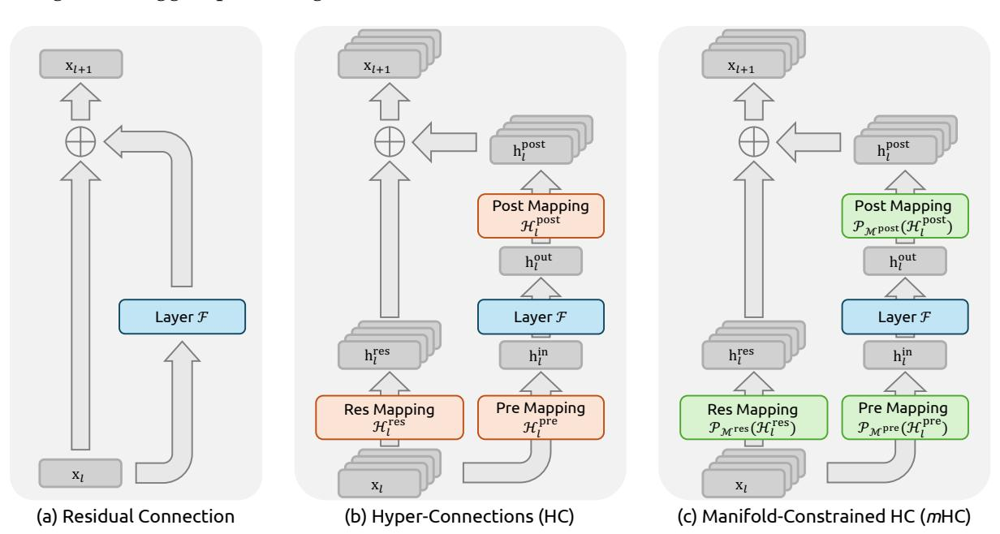
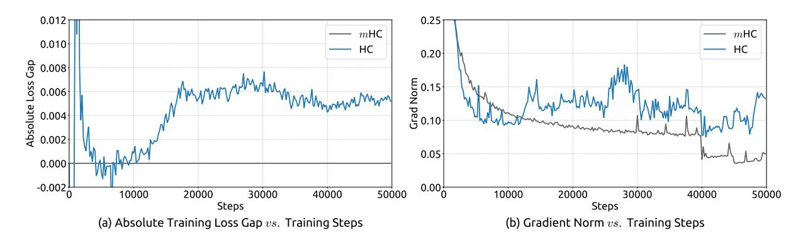
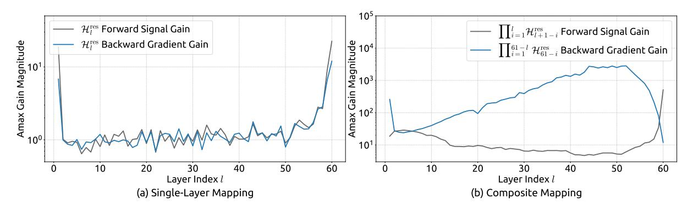
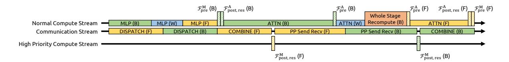
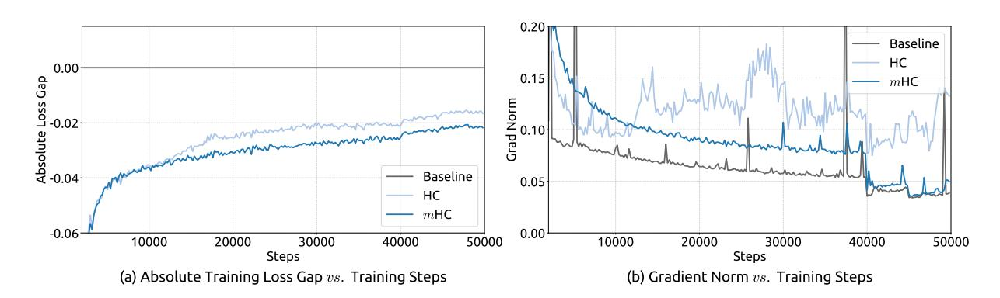
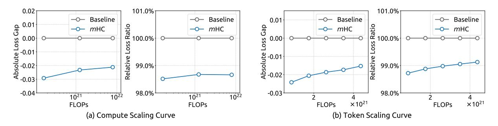
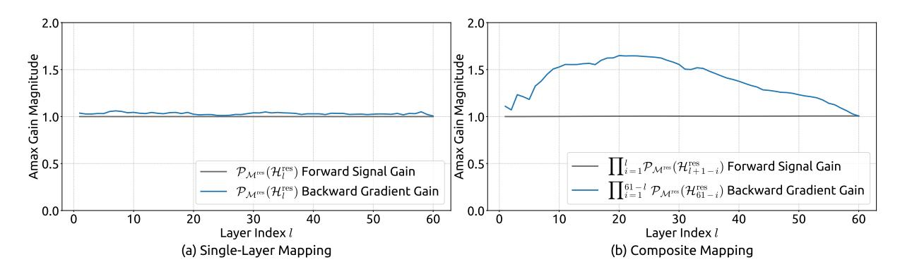
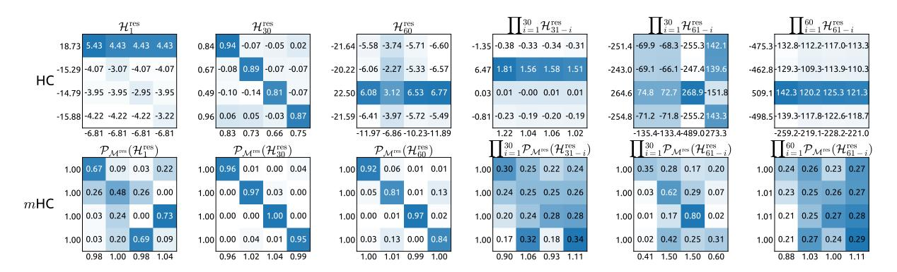

# mHC: Manifold-Constrained Hyper-Connections

Zhenda Xie\*†, Yixuan Wei\*, Huanqi Cao\*, Chenggang Zhao, Chengqi Deng, Jiashi Li, Damai Dai, Huazuo Gao, Jiang Chang, Kuai Yu, Liang Zhao, Shangyan Zhou, Zhean Xu, Zhengyan Zhang, Wangding Zeng, Shengding Hu, Yuqing Wang, Jingyang Yuan, Lean Wang, Wenfeng Liang

### DeepSeek-AI

### **Abstract**

Recently, studies exemplified by Hyper-Connections (HC) have extended the ubiquitous residual connection paradigm established over the past decade by expanding the residual stream width and diversifying connectivity patterns. While yielding substantial performance gains, this diversification fundamentally compromises the identity mapping property intrinsic to the residual connection, which causes severe training instability and restricted scalability, and additionally incurs notable memory access overhead. To address these challenges, we propose **Manifold-Constrained Hyper-Connections** (*m***HC**), a general framework that projects the residual connection space of HC onto a specific manifold to restore the identity mapping property, while incorporating rigorous infrastructure optimization to ensure efficiency. Empirical experiments demonstrate that *m*HC is effective for training at scale, offering tangible performance improvements and superior scalability. We anticipate that *m*HC, as a flexible and practical extension of HC, will contribute to a deeper understanding of topological architecture design and suggest promising directions for the evolution of foundational models.

Figure 1 | **Illustrations of Residual Connection Paradigms.** This figure compares the structural design of (a) standard Residual Connection, (b) Hyper-Connections (HC), and (c) our proposed **Manifold-Constrained Hyper-Connections** (*m***HC**). Unlike the unconstrained HC, *m*HC focuses on optimizing the residual connection space by projecting the matrices onto a constrained manifold to ensure stability.

\*Core contributors. †Corresponding author: xie.zhenda@deepseek.com

### **Contents**

| 1 |     | Introduction                                       | 3  |  |  |  |  |  |  |
|---|-----|----------------------------------------------------|----|--|--|--|--|--|--|
| 2 |     | Related Works                                      | 4  |  |  |  |  |  |  |
|   | 2.1 | Micro Design                                    | 4  |  |  |  |  |  |  |
|   | 2.2 | Macro Design                                    | 5  |  |  |  |  |  |  |
| 3 |     | Preliminary                                        | 5  |  |  |  |  |  |  |
|   | 3.1 | Numerical Instability                              | 6  |  |  |  |  |  |  |
|   | 3.2 | System Overhead                                 | 7  |  |  |  |  |  |  |
| 4 |     | Method                                             |    |  |  |  |  |  |  |
|   | 4.1 | Manifold-Constrained Hyper-Connections          | 8  |  |  |  |  |  |  |
|   | 4.2 | Parameterization and Manifold Projection           | 9  |  |  |  |  |  |  |
|   | 4.3 | Efficient Infrastructure Design                    | 9  |  |  |  |  |  |  |
|   |     | 4.3.1 Kernel Fusion                             | 9  |  |  |  |  |  |  |
|   |     | 4.3.2 Recomputing                            | 10 |  |  |  |  |  |  |
|   |     | 4.3.3 Overlapping Communication in DualPipe  | 11 |  |  |  |  |  |  |
| 5 |     | Experiments                                        | 12 |  |  |  |  |  |  |
|   | 5.1 | Experimental Setup                                 | 12 |  |  |  |  |  |  |
|   | 5.2 | Main Results                                       | 12 |  |  |  |  |  |  |
|   | 5.3 | Scaling Experiments                             | 13 |  |  |  |  |  |  |
|   | 5.4 | Stability Analysis                              | 14 |  |  |  |  |  |  |
| 6 |     | Conclusion and Outlook                             | 15 |  |  |  |  |  |  |
| A |     | Appendix                                           | 19 |  |  |  |  |  |  |
|   | A.1 | Detailed Model Specifications and Hyper-parameters | 19 |  |  |  |  |  |  |

#### 1. Introduction

Deep neural network architectures have undergone rapid evolution since the introduction of ResNets (He et al., 2016a). As illustrated in Fig. 1(a), the structure of a single-layer can be formulated as follows:

$$\mathbf{x}_{l+1} = \mathbf{x}_l + \mathcal{F}(\mathbf{x}_l, \mathcal{W}_l),\tag{1}$$

where  $\mathbf{x}_l$  and  $\mathbf{x}_{l+1}$  denote the *C*-dimensional input and output of the *l*-th layer, respectively, and  $\mathcal{F}$  represents the residual function. Although the residual function  $\mathcal{F}$  has evolved over the past decade to include various operations such as convolution, attention mechanisms, and feed forward networks, the paradigm of the residual connection has maintained its original form. Accompanying the progression of Transformer (Vaswani et al., 2017) architecture, this paradigm has currently established itself as a fundamental design element in large language models (LLMs) (Brown et al., 2020; Liu et al., 2024b; Touvron et al., 2023).

This success is primarily attributed to the concise form of the residual connection. More importantly, early research (He et al., 2016b) revealed that the identity mapping property of the residual connection maintains stability and efficiency during large-scale training. By recursively extending the residual connection across multiple layers, Eq. (1) yields:

$$\mathbf{x}_{L} = \mathbf{x}_{l} + \sum_{i=1}^{L-1} \mathcal{F}(\mathbf{x}_{i}, \mathcal{W}_{i}),$$
 (2)

where L and l correspond to deeper and shallower layers, respectively. The term identity mapping refers to the component  $\mathbf{x}_l$  itself, which emphasizes the property that the signal from the shallower layer maps directly to the deeper layer without any modification.

Recently, studies exemplified by Hyper-Connections (HC) (Zhu et al., 2024) have introduced a new dimension to the residual connection and empirically demonstrated its performance potential. The single-layer architecture of HC is illustrated in Fig. 1(b). By expanding the width of the residual stream and enhancing connection complexity, HC significantly increases topological complexity without altering the computational overhead of individual units regarding FLOPs. Formally, single-layer propagation in HC is defined as:

$$\mathbf{x}_{l+1} = \mathcal{H}_l^{\text{res}} \mathbf{x}_l + \mathcal{H}_l^{\text{post} \top} \mathcal{F}(\mathcal{H}_l^{\text{pre}} \mathbf{x}_l, \mathcal{W}_l), \tag{3}$$

where  $\mathbf{x}_l$  and  $\mathbf{x}_{l+1}$  denote the input and output of the l-th layer, respectively. Unlike the formulation in Eq. (1), the feature dimension of  $\mathbf{x}_l$  and  $\mathbf{x}_{l+1}$  is expanded from C to  $n \times C$ , where n is the expansion rate. The term  $\mathcal{H}_l^{\text{res}} \in \mathbb{R}^{n \times n}$  represents a learnable mapping that mixes features within the residual stream. Also as a learnable mapping,  $\mathcal{H}_l^{\text{pre}} \in \mathbb{R}^{1 \times n}$  aggregates features from the nC-dim stream into a C-dim layer input, and conversely,  $\mathcal{H}_l^{\text{post}} \in \mathbb{R}^{1 \times n}$  maps the layer output back onto the stream.

However, as the training scale increases, HC introduces potential risks of instability. The primary concern is that the unconstrained nature of HC compromises the identity mapping property when the architecture extends across multiple layers. In architectures comprising multiple parallel streams, an ideal identity mapping serves as a conservation mechanism. It ensures that the average signal intensity across streams remains invariant during both forward and backward propagation. Recursively extending HC to multiple layers via Eq. (3) yields:

$$\mathbf{x}_{L} = \left(\prod_{i=1}^{L-l} \mathcal{H}_{L-i}^{\text{res}}\right) \mathbf{x}_{l} + \sum_{i=l}^{L-1} \left(\prod_{j=1}^{L-1-i} \mathcal{H}_{L-j}^{\text{res}}\right) \mathcal{H}_{i}^{\text{post} \, \top} \mathcal{F}(\mathcal{H}_{i}^{\text{pre}} \mathbf{x}_{i}, \mathcal{W}_{i}), \tag{4}$$

where L and l represent a deeper layer and a shallower layer, respectively. In contrast to Eq. (2), the composite mapping  $\prod_{i=1}^{L-l} \mathcal{H}_{L-i}^{res}$  in HC fails to preserve the global mean of the features. This discrepancy leads to unbounded signal amplification or attenuation, resulting in instability during large-scale training. A further consideration is that, while HC preserves computational efficiency in terms of FLOPs, the hardware efficiency concerning memory access costs for the widened residual stream remains unaddressed in the original design. These factors collectively restrict the practical scalability of HC and hinder its application in large-scale training.

To address these challenges, we propose **Manifold-Constrained Hyper-Connections** (*m***HC**), as shown in Fig. 1(c), a general framework that projects the residual connection space of HC onto a specific manifold to restore the identity mapping property, while incorporating rigorous infrastructure optimization to ensure efficiency. Specifically, mHC utilizes the Sinkhorn-Knopp algorithm (Sinkhorn and Knopp, 1967) to entropically project  $\mathcal{H}_{l}^{res}$  onto the Birkhoff polytope. This operation effectively constrains the residual connection matrices within the manifold that is constituted by doubly stochastic matrices. Since the row and column sums of these matrices equal to 1, the operation  $\mathcal{H}_{l}^{\text{res}} \mathbf{x}_{l}$  functions as a convex combination of the input features. This characteristic facilitates a well-conditioned signal propagation where the feature mean is conserved, and the signal norm is strictly regularized, effectively mitigating the risk of vanishing or exploding signals. Furthermore, due to the closure of matrix multiplication for doubly stochastic matrices, the composite mapping  $\prod_{i=1}^{L-l} \mathcal{H}_{L-i}^{res}$  retains this conservation property. Consequently, mHC effectively maintains the stability of identity mappings between arbitrary depths. To ensure efficiency, we employ kernel fusion and develop mixed precision kernels utilizing TileLang (Wang et al., 2025). Furthermore, we mitigate the memory footprint through selective recomputing and carefully overlap communication within the DualPipe schedule (Liu et al., 2024b).

Extensive experiments on language model pretraining demonstrate that mHC exhibits exceptional stability and scalability while maintaining the performance advantages of HC. Inhouse large-scale training indicates that mHC supports training at scale and introduces only a 6.7% additional time overhead when expansion rate n = 4.

#### 2. Related Works

Architectural advancements in deep learning can be primarily classified into *micro-design* and *macro-design*. Micro-design concerns the internal architecture of computational blocks, specifying how features are processed across spatial, temporal, and channel dimensions. In contrast, macro-design establishes the inter-block topological structure, thereby dictating how feature representations are propagated, routed, and merged across distinct layers.

#### 2.1. Micro Design

Driven by parameter sharing and translation invariance, convolution initially dominated the processing of structured signals. While subsequent variations such as depthwise separable (Chollet, 2017) and grouped convolutions (Xie et al., 2017) optimized efficiency, the advent of Transformers (Vaswani et al., 2017) established Attention and Feed-Forward Networks (FFNs) as the fundamental building blocks of modern architecture. Attention mechanisms facilitate global information propagation, while FFNs enhance the representational capacity of individual features. To balance performance with the computational demands of LLMs, attention mechanisms have evolved towards efficient variants such as Multi-Query Attention (MQA) (Shazeer, 2019), Grouped-Query Attention (GQA) (Ainslie et al., 2023), and Multi-Head Latent Attention

(MLA) (Liu et al., 2024a). Simultaneously, FFNs have been generalized into sparse computing paradigms via Mixture-of-Experts (MoE) (Fedus et al., 2022; Lepikhin et al., 2020; Shazeer et al., 2017), allowing for massive parameter scaling without proportional computational costs.

#### 2.2. Macro Design

Macro-design governs the global topology of the network (Srivastava et al., 2015). Following ResNet (He et al., 2016a), architectures such as DenseNet (Huang et al., 2017) and Fractal-Net (Larsson et al., 2016) aimed to enhance performance by increasing topological complexity through dense connectivity and multi-path structures, respectively. Deep Layer Aggregation (DLA) (Yu et al., 2018) further extended this paradigm by recursively aggregating features across various depths and resolutions.

More recently, the focus of macro-design has shifted toward expanding the width of the residual stream (Chai et al., 2020; Fang et al., 2023; Heddes et al., 2025; Mak and Flanigan, 2025; Menghani et al., 2025; Pagliardini et al., 2024; Xiao et al., 2025; Xie et al., 2023; Zhu et al., 2024). Hyper-Connections (HC) (Zhu et al., 2024) introduced learnable matrices to modulate connection strengths among features at varying depths, while the Residual Matrix Transformer (RMT) (Mak and Flanigan, 2025) replaced the standard residual stream with an outer-product memory matrix to facilitate feature storage. Similarly, MUDDFormer (Xiao et al., 2025) employs multiway dynamic dense connections to optimize cross-layer information flow. Despite their potential, these approaches compromise the inherent identity mapping property of the residual connection, thereby introducing instability and hindering scalability. Furthermore, they incur significant memory access overhead due to expanded feature widths. Building upon HC, the proposed *m*HC restricts the residual connection space onto a specific manifold to restore the identity mapping property, while also incorporating rigorous infrastructure optimizations to ensure efficiency. This approach enhances stability and scalability while maintaining the topological benefits of expanded connections.

### 3. Preliminary

We first establish the notation used in this work. In the HC formulation, the input to the l-th layer,  $\mathbf{x}_l \in \mathbb{R}^{1 \times C}$ , is expanded by a factor of n to construct a hidden matrix  $\mathbf{x}_l = (\mathbf{x}_{l,0}^\top, \dots, \mathbf{x}_{l,n-1}^\top)^\top \in \mathbb{R}^{n \times C}$  which can be viewed as n-stream residual. This operation effectively broadens the width of the residual stream. To govern the read-out, write-in, and updating processes of this stream, HC introduces three learnable linear mappings— $\mathcal{H}_l^{\mathrm{pre}}$ ,  $\mathcal{H}_l^{\mathrm{post}} \in \mathbb{R}^{1 \times n}$ , and  $\mathcal{H}_l^{\mathrm{res}} \in \mathbb{R}^{n \times n}$ . These mappings modify the standard residual connection shown in Eq. (1), resulting in the formulation given in Eq. (3).

In the HC formulation, learnable mappings are composed of two parts of coefficients: the input-dependent one and the global one, referred to as dynamic mappings and static mappings, respectively. Formally, HC computes the coefficients as follows:

$$\begin{cases} \tilde{\mathbf{x}}_{l} = \text{RMSNorm}(\mathbf{x}_{l}) \\ \mathcal{H}_{l}^{\text{pre}} = \alpha_{l}^{\text{pre}} \cdot \tanh(\theta_{l}^{\text{pre}} \tilde{\mathbf{x}}_{l}^{\top}) + \mathbf{b}_{l}^{\text{pre}} \\ \mathcal{H}_{l}^{\text{post}} = \alpha_{l}^{\text{post}} \cdot \tanh(\theta_{l}^{\text{post}} \tilde{\mathbf{x}}_{l}^{\top}) + \mathbf{b}_{l}^{\text{post}} \\ \mathcal{H}_{l}^{\text{res}} = \alpha_{l}^{\text{res}} \cdot \tanh(\theta_{l}^{\text{res}} \tilde{\mathbf{x}}_{l}^{\top}) + \mathbf{b}_{l}^{\text{res}}, \end{cases}$$
(5)

where RMSNorm(·) (Zhang and Sennrich, 2019) is applied to the last dimension, and the scalars  $\alpha_l^{\rm pre}$ ,  $\alpha_l^{\rm post}$  and  $\alpha_l^{\rm res} \in \mathbb{R}$  are learnable gating factors initialized to small values. The dynamic

mappings are derived via linear projections parameterized by  $\theta_l^{\mathrm{pre}}$ ,  $\theta_l^{\mathrm{post}} \in \mathbb{R}^{1 \times C}$  and  $\theta_l^{\mathrm{res}} \in \mathbb{R}^{n \times C}$ , while the static mappings are represented by learnable biases  $\mathbf{b}_l^{\mathrm{pre}}$ ,  $\mathbf{b}_l^{\mathrm{post}} \in \mathbb{R}^{1 \times n}$  and  $\mathbf{b}_l^{\mathrm{res}} \in \mathbb{R}^{n \times n}$ .

It is worth noting that the introduction of these mappings— $\mathcal{H}_l^{\text{pre}}$ ,  $\mathcal{H}_l^{\text{post}}$ , and  $\mathcal{H}_l^{\text{res}}$ —incurs negligible computational overhead, as the typical expansion rate n, e.g. 4, is much smaller than the input dimension C. With this design, HC effectively decouples the information capacity of the residual stream from the layer's input dimension, which is strongly correlated with the model's computational complexity (FLOPs). Consequently, HC offers a new avenue for scaling by adjusting the residual stream width, complementing the traditional scaling dimensions of model FLOPs and training data size discussed in pre-training scaling laws (Hoffmann et al., 2022).

Although HC necessitates three mappings to manage the dimensional mismatch between the residual stream and the layer input, preliminary experiments presented in Tab. 1 indicate that the residual mapping  $\mathcal{H}_l^{\text{res}}$  yields the most significant performance gain. This finding underscores the critical importance of effective information exchange within the residual stream.

Table 1 | **Ablation Study of HC Components.** When a specific mapping ( $\mathcal{H}_l^{\text{pre}}$ ,  $\mathcal{H}_l^{\text{post}}$ , or  $\mathcal{H}_l^{\text{res}}$ ) is disabled, we employ a fixed mapping to maintain dimensional consistency: uniform weights of 1/n for  $\mathcal{H}_l^{\text{pre}}$ , uniform weights of ones for  $\mathcal{H}_l^{\text{post}}$ , and the identity matrix for  $\mathcal{H}_l^{\text{res}}$ .

| $\mathcal{H}_l^{\mathrm{res}}$ | $\mathcal{H}^{\text{pre}}_l$ | $\mathcal{H}_l^{\text{post}}$ | Absolute Loss Gap |
|--------------------------------|------------------------------|-------------------------------|-------------------|
|                                |                              |                               | 0.0               |
| $\checkmark$                   |                              |                               | - 0.022           |
| $\checkmark$                   | $\checkmark$                 |                               | - 0.025           |
|                                | $\checkmark$                 | $\checkmark$                  | - 0.027           |

#### 3.1. Numerical Instability

While the residual mapping  $\mathcal{H}_l^{\mathrm{res}}$  is instrumental for performance, its sequential application poses a significant risk to numerical stability. As detailed in Eq. (4), when HC is extended across multiple layers, the effective signal propagation from layer l to L is governed by the composite mapping  $\prod_{i=1}^{L-l}\mathcal{H}_{L-i}^{\mathrm{res}}$ . Since the learnable mapping  $\mathcal{H}_l^{\mathrm{res}}$  is unconstrained, this composite mapping inevitably deviates from the identity mapping. Consequently, the signal magnitude is prone to explosion or vanishing during both the forward pass and backpropagation. This phenomenon undermines the fundamental premise of residual learning, which relies on unimpeded signal flow, thereby destabilizing the training process in deeper or larger-scale models.

Empirical evidence supports this analysis. We observe unstable loss behavior in large-scale experiments, as illustrated in Fig. 2. Taking mHC as the baseline, HC exhibits an unexpected loss surge around the 12k step, which is highly correlated with the instability in the gradient norm. Furthermore, the analysis on  $\mathcal{H}_l^{\text{res}}$  validates the mechanism of this instability. To quantify how the composite mapping  $\prod_{i=1}^{L-l} \mathcal{H}_{L-i}^{\text{res}}$  amplifies signals along the residual stream, we utilize two metrics. The first, based on the maximum absolute value of the row sums of the composite mapping, captures the worst-case expansion in the forward pass. The second, based on the maximum absolute column sum, corresponds to the backward pass. We refer to these metrics as the  $Amax\ Gain\ Magnitude$  of the composite mapping. As shown in Fig. 3 (b), the Amax Gain Magnitude yields extreme values with peaks of 3000, a stark divergence from 1 that confirms the presence of exploding residual streams.

Figure 2 | **Training Instability of Hyper-Connections (HC).** This figure illustrates (a) the absolute loss gap of HC relative to *m*HC, and (b) the comparisons of gradient norms. All results are based on 27B models.

Figure 3 | **Propagation Instability of Hyper-Connections (HC).** This figure illustrates the propagation dynamics of (a) the single-layer mapping  $\mathcal{H}_l^{\text{res}}$  and (b) the composite mapping  $\prod_{l=1}^{L-l} \mathcal{H}_{L-i}^{\text{res}}$  within the 27B model. The layer index l (x-axis) unrolls each standard Transformer block into two independent layers (Attention and FFN). The Amax Gain Magnitude (y-axis) is calculated as the maximum absolute row sum (for the forward signal) and column sum (for the backward gradient), averaged over all tokens in a selected sequence.

#### 3.2. System Overhead

While the computational complexity of HC remains manageable due to the linearity of the additional mappings, the system-level overhead prevents a non-negligible challenge. Specifically, memory access (I/O) costs often constitute one of the primary bottlenecks in modern model architectures, which is widely referred to as the "memory wall" (Dao et al., 2022). This bottleneck is frequently overlooked in architectural design, yet it decisively impacts runtime efficiency.

Focusing on the widely adopted pre-norm Transformer (Vaswani et al., 2017) architecture, we analyze the I/O patterns inherent to HC. Tab. 2 summarizes the per token memory access overhead in a single residual layer introduced by the n-stream residual design. The analysis reveals that HC increases the memory access cost by a factor approximately proportional to n. This excessive I/O demand significantly degrades training throughput without the mitigation of fused kernels. Besides, since  $\mathcal{H}_l^{\text{pre}}$ ,  $\mathcal{H}_l^{\text{post}}$ , and  $\mathcal{H}_l^{\text{res}}$  involve learnable parameters, their intermediate activations are required for backpropagation. This results in a substantial increase in the GPU memory footprint, often necessitating gradient checkpointing to maintain feasible memory usage. Furthermore, HC requires n-fold more communication cost in pipeline parallelism (Qi et al., 2024), leading to larger bubbles and decreasing the training throughput.

Table 2 | **Comparison of Memory Access Costs Per Token.** This analysis accounts for the overhead introduced by the residual stream maintenance in the forward pass, excluding the internal I/O of the layer function  $\mathcal{F}$ .

| Method      | Operation                                                                                                   | Read (Elements)      | Write (Elements)     |  |
|-------------|-------------------------------------------------------------------------------------------------------------|----------------------|----------------------|--|
| Residual    | Residual Merge                                                                                              | 2 <i>C</i>           | C                    |  |
| Connection  | Total I/O                                                                                                   | 2C                   | С                    |  |
|             | Calculate $\mathcal{H}_{l}^{\text{pre}}$ , $\mathcal{H}_{l}^{\text{post}}$ , $\mathcal{H}_{l}^{\text{res}}$ | пС                   | $n^2 + 2n$           |  |
|             | $\mathcal{H}_{l}^{\mathrm{pre}}$                                                                            | nC + n               | C                    |  |
| Hyper-      | $\mathcal{H}_l^{\text{post}}$                                                                               | C + n                | пС                   |  |
| Connections | $\mathcal{H}_l^{\mathrm{res}}$                                                                              | $nC + n^2$           | пС                   |  |
|             | Residual Merge                                                                                              | 2nC                  | nC                   |  |
|             | Total I/O                                                                                                   | $(5n+1)C + n^2 + 2n$ | $(3n+1)C + n^2 + 2n$ |  |

#### 4. Method

#### 4.1. Manifold-Constrained Hyper-Connections

Drawing inspiration from the identity mapping principle (He et al., 2016b), the core premise of mHC is to constrain the residual mapping  $\mathcal{H}_l^{\text{res}}$  onto a specific manifold. While the original identity mapping ensures stability by enforcing  $\mathcal{H}_l^{\text{res}} = \mathbf{I}$ , it fundamentally precludes information exchange within the residual stream, which is critical for maximizing the potential of multistream architectures. Therefore, we propose projecting the residual mapping onto a manifold that simultaneously maintains the stability of signal propagation across layers and facilitates mutual interaction among residual streams to preserve the model's expressivity. To this end, we restrict  $\mathcal{H}_l^{\text{res}}$  to be a doubly stochastic matrix, which has non-negative entries where both the rows and columns sum to 1. Formally, let  $\mathcal{M}^{\text{res}}$  denote the manifold of doubly stochastic matrices (also known as the Birkhoff polytope). We constrain  $\mathcal{H}_l^{\text{res}}$  to  $\mathcal{P}_{\mathcal{M}^{\text{res}}}(\mathcal{H}_l^{\text{res}})$ , defined as:

$$\mathcal{P}_{\mathcal{M}^{\text{res}}}(\mathcal{H}_{l}^{\text{res}}) := \left\{ \mathcal{H}_{l}^{\text{res}} \in \mathbb{R}^{n \times n} \mid \mathcal{H}_{l}^{\text{res}} \mathbf{1}_{n} = \mathbf{1}_{n}, \ \mathbf{1}_{n}^{\top} \mathcal{H}_{l}^{\text{res}} = \mathbf{1}_{n}^{\top}, \ \mathcal{H}_{l}^{\text{res}} \geqslant 0 \right\}, \tag{6}$$

where  $\mathbf{1}_n$  represents the *n*-dimensional vector of all ones.

It is worth noting that when n = 1, the doubly stochastic condition degenerates to the scalar 1, thereby recovering the original identity mapping. The choice of double stochasticity confers several rigorous theoretical properties beneficial for large-scale model training:

- 1. **Norm Preservation:** The spectral norm of a doubly stochastic matrix is bounded by 1 (i.e.,  $\|\mathcal{H}_l^{res}\|_2 \le 1$ ). This implies that the learnable mapping is non-expansive, effectively mitigating the gradient explosion problem.
- 2. **Compositional Closure:** The set of doubly stochastic matrices is closed under matrix multiplication. This ensures that the composite residual mapping across multiple layers,  $\prod_{i=1}^{L-l} \mathcal{H}_{L-i}^{\text{res}}$ , remains doubly stochastic, thereby preserving stability throughout the entire depth of the model.
- 3. **Geometric Interpretation via the Birkhoff Polytope:** The set  $\mathcal{M}^{res}$  forms the Birkhoff polytope, which is the convex hull of the set of permutation matrices. This provides a clear geometric interpretation: the residual mapping acts as a convex combination of permutations. Mathematically, the repeated application of such matrices tends to increase

the mixing of information across streams monotonically, effectively functioning as a robust feature fusion mechanism.

Additionally, we impose non-negativity constraints on the input mappings  $\mathcal{H}_l^{\text{pre}}$  and output mappings  $\mathcal{H}_l^{\text{post}}$ . This constrain prevents signal cancellation arising from the composition of positive and negative coefficients, which can also be considered as a special manifold projection.

#### 4.2. Parameterization and Manifold Projection

In this section, we detail the calculation process of  $\mathcal{H}_l^{\text{pre}}$ ,  $\mathcal{H}_l^{\text{post}}$ , and  $\mathcal{H}_l^{\text{res}}$  in mHC. Given the input hidden matrix  $\mathbf{x}_l \in \mathbb{R}^{n \times C}$  at the l-th layer, we first flatten it into a vector  $\vec{\mathbf{x}}_l = \text{vec}(\mathbf{x}_l) \in \mathbb{R}^{1 \times nC}$  to preserve full context information. Then, we follow the original HC formulation to get the dynamic mappings and the static mappings as follows:

$$\begin{cases} \vec{\mathbf{x}}_{l}' = \text{RMSNorm}(\vec{\mathbf{x}}_{l}) \\ \tilde{\mathcal{H}}_{l}^{\text{pre}} = \alpha_{l}^{\text{pre}} \cdot (\vec{\mathbf{x}}_{l}' \boldsymbol{\varphi}_{l}^{\text{pre}}) + \mathbf{b}_{l}^{\text{pre}} \\ \tilde{\mathcal{H}}_{l}^{\text{post}} = \alpha_{l}^{\text{post}} \cdot (\vec{\mathbf{x}}_{l}' \boldsymbol{\varphi}_{l}^{\text{post}}) + \mathbf{b}_{l}^{\text{post}} \\ \tilde{\mathcal{H}}_{l}^{\text{res}} = \alpha_{l}^{\text{res}} \cdot \text{mat}(\vec{\mathbf{x}}_{l}' \boldsymbol{\varphi}_{l}^{\text{res}}) + \mathbf{b}_{l}^{\text{res}}, \end{cases}$$

$$(7)$$

where  $\varphi_l^{\text{pre}}$ ,  $\varphi_l^{\text{post}} \in \mathbb{R}^{nC \times n}$  and  $\varphi_l^{\text{res}} \in \mathbb{R}^{nC \times n^2}$  are linear projections for dynamic mappings and  $\text{mat}(\cdot)$  is a reshape function from  $\mathbb{R}^{1 \times n^2}$  to  $\mathbb{R}^{n \times n}$ .

Then, the final constrained mappings are obtained via:

$$\begin{cases} \mathcal{H}_{l}^{\text{pre}} = \sigma(\tilde{\mathcal{H}}_{l}^{\text{pre}}) \\ \mathcal{H}_{l}^{\text{post}} = 2\sigma(\tilde{\mathcal{H}}_{l}^{\text{post}}) \\ \mathcal{H}_{l}^{\text{res}} = \text{Sinkhorn-Knopp}(\tilde{\mathcal{H}}_{l}^{\text{res}}), \end{cases}$$
(8)

where  $\sigma(\cdot)$  denotes the Sigmoid function. The Sinkhorn-Knopp $(\cdot)$  operator firstly makes all elements to be positive via an exponent operator and then conducts iterative normalization process that alternately rescales rows and columns to sum to 1. Specifically, given a positive matrix  $\mathbf{M}^{(0)} = \exp(\tilde{\mathcal{H}}_l^{res})$  as the start point, the normalization iteration proceeds as:

$$\mathbf{M}^{(t)} = \mathcal{T}_r \left( \mathcal{T}_c(\mathbf{M}^{(t-1)}) \right), \tag{9}$$

where  $\mathcal{T}_r$  and  $\mathcal{T}_c$  denote row and column normalization, respectively. This process converges to a doubly stochastic matrix  $\mathcal{H}_l^{\text{res}} = \mathbf{M}^{(t_{\text{max}})}$  as  $t_{\text{max}} \to \infty$ . We choose  $t_{\text{max}} = 20$  as a practical value in our experiments.

#### 4.3. Efficient Infrastructure Design

In this section, we detail the infrastructure design tailored for mHC. Through rigorous optimization, we implement mHC (with n = 4) in large-scale models with a marginal training overhead of only 6.7%.

#### 4.3.1. Kernel Fusion

Observing that RMSNorm in mHC imposes significant latency when operating on the high-dimensional hidden state  $\vec{\mathbf{x}}_l \in \mathbb{R}^{1 \times nC}$ , we reorder the dividing-by-norm operation to follow the

matrix multiplication. This optimization maintains mathematical equivalence while improving efficiency. Furthermore, we employ mixed-precision strategies to maximize numerical accuracy without compromising speed, and fuse multiple operations with shared memory access into unified compute kernels to reduce memory bandwidth bottlenecks. Based on the inputs and parameters detailed in Eq. (10) to (13), we implement three specialized mHC kernels to compute  $\mathcal{H}_l^{\text{pre}}$ ,  $\mathcal{H}_l^{\text{post}}$ , and  $\mathcal{H}_l^{\text{res}}$ . In these kernels, the biases and linear projections are consolidated into  $\mathbf{b}_l$ and  $\varphi_l$ , and the RMSNorm weight is also absorbed in  $\varphi_l$ .

- Eq. (14) to (15): We develop a unified kernel that fuses two scans on  $\vec{x}_l$ , leveraging matrix multiplication units to maximize memory bandwidth utilization. The backward pass—comprising two matrix multiplications—is similarly consolidated into a single kernel, eliminating redundant reloading of  $\vec{x}_l$ . Both kernels feature a finely tuned pipeline (load, cast, compute, store) to efficiently handle mixed-precision processing.
- Eq. (16) to (18): These lightweight operations on small coefficients are opportunistically fused into a single kernel, significantly reducing kernel launch overhead.
- Eq. (19): We implement the Sinkhorn-Knopp iteration within a single kernel. For the backward pass, we derive a custom backward kernel that recomputes the intermediate results on-chip and traverses the entire iteration.

$$\varphi_1$$
: tfloat32 [ $nC, n^2 + 2n$ ] (10)

$$\vec{\mathbf{x}}_l: \text{bfloat16} \qquad [1, nC] \tag{11}$$

$$\vec{\mathbf{x}}_l$$
: bfloat16 [1, nC] (11)  
 $\alpha_l^{\text{pre}}, \alpha_l^{\text{post}}, \alpha_l^{\text{res}}$ : float32 Scalars (12)  
 $\mathbf{b}_l$ : float32 [1, n2 + 2n] (13)

$$\mathbf{b}_1$$
: float32  $[1, n^2 + 2n]$  (13)

$$\left[\tilde{\mathcal{H}}_{l}^{\text{pre}}, \tilde{\mathcal{H}}_{l}^{\text{post}}, \tilde{\mathcal{H}}_{l}^{\text{res}}\right] : \text{float32} \qquad = \vec{\mathbf{x}}_{l} \varphi_{l}$$
 (14)

$$r: \text{float32} \qquad = \|\vec{\mathbf{x}}_l\|_2 / \sqrt{nC} \tag{15}$$

$$\left[\tilde{\mathcal{H}}_{l}^{\text{pre}}, \tilde{\mathcal{H}}_{l}^{\text{post}}, \tilde{\mathcal{H}}_{l}^{\text{res}}\right] : \text{float32} \qquad = \vec{\mathbf{x}}_{l} \boldsymbol{\varphi}_{l} \qquad (14)$$

$$r : \text{float32} \qquad = \left\|\vec{\mathbf{x}}_{l}\right\|_{2} / \sqrt{nC} \qquad (15)$$

$$\left[\tilde{\mathcal{H}}_{l}^{\text{pre}}, \tilde{\mathcal{H}}_{l}^{\text{post}}, \tilde{\mathcal{H}}_{l}^{\text{res}}\right] : \text{float32} \qquad = 1/r \left[\alpha_{l}^{\text{pre}} \tilde{\mathcal{H}}_{l}^{\text{pre}}, \alpha_{l}^{\text{post}} \tilde{\mathcal{H}}_{l}^{\text{post}}, \alpha_{l}^{\text{res}} \tilde{\mathcal{H}}_{l}^{\text{res}}\right] + \mathbf{b}_{l} \qquad (16)$$

$$\mathcal{H}_{l}^{\text{pre}}$$
: float32 =  $\sigma\left(\tilde{\mathcal{H}}_{l}^{\text{pre}}\right)$  (17)

$$\mathcal{H}_{l}^{\text{post}}$$
: float32 =  $2\sigma\left(\tilde{\mathcal{H}}_{l}^{\text{post}}\right)$  (18)

$$\mathcal{H}_{l}^{\text{res}}$$
: float32 = Sinkhorn-Knopp  $(\tilde{\mathcal{H}}_{l}^{\text{res}})$  (19)

Using the coefficients derived from the aforementioned kernels, we introduce two additional kernels to apply these mappings: one for  $\mathcal{F}_{pre} := \mathcal{H}_l^{pre} \mathbf{x}_l$  and another for  $\mathcal{F}_{post,res} := \mathcal{H}_l^{res} \mathbf{x}_l + \mathcal{H}_l^{post} \mathcal{F}(\cdot, \cdot)$ . Through fusing the application of  $\mathcal{H}_l^{post}$  and  $\mathcal{H}_l^{res}$  with residual merging, we reduce the number of elements read from (3n + 1)C to (n + 1)C and the number of elements written from 3nC to nC for this kernel. We efficiently implement the majority of kernels (excluding Eq. (14) to (15)) using TileLang (Wang et al., 2025). This framework streamlines the implementation of kernels with complex calculation process and allows us to fully utilize the memory bandwidth with minimal engineering effort.

#### 4.3.2. Recomputing

The *n*-stream residual design introduces substantial memory overhead during training. To mitigate this, we discard the intermediate activations of the mHC kernels after the forward pass and recompute them on-the-fly in the backward pass, through re-executing the mHC kernels without the heavy layer function  $\mathcal{F}$ . Consequently, for a block of  $L_r$  consecutive layers, we need only store the input  $\mathbf{x}_{l_0}$  to the first layer. Excluding lightweight coefficients while accounting for the pre-norm with in  $\mathcal{F}$ , Tab. 3 summarizes the intermediate activations preserved for the backward pass.

Table 3 | **Stored and Recomputed Intermediate Activations** We list per token activation preserved for the backward pass and the transient activation recomputed in  $L_r$  consecutive layers. Layer  $l_0$  represents the first layer in  $L_r$  layers and layer l is in  $[l_0, l_0 + L_r - 1]$ .

| Activations     | $\mathbf{x}_{l_0}$ | $\mathcal{F}(\mathcal{H}_l^{\text{pre}}\mathbf{x}_l, \mathcal{W}_l)$ | $ \mathbf{x}_l $ | $\mathcal{H}_l^{\mathrm{pre}}\mathbf{x}_l$ | $RMSNorm(\mathcal{H}_l^{pre} \mathbf{x}_l)$ |
|-----------------|--------------------|----------------------------------------------------------------------|------------------|--------------------------------------------|---------------------------------------------|
| Size (Elements) | пС                 | С                                                                    | nC               | С                                          | С                                           |
| Stored Method   | Every $L_r$ layers | Every layer                                                          |                  | Transien                                   | t inside $L_r$ layers                       |

Since mHC kernels recomputation is performed for blocks of  $L_r$  consecutive layers, given a total of L layers, we must persistently store the first layer input  $\mathbf{x}_{l_0}$  for all  $\lceil \frac{L}{L_r} \rceil$  blocks for the backward pass. In addition to this resident memory, the recomputation process introduces a transient memory overhead of  $(n+2)C \times L_r$  elements for the active block, which determines the peak memory usage during backpropagation. Consequently, we determine the optimal block size  $L_r^*$  by minimizing the total memory footprint corresponded to  $L_r$ :

$$L_r^* = \arg\min_{L_r} \left[ nC \times \left[ \frac{L}{L_r} \right] + (n+2)C \times L_r \right] \approx \sqrt{\frac{nL}{n+2}}.$$
 (20)

Furthermore, pipeline parallelism in large-scale training imposes a constraint: recomputation blocks must not cross pipeline stage boundaries. Observing that the theoretical optimum  $L_r^*$  typically aligns with the number of layers per pipeline stage, we choose to synchronize the recomputation boundaries with the pipeline stages.

#### 4.3.3. Overlapping Communication in DualPipe

In large-scale training, pipeline parallelism is the standard practice for mitigating parameter and gradient memory footprints. Specifically, we adopt the DualPipe schedule (Liu et al., 2024b), which effectively overlaps scale-out interconnected communication traffic, such as those in expert and pipeline parallelism. However, compared to the single-stream design, the proposed n-stream residual in mHC incurs substantial communication latency across pipeline stages. Furthermore, at stage boundaries, the recomputation of mHC kernels for all  $L_r$  layers introduces non-negligible computational overhead. To address these bottlenecks, we extend the DualPipe schedule (see Fig. 4) to facilitate improved overlapping of communication and computation at pipeline stage boundaries.

Notably, to prevent blocking the communication stream, we execute the  $\mathcal{F}_{post,res}$  kernels of MLP (i.e. FFN) layers on a dedicated high-priority compute stream. We further refrain from employing persistent kernels for long-running operations in attention layers, thereby preventing extended stalls. This design enables the preemption of overlapped attention computations, allowing for flexible scheduling while maintaining high utilization of the compute device's processing units. Furthermore, the recomputation process is decoupled from pipeline communication dependencies, as the initial activation of each stage  $\mathbf{x}_{l_0}$  is already cached locally.

Figure 4 | Communication-Computation Overlapping for mHC. We extend the DualPipe schedule to handle the overhead introduced by mHC. Lengths of each block are illustrative only and do not represent actual duration. (F), (B), (W) refers to forward pass, backward pass, weight gradient computation, respectively.  $\mathcal{F}^A$  and  $\mathcal{F}^M$  represents kernels corresponded to Attention and MLP, respectively.

### 5. Experiments

#### 5.1. Experimental Setup

We validate the proposed method via language model pre-training, conducting a comparative analysis between the baseline, HC, and our proposed *m*HC. Utilizing MoE architectures inspired by DeepSeek-V3 (Liu et al., 2024b), we train four distinct model variants to cover different evaluation regimes. Specifically, the expansion rate *n* for both HC and *m*HC is set to 4. Our primary focus is a 27B model trained with a dataset size proportional to its parameters, which serves as the subject for our system-level main results. Expanding on this, we analyze the compute scaling behavior by incorporating smaller 3B and 9B models trained with proportional data, which allows us to observe performance trends across varying compute. Additionally, to specifically investigate the token scaling behavior, we train a separate 3B model on a fixed corpus of 1 trillion tokens. Detailed model configurations and training hyper-parameters are provided in Appendix A.1.

#### 5.2. Main Results

Figure 5 | Training Stability of Manifold-Constrained Hyper-Connections (mHC). This figure illustrates (a) the absolute training loss gap of mHC and HC relative to the baseline, and (b) the gradient norm of the three methods. All experiments utilize the 27B model. The results demonstrate that mHC exhibits improved stability in terms of both loss and gradient norm.

We begin by examining the training stability and convergence of the 27B models. As illustrated in Fig. 5 (a), *m*HC effectively mitigates the training instability observed in HC, achieving a final loss reduction of 0.021 compared to the baseline. This improved stability is further corroborated by the gradient norm analysis in Fig. 5 (b), where *m*HC exhibits significantly better behavior than HC, maintaining a stable profile comparable to the baseline.

Table 4 | **System-level Benchmark Results for 27B Models.** This table compares the zero-shot and few-shot performance of the Baseline, HC, and *m*HC across 8 diverse downstream benchmarks. *m*HC consistently outperforms the Baseline and surpasses HC on the majority of benchmarks, demonstrating its effectiveness in large-scale pre-training.

| Benchmark (Metric) | BBH (EM) | DROP (F1) | GSM8K (EM) | HellaSwag (Acc.) | MATH (EM) | MMLU (Acc.) | PIQA (Acc.) | TriviaQA (EM) |
|-----------------------|-------------|--------------|---------------|---------------------|--------------|----------------|----------------|------------------|
| # Shots               | 3-shot      | 3-shot       | 8-shot        | 10-shot             | 4-shot       | 5-shot         | 0-shot         | 5-shot           |
| 27B Baseline          | 43.8        | 47.0         | 46.7          | 73.7                | 22.0         | 59.0           | 78.5           | 54.3             |
| 27B w/ HC             | 48.9        | 51.6         | 53.2          | 74.3                | 26.4         | 63.0           | 79.9           | 56.3             |
| 27B w/ mHC            | 51.0        | 53.9         | 53.8          | 74.7                | 26.0         | 63.4           | 80.5           | 57.6             |

Tab. 4 presents the downstream performance across a diverse set of benchmarks (Bisk et al., 2020; Cobbe et al., 2021; Hendrycks et al., 2020, 2021; Joshi et al., 2017; Zellers et al., 2019). *m*HC yields comprehensive improvements, consistently outperforming the baseline and surpassing HC on the majority of tasks. Notably, compared to HC, *m*HC further enhances the model's reasoning capabilities, delivering performance gains of 2.1% on BBH (Suzgun et al., 2022) and 2.3% on DROP (Dua et al., 2019).

#### 5.3. Scaling Experiments

Figure 6 | Scaling properties of *m*HC compared to the Baseline. (a) Compute Scaling Curve. Solid lines depict the performance gap across different compute budgets. Each point represents a specific compute-optimal configuration of model size and dataset size, scaling from 3B and 9B to 27B parameters. (b) Token Scaling Curve. Trajectory of the 3B model during training. Each point represents the model's performance at different training tokens. Detailed architectures and training configurations are provided in Appendix A.1.

To assess the scalability of our approach, we report the relative loss improvement of mHC against the baseline across different scales. In Fig. 6 (a), we plot the compute scaling curve spanning 3B, 9B, and 27B parameters. The trajectory indicates that the performance advantage is robustly maintained even at higher computational budgets, showing only marginal attenuation. Furthermore, we examine the within-run dynamics in Fig. 6 (b), which presents the token scaling curve for the 3B model. Collectively, these findings validate the effectiveness of mHC in large-scale scenarios. This conclusion is further corroborated by our in-house large-scale training experiments.

Figure 7 | Propagation Stability of Manifold-Constrained Hyper-Connections (mHC). This figure illustrates the propagation dynamics of (a) the single-layer mapping  $\mathcal{P}_{\mathcal{M}^{res}}(\mathcal{H}_{l}^{res})$  and (b) the composite mapping  $\prod_{i=1}^{L-l} \mathcal{P}_{\mathcal{M}^{res}}(\mathcal{H}_{L-i}^{res})$  within the 27B model. The results demonstrate that mHC significantly enhances propagation stability compared to HC.

Figure 8 | **Visualizations of Learnable Mappings.** This figure displays representative single-layer and composite mappings for HC (first row) and *m*HC (second row). Each matrix is computed by averaging over all tokens within a selected sequence. The labels annotated along the y-axis and x-axis indicate the forward signal gain (row sum) and the backward gradient gain (column sum), respectively.

#### 5.4. Stability Analysis

Similar to Fig. 3, Fig. 7 illustrates the propagation stability of *m*HC. Ideally, the single-layer mapping satisfies the doubly stochastic constraint, implying that both the forward signal gain and the backward gradient gain should equal to 1. However, practice implementations utilizing the Sinkhorn-Knopp algorithm must limit the number of iterations to achieve computational efficiency. In our settings, we use 20 iterations to obtain an approximate solution. Consequently, as shown in Fig. 7(a), the backward gradient gain deviates slightly from 1. In the composite case shown in Fig. 7(b), the deviation increases but remains bounded, reaching a maximum value of approximately 1.6. Notably, compared to the maximum gain magnitude of nearly 3000 in HC, *m*HC significantly reduces it by three orders of magnitude. These results demonstrate that *m*HC significantly enhances propagation stability compared to HC, ensuring stable forward signal and backward gradient flows. Additionally, Fig. 8 displays representative mappings. We observe that for HC, when the maximum gain is large, other values also tend to be significant, which indicates general instability across all propagation paths. In contrast, *m*HC consistently vields stable results.

### **6. Conclusion and Outlook**

In this paper, we identify that while expanding the width of residual stream and diversifying connections yields performance gains as proposed in Hyper-Connections (HC), the unconstrained nature of these connections leads to signal divergence. This disruption compromises the conservation of signal energy across layers, inducing training instability and hindering the scalability of deep networks. To address these challenges, we introduce **Manifold-Constrained Hyper-Connections** (*m***HC**), a generalized framework that projects the residual connection space onto a specific manifold. By employing the Sinkhorn-Knopp algorithm to enforce a doubly stochastic constraint on residual mappings, *m*HC transforms signal propagation into a convex combination of features. Empirical results confirm that *m*HC effectively restores the identity mapping property, enabling stable large-scale training with superior scalability compared to conventional HC. Crucially, through efficient infrastructure-level optimizations, *m*HC delivers these improvements with negligible computational overhead.

As a generalized extension of the HC paradigm, *m*HC opens several promising avenues for future research. Although this work utilizes doubly stochastic matrices to ensure stability, the framework accommodates the exploration of diverse manifold constraints tailored to specific learning objectives. We anticipate that further investigation into distinct geometric constraints could yield novel methods that better optimize the trade-off between plasticity and stability. Furthermore, we hope *m*HC rejuvenates community interest in macro-architecture design. By deepening the understanding of how topological structures influence optimization and representation learning, *m*HC will help address current limitations and potentially illuminate new pathways for the evolution of next-generation foundational architectures.

### **References**

- J. Ainslie, J. Lee-Thorp, M. De Jong, Y. Zemlyanskiy, F. Lebrón, and S. Sanghai. Gqa: Training generalized multi-query transformer models from multi-head checkpoints. arXiv preprint arXiv:2305.13245, 2023.
- Y. Bisk, R. Zellers, R. L. Bras, J. Gao, and Y. Choi. PIQA: reasoning about physical commonsense in natural language. In The Thirty-Fourth AAAI Conference on Artificial Intelligence, AAAI 2020, The Thirty-Second Innovative Applications of Artificial Intelligence Conference, IAAI 2020, The Tenth AAAI Symposium on Educational Advances in Artificial Intelligence, EAAI 2020, New York, NY, USA, February 7-12, 2020, pages 7432–7439. AAAI Press, 2020. doi: 10.1609/aaai.v34i05.6239. URL <https://doi.org/10.1609/aaai.v34i05.6239>.
- T. Brown, B. Mann, N. Ryder, M. Subbiah, J. D. Kaplan, P. Dhariwal, A. Neelakantan, P. Shyam, G. Sastry, A. Askell, et al. Language models are few-shot learners. Advances in neural information processing systems, 33:1877–1901, 2020.
- Y. Chai, S. Jin, and X. Hou. Highway transformer: Self-gating enhanced self-attentive networks. In D. Jurafsky, J. Chai, N. Schluter, and J. Tetreault, editors, Proceedings of the 58th Annual Meeting of the Association for Computational Linguistics, pages 6887–6900, Online, July 2020. Association for Computational Linguistics. doi: 10.18653/v1/2020.acl-main.616. URL <https://aclanthology.org/2020.acl-main.616/>.
- F. Chollet. Xception: Deep learning with depthwise separable convolutions. In Proceedings of the IEEE conference on computer vision and pattern recognition, pages 1251–1258, 2017.

- K. Cobbe, V. Kosaraju, M. Bavarian, M. Chen, H. Jun, L. Kaiser, M. Plappert, J. Tworek, J. Hilton, R. Nakano, et al. Training verifiers to solve math word problems. arXiv preprint arXiv:2110.14168, 2021.
- T. Dao, D. Y. Fu, S. Ermon, A. Rudra, and C. Ré. FlashAttention: Fast and memory-efficient exact attention with IO-awareness. In Advances in Neural Information Processing Systems (NeurIPS), 2022.
- D. Dua, Y. Wang, P. Dasigi, G. Stanovsky, S. Singh, and M. Gardner. DROP: A reading comprehension benchmark requiring discrete reasoning over paragraphs. In J. Burstein, C. Doran, and T. Solorio, editors, Proceedings of the 2019 Conference of the North American Chapter of the Association for Computational Linguistics: Human Language Technologies, NAACL-HLT 2019, Minneapolis, MN, USA, June 2-7, 2019, Volume 1 (Long and Short Papers), pages 2368– 2378. Association for Computational Linguistics, 2019. doi: 10.18653/V1/N19-1246. URL <https://doi.org/10.18653/v1/n19-1246>.
- Y. Fang, Y. CAI, J. Chen, J. Zhao, G. Tian, and G. Li. Cross-layer retrospective retrieving via layer attention. In The Eleventh International Conference on Learning Representations, 2023. URL <https://openreview.net/forum?id=pvgEL1yS3Ql>.
- W. Fedus, B. Zoph, and N. Shazeer. Switch transformers: Scaling to trillion parameter models with simple and efficient sparsity. Journal of Machine Learning Research, 23(120):1–39, 2022.
- K. He, X. Zhang, S. Ren, and J. Sun. Deep residual learning for image recognition. In Proceedings of the IEEE conference on computer vision and pattern recognition, pages 770–778, 2016a.
- K. He, X. Zhang, S. Ren, and J. Sun. Identity mappings in deep residual networks. In European conference on computer vision, pages 630–645. Springer, 2016b.
- M. Heddes, A. Javanmard, K. Axiotis, G. Fu, M. Bateni, and V. Mirrokni. Deepcrossattention: Supercharging transformer residual connections. In Forty-second International Conference on Machine Learning, 2025. URL <https://openreview.net/forum?id=j3JBfFnGYh>.
- D. Hendrycks, C. Burns, S. Basart, A. Zou, M. Mazeika, D. Song, and J. Steinhardt. Measuring massive multitask language understanding. arXiv preprint arXiv:2009.03300, 2020.
- D. Hendrycks, C. Burns, S. Kadavath, A. Arora, S. Basart, E. Tang, D. Song, and J. Steinhardt. Measuring mathematical problem solving with the math dataset. arXiv preprint arXiv:2103.03874, 2021.
- J. Hoffmann, S. Borgeaud, A. Mensch, E. Buchatskaya, T. Cai, E. Rutherford, D. de Las Casas, L. A. Hendricks, J. Welbl, A. Clark, T. Hennigan, E. Noland, K. Millican, G. van den Driessche, B. Damoc, A. Guy, S. Osindero, K. Simonyan, E. Elsen, O. Vinyals, J. Rae, and L. Sifre. An empirical analysis of compute-optimal large language model training. In S. Koyejo, S. Mohamed, A. Agarwal, D. Belgrave, K. Cho, and A. Oh, editors, Advances in Neural Information Processing Systems, volume 35, pages 30016–30030. Curran Associates, Inc., 2022. URL [https://proceedings.neurips.cc/paper\\_files/paper/2022/file/c1e2faf](https://proceedings.neurips.cc/paper_files/paper/2022/file/c1e2faff6f588870935f114ebe04a3e5-Paper-Conference.pdf) [f6f588870935f114ebe04a3e5-Paper-Conference.pdf](https://proceedings.neurips.cc/paper_files/paper/2022/file/c1e2faff6f588870935f114ebe04a3e5-Paper-Conference.pdf).
- G. Huang, Z. Liu, L. Van Der Maaten, and K. Q. Weinberger. Densely connected convolutional networks. In Proceedings of the IEEE conference on computer vision and pattern recognition, pages 4700–4708, 2017.

- M. Joshi, E. Choi, D. Weld, and L. Zettlemoyer. TriviaQA: A large scale distantly supervised challenge dataset for reading comprehension. In R. Barzilay and M.-Y. Kan, editors, Proceedings of the 55th Annual Meeting of the Association for Computational Linguistics (Volume 1: Long Papers), pages 1601–1611, Vancouver, Canada, July 2017. Association for Computational Linguistics. doi: 10.18653/v1/P17-1147. URL <https://aclanthology.org/P17-1147>.
- G. Larsson, M. Maire, and G. Shakhnarovich. Fractalnet: Ultra-deep neural networks without residuals. arXiv preprint arXiv:1605.07648, 2016.
- D. Lepikhin, H. Lee, Y. Xu, D. Chen, O. Firat, Y. Huang, M. Krikun, N. Shazeer, and Z. Chen. Gshard: Scaling giant models with conditional computation and automatic sharding. arXiv preprint arXiv:2006.16668, 2020.
- A. Liu, B. Feng, B. Wang, B. Wang, B. Liu, C. Zhao, C. Dengr, C. Ruan, D. Dai, D. Guo, et al. Deepseek-v2: A strong, economical, and efficient mixture-of-experts language model. arXiv preprint arXiv:2405.04434, 2024a.
- A. Liu, B. Feng, B. Xue, B. Wang, B. Wu, C. Lu, C. Zhao, C. Deng, C. Zhang, C. Ruan, et al. Deepseek-v3 technical report. arXiv preprint arXiv:2412.19437, 2024b.
- I. Loshchilov and F. Hutter. Decoupled weight decay regularization. arXiv preprint arXiv:1711.05101, 2017.
- B. Mak and J. Flanigan. Residual matrix transformers: Scaling the size of the residual stream. arXiv preprint arXiv:2506.22696, 2025.
- G. Menghani, R. Kumar, and S. Kumar. LAurel: Learned augmented residual layer. In Forty-second International Conference on Machine Learning, 2025. URL [https://open](https://openreview.net/forum?id=rUDRWP9WvZ) [review.net/forum?id=rUDRWP9WvZ](https://openreview.net/forum?id=rUDRWP9WvZ).
- M. Pagliardini, A. Mohtashami, F. Fleuret, and M. Jaggi. Denseformer: Enhancing information flow in transformers via depth weighted averaging. In The Thirty-eighth Annual Conference on Neural Information Processing Systems, 2024. URL [https://openreview.net/forum](https://openreview.net/forum?id=kMnoh7CXrq) [?id=kMnoh7CXrq](https://openreview.net/forum?id=kMnoh7CXrq).
- P. Qi, X. Wan, G. Huang, and M. Lin. Zero bubble (almost) pipeline parallelism. In The Twelfth International Conference on Learning Representations, 2024. URL [https://openreview](https://openreview.net/forum?id=tuzTN0eIO5) [.net/forum?id=tuzTN0eIO5](https://openreview.net/forum?id=tuzTN0eIO5).
- N. Shazeer. Fast transformer decoding: One write-head is all you need. arXiv preprint arXiv:1911.02150, 2019.
- N. Shazeer, A. Mirhoseini, K. Maziarz, A. Davis, Q. Le, G. Hinton, and J. Dean. Outrageously large neural networks: The sparsely-gated mixture-of-experts layer. arXiv preprint arXiv:1701.06538, 2017.
- R. Sinkhorn and P. Knopp. Concerning nonnegative matrices and doubly stochastic matrices. Pacific Journal of Mathematics, 21(2):343–348, 1967.
- R. K. Srivastava, K. Greff, and J. Schmidhuber. Training very deep networks. In C. Cortes, N. Lawrence, D. Lee, M. Sugiyama, and R. Garnett, editors, Advances in Neural Information Processing Systems, volume 28. Curran Associates, Inc., 2015. URL [https://proceedings.](https://proceedings.neurips.cc/paper_files/paper/2015/file/215a71a12769b056c3c32e7299f1c5ed-Paper.pdf) [neurips.cc/paper\\_files/paper/2015/file/215a71a12769b056c3c32e7299f1c5e](https://proceedings.neurips.cc/paper_files/paper/2015/file/215a71a12769b056c3c32e7299f1c5ed-Paper.pdf) [d-Paper.pdf](https://proceedings.neurips.cc/paper_files/paper/2015/file/215a71a12769b056c3c32e7299f1c5ed-Paper.pdf).

- J. Su, M. Ahmed, Y. Lu, S. Pan, W. Bo, and Y. Liu. Roformer: Enhanced transformer with rotary position embedding. Neurocomputing, 568:127063, 2024.
- M. Suzgun, N. Scales, N. Schärli, S. Gehrmann, Y. Tay, H. W. Chung, A. Chowdhery, Q. V. Le, E. H. Chi, D. Zhou, et al. Challenging big-bench tasks and whether chain-of-thought can solve them. arXiv preprint arXiv:2210.09261, 2022.
- H. Touvron, T. Lavril, G. Izacard, X. Martinet, M.-A. Lachaux, T. Lacroix, B. Rozière, N. Goyal, E. Hambro, F. Azhar, et al. Llama: Open and efficient foundation language models. arXiv preprint arXiv:2302.13971, 2023.
- A. Vaswani, N. Shazeer, N. Parmar, J. Uszkoreit, L. Jones, A. N. Gomez, Ł. Kaiser, and I. Polosukhin. Attention is all you need. Advances in neural information processing systems, 30, 2017.
- L. Wang, H. Gao, C. Zhao, X. Sun, and D. Dai. Auxiliary-loss-free load balancing strategy for mixture-of-experts. arXiv preprint arXiv:2408.15664, 2024.
- L. Wang, Y. Cheng, Y. Shi, Z. Tang, Z. Mo, W. Xie, L. Ma, Y. Xia, J. Xue, F. Yang, et al. Tilelang: A composable tiled programming model for ai systems. arXiv preprint arXiv:2504.17577, 2025.
- D. Xiao, Q. Meng, S. Li, and X. Yuan. Muddformer: Breaking residual bottlenecks in transformers via multiway dynamic dense connections. arXiv preprint arXiv:2502.12170, 2025.
- S. Xie, R. Girshick, P. Dollár, Z. Tu, and K. He. Aggregated residual transformations for deep neural networks. In Proceedings of the IEEE conference on computer vision and pattern recognition, pages 1492–1500, 2017.
- S. Xie, H. Zhang, J. Guo, X. Tan, J. Bian, H. H. Awadalla, A. Menezes, T. Qin, and R. Yan. Residual: Transformer with dual residual connections, 2023. URL [https://arxiv.org/abs/2304.1](https://arxiv.org/abs/2304.14802) [4802](https://arxiv.org/abs/2304.14802).
- F. Yu, D. Wang, E. Shelhamer, and T. Darrell. Deep layer aggregation. In Proceedings of the IEEE conference on computer vision and pattern recognition, pages 2403–2412, 2018.
- R. Zellers, A. Holtzman, Y. Bisk, A. Farhadi, and Y. Choi. HellaSwag: Can a machine really finish your sentence? In A. Korhonen, D. R. Traum, and L. Màrquez, editors, Proceedings of the 57th Conference of the Association for Computational Linguistics, ACL 2019, Florence, Italy, July 28- August 2, 2019, Volume 1: Long Papers, pages 4791–4800. Association for Computational Linguistics, 2019. doi: 10.18653/v1/p19-1472. URL [https://doi.org/10.18653/v1/p1](https://doi.org/10.18653/v1/p19-1472) [9-1472](https://doi.org/10.18653/v1/p19-1472).
- B. Zhang and R. Sennrich. Root mean square layer normalization. Advances in neural information processing systems, 32, 2019.
- D. Zhu, H. Huang, Z. Huang, Y. Zeng, Y. Mao, B. Wu, Q. Min, and X. Zhou. Hyper-connections. arXiv preprint arXiv:2409.19606, 2024.

## **A. Appendix**

#### **A.1. Detailed Model Specifications and Hyper-parameters.**

Table 5 | **Detailed Model Specifications and Hyper-parameters.** This table presents the architectural configurations for the 3B, 9B, and 27B models based on the DeepSeek-V3 [\(Liu et al., 2024b\)](#page-16-0) architecture. It outlines the specific hyper-parameters for *m*HC and HC, including the residual stream expansion and Sinkhorn-Knopp settings, alongside the optimization and training protocols used in the experiments.

| Attribute                   | 3B                                  | 9B                            | 27B    | 3B 1T Tokens |
|-----------------------------|-------------------------------------|-------------------------------|--------|-----------------|
| Vocab Params                | 331M                                | 496M                          | 662M   | 331M            |
| Active Params               | 612M                                | 1.66B                         | 4.14B  | 612M            |
| Total Params                | 2.97B                               | 9.18B                         | 27.0B  | 2.97B           |
| Layers                      | 12                                  | 18                            | 30     | 12              |
| Leading Dense Layers        |                                     | 1                             |        | 1               |
| Routed Experts              | 64                                  | 64                            | 72     | 64              |
| Active Experts              |                                     | 6                             |        | 6               |
| Shared Experts              |                                     | 2                             |        | 2               |
| Dimension                   | 1280                                | 1920                          | 2560   | 1280            |
| FFN Dimension               | 896                                 | 1280                          | 1536   | 896             |
| Load Balancing Method       |                                     | Loss-Free (Wang et al., 2024) |        | Loss-Free       |
| Attention Heads             | 16                                  | 24                            | 32     | 16              |
| Attention Dimension         |                                     | 128                           |        | 128             |
| Attention Variant           |                                     | MLA (Liu et al., 2024a)       |        | MLA             |
| KV Rank                     |                                     | 512                           |        | 512             |
| Position Embedding          | RoPE (Su et al., 2024)              | RoPE                          |        |                 |
| RoPE Dimension              |                                     | 64                            |        |                 |
| RoPE 𝜃                      |                                     | 10000                         |        |                 |
| Layer Norm Type             | RMSNorm (Zhang and Sennrich, 2019)  | RMSNorm                       |        |                 |
| Layer Norm 𝜀                |                                     | 1e-20                         |        |                 |
| mHC/HC Expansion Rate 𝑛     |                                     | 4                             |        | 4               |
| mHC/HC Gating Factor Init 𝛼 |                                     | 0.01                          |        |                 |
| mHC Sinkhorn-Knopp 𝑡max     |                                     | 0.01 20                    |        | 20              |
| Sequence Length             |                                     | 4096                          |        | 4096            |
| Vocab Size                  |                                     | 129280                        |        | 129280          |
| Batch Size                  | 320                                 | 512                           | 1280   | 2560            |
| Training Steps              | 30000                               | 50000                         | 50000  | 100000          |
| Training Tokens             | 39.3B                               | 105B                          | 262B   | 1.05T           |
| Warmup Steps                |                                     | 2000                          |        | 2000            |
| Optimizer                   | AdamW (Loshchilov and Hutter, 2017) | AdamW                         |        |                 |
| AdamW Betas                 |                                     | (0.9, 0.95)                   |        |                 |
| AdamW 𝜀                     |                                     | (0.9, 0.95) 1e-20          |        | 1e-20           |
| Base Learning Rate          | 8.6e-4                              | 5.9e-4                        | 4.0e-4 | 9.0e-4          |
| Lr Scheduler                |                                     | Step                          |        |                 |
| Lr Decay Step Ratio         |                                     | [0.8 ×, 0.9 ×]             |        |                 |
| Lr Decay Rate               |                                     | [0.316, 0.1]                  |        |                 |
| Weight Decay                |                                     | [0.316, 0.1] 0.1           |        | 0.1             |