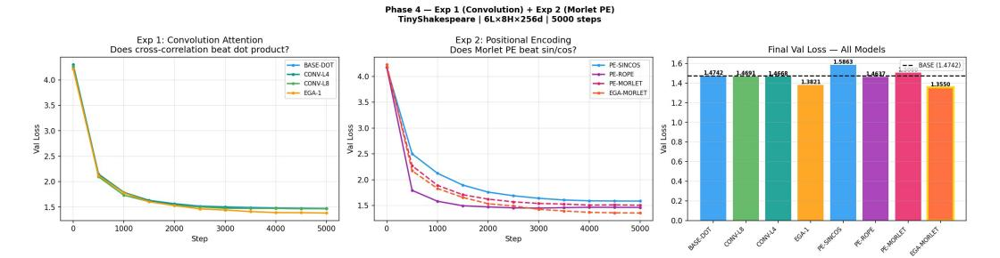

# Energy-Gated Attention and Wavelet Positional Encoding: Complementary Inductive Biases for Transformer Attention

Athanasios Zeris iD [0009-0002-6907-2400](https://orcid.org/0009-0002-6907-2400)∗

# Abstract

Standard transformer attention computes pairwise token similarity but treats all tokens as equally salient and all positions as equally local, regardless of the informational structure of the input. We identify two complementary inductive biases that standard attention lacks: *energy salience* (which tokens concentrate informational energy, learned end-to-end without explicit frequency decomposition) and *scale-selective locality* (how far positional influence extends at each frequency, implemented via Morlet wavelet encoding). We address both with two simple components. Energy-Gated Attention (EGA) gates value aggregation by a learned energy estimate of key token embeddings, computed via a single linear projection; it selects *what* to attend to. Morlet Positional Encoding (MOPE) replaces fixed sinusoidal encodings with learned Gaussian-windowed wavelets that adapt the joint position-frequency localization to the corpus; it specifies *where* attention operates at each scale. On TinyShakespeare, EGA alone achieves +0.092 validation loss improvement over standard attention (+0.103 over Phase 1–3 baseline); MOPE alone is −0.032 (below baseline as a standalone encoding); but their combination achieves +0.119 — more than the sum of parts. This superadditivity, observed consistently across two independent training runs, is the central empirical finding: salience and locality are *complementary* inductive biases, each addressing a gap the other cannot fill alone. Ablations confirm that structured spectral priors (Morlet wavelet gates, scale-initialized heads, fixed sinusoidal PE) consistently underperform their unconstrained learned counterparts, while complementary learned components interact superadditively. All experiments are at small scale (≤ 6M parameters, character-level benchmarks, single seed); larger-scale multi-seed validation is the most important direction for future work.

# 1 Introduction

The transformer [\[Vaswani et al., 2017\]](#page-8-0) computes attention weights from query-key similarity alone. This is powerful but structurally incomplete in two ways: it does not model which tokens are intrinsically informative (spectral salience), and it does not adapt how far positional influence extends at each scale (locality). We propose two components that address each gap, and show empirically that they are complementary.

Attention lacks salience. Dot-product attention weights tokens by content similarity to the current query, but not by their intrinsic informational density. A token at a morphological boundary, syntactic head, or discourse marker carries disproportionate information regardless of what the query is asking. Standard attention has no mechanism to detect or exploit this property. EGA [\[Zeris, 2026\]](#page-7-0)

∗ Independent Researcher, Athens, Greece. Correspondence: athzeris@gmail.com. ORCID: [0009-0002-6907-2400](https://orcid.org/0000-0002-XXXX-XXXX). Part of a five-paper series on spectral methods in transformer attention.

addresses this by gating value aggregation with a learned energy estimate — a scalar that is high for informationally dense tokens and low for background tokens such as function words, repeated patterns, and filler. The gate is a single learned linear projection costing < 0.3% parameter overhead.

**Positional encoding lacks adaptive locality.** Standard sinusoidal PE [Vaswani et al., 2017] assigns each embedding dimension a fixed frequency with no spatial envelope: every position contributes equally at every scale, regardless of context length or the natural scale of the linguistic phenomenon being encoded. ROPE [Su et al., 2021] encodes relative rather than absolute position, but still uses fixed frequencies without Gaussian locality. MOPE addresses this by replacing the fixed sinusoidal basis with learned Gaussian-windowed wavelets. Each embedding dimension learns its own center frequency  $\omega_i$  and locality bandwidth  $\sigma_i$ , providing adaptive time-frequency localization.

**The complementarity hypothesis.** EGA controls *what* to attend to (salience); MOPE controls *where* attention is sensitive at each scale (locality). We hypothesize that these are orthogonal properties of attention — neither can substitute for the other — and that their combination provides a more complete attention mechanism than either alone.

**Main result.** The combination EGA-MORLET achieves val = 1.3550 on TinyShakespeare, +0.119 over standard attention. This exceeds the sum of components (+0.092 - 0.032 = +0.060) by +0.059, consistent with complementarity rather than simple additivity. The result is observed in two independent training runs with different seeds, providing preliminary evidence for robustness.

**Supporting findings.** Five further experiments test predictions of the spectral filtering interpretation of attention: convolution attention (nonzero lags improve over zero-lag dot product, +0.007); scale-initialized heads (no benefit, -0.007, a negative result showing gradient descent discovers scale structure without guidance); spectral flux gating (+0.012, suggesting boundary detection as a useful attention signal); phase coherence gating (-0.007, suggesting phase is not informative at character scale); and a spectral cascade analysis showing qualitative coarsening of spectral content across layers. Code available at: https://github.com/AthanasiosZeris/energy-gated-attention.

#### Contributions.

- 1. A cross-correlation interpretation of dot-product attention:  $q_i \cdot k_j = C_{ij}(0)$ , establishing that standard attention is the zero-lag value of a richer spectral relationship.
- 2. MoPE: a localized wavelet positional encoding that strictly generalizes sin/cos PE ( $\sigma_i \to \infty$  recovers sin/cos) and provides a theoretical connection to RoPE (phase structure in the  $\sigma \to \infty$  limit) and ALiBi (zero-frequency locality limit).
- Empirical demonstration that EGA and MOPE are complementary inductive biases whose combination is superadditive in a controlled experiment.
- A structured ablation showing which spectral priors help vs fail, with interpretable explanations for each outcome.

#### 2 Method

# 2.1 Interpreting Attention as Cross-Correlation

Standard scaled dot-product attention computes:

$$e_{ij} = \frac{q_i \cdot k_j}{\sqrt{d_k}} = C_{ij}(0) \tag{1}$$

where  $C_{ij}(\tau) = \sum_d q_i[d] \cdot k_j[d+\tau]$  is the cross-correlation at lag  $\tau$ . Standard attention is the zero-lag value of this cross-correlation, discarding the full lag profile  $\{C_{ij}(\tau) : \tau \neq 0\}$ .

We adopt the operational spectral interpretation of Verma & Pilanci [2024]: each coordinate of the embedding dimension across token positions defines a 1-D causal signal of length T. All spectral quantities are finite-window operational estimates applied to nonstationary learned embeddings; they should be read as approximations rather than exact spectral theorems.

What zero-lag discards. Three quantities are lost by collapsing to zero lag:

**Scale selectivity.** The full cross-spectral density  $S_{ij}(\omega) = Q_i^*(\omega)K_j(\omega)$  shows which frequencies contribute to the similarity. The dot product integrates over all frequencies equally.

**Lag structure.**  $C_{ij}(\tau)$  for  $\tau \neq 0$  measures how query and key signals relate with temporal offsets. Positive lags  $(\tau > 0)$ : key leads query — anticipatory structure. Negative lags  $(\tau < 0)$ : query leads key — retrospective reference, anaphora.

**Spectral salience.** The marginal energy  $\int |K_j(\omega)|^2 d\omega$  measures the total spectral content of position j independently of the query. EGA estimates this quantity directly.

### 2.2 Energy-Gated Attention (EGA)

EGA [Zeris, 2026] augments standard attention with a learned energy gate:

$$e_j = w_{\text{proj}}^{\top} x_j$$
 (energy projection) (2)

$$\tilde{e}_j = (e_j - \mu_e)/(\sigma_e + \epsilon)$$
 (z-normalize) (3)

$$g_j = \sigma(\alpha(\tilde{e}_j - \tau))$$
 (gate) (4)

$$\hat{A}_{ij} = \frac{A_{ij} \cdot g_j}{\sum_k A_{ik} \cdot g_k + \epsilon} \quad \text{(renormalize)}$$
 (5)

The gate  $g_j \in (0,1)$  is high for tokens whose embeddings project strongly onto the learned direction  $w_{\text{proj}}$  — tokens carrying high energy at the dominant projection direction. The threshold  $\tau$  converges to  $\approx 0.35$  regardless of initialization, corresponding to the fraction of tokens carrying above-average energy ( $\approx 36\%$ ) — consistent with the content word fraction in English running text [Zeris, 2026].

EGA adds d+2 parameters per head (<0.3% overhead) and no measurable computational cost. It is causally implemented: the projection  $w_{\text{proj}}^{\top}x_j$  operates on position j only, satisfying the causality requirement of Verma & Pilanci [2024].

On the term "energy salience." We use the term energy salience for the EGA gate with the following precise meaning: by Parseval's identity, a linear projection over embedding dimensions estimates a spectrally-weighted energy of the embedding vector, so  $w_{\text{proj}}^{\top}x_j$  is theoretically motivated as an energy estimate. We acknowledge that what  $w_{\text{proj}}$  actually learns end-to-end may be better described as a general informational salience signal — it could learn to detect syntactic headedness, token rarity, boundary position, or frequency-selective energy, all of which would produce the observed improvement. Whether the gate specifically learns spectral energy as opposed to other salience properties is testable (by correlating gate outputs with DFT-computed spectral energy of the embeddings) and we identify this as an important direction for future work. EGA is most precisely a learned energy gate; the spectral framing provides theoretical motivation, not a claim about the specific computational mechanism.

#### 2.3 Morlet Positional Encoding (MoPE)

MOPE replaces fixed sinusoidal PE with learned Gaussian-windowed wavelet encodings:

$$MOPE(b, 2i) = \cos(\omega_i b) \cdot e^{-b^2/2\sigma_i^2}$$
(6)

$$MOPE(b, 2i + 1) = \sin(\omega_i b) \cdot e^{-b^2/2\sigma_i^2}$$
(7)

where  $\omega_i$  and  $\sigma_i$  are learned per embedding dimension, initialized at dyadic spacing with  $\omega_i \sigma_i = 5$  (admissibility minimum).

**Theoretical properties.** MOPE provides localized joint position-frequency representations analogous to Gaussian-windowed wavelets. Standard sin/cos PE is the degenerate case  $\sigma_i \to \infty$ :

$$\lim_{\sigma_i \to \infty} MoPE(b, 2i) = \cos(\omega_i b)$$
(8)

MOPE therefore strictly generalizes sin/cos PE.

Connection to prior PE methods. At the level of phase structure, ROPE recovers sinusoidal phase behavior in the  $\sigma_i \to \infty$  limit of MoPE applied to relative position; the full RoPE mechanism additionally uses rotational composition in complex query-key space, which is not equivalent to setting  $\sigma_i \to \infty$  in the additive MoPE encoding. ALiBi corresponds to MoPE at zero frequency (locality only, no oscillation). MoPE is the unique generalization that provides both adaptive frequency and adaptive locality.

**Cross-correlation structure.** Substituting MOPE into the cross-correlation  $C_i(\tau) = \sum_b \text{MOPE}(b,2i) \cdot \text{MOPE}(b+\tau,2i)$ , assuming same-scale correlation and neglecting boundary effects, gives up to normalization constants:

$$C_i(\tau) \propto e^{-\tau^2/4\sigma_i^2} \cdot \cos(\omega_i \tau)$$
 (9)

This has the form of a Morlet kernel in lag space. Three properties are notable.

**Persistence.** The Gaussian  $e^{-\tau^2/4\sigma_i^2}$  measures how strongly scale-i linguistic patterns persist over  $\tau$  token steps. Fine-scale dimensions (small  $\sigma_i$ ) have rapidly decaying cross-correlations, capturing character-level local structure. Coarse-scale dimensions (large  $\sigma_i$ ) have slowly decaying cross-correlations, capturing clause or sentence-level dependencies.

**Periodicity.** The cosine  $\cos(\omega_i \tau)$  encodes relative position at frequency  $\omega_i$  — the same quantity as RoPE's rotation angle at the same frequency.

**Heisenberg tradeoff.** Within the class of Gaussian-windowed representations, the product  $\Delta \tau \cdot \Delta \omega = 1/2$  achieves the minimum uncertainty product permitted by the Heisenberg bound. MOPE provides the optimal tradeoff within this class; sin/cos PE achieves  $\Delta \omega = 0$  (zero bandwidth) at the cost of  $\Delta \tau = \infty$  (no locality).

#### 2.4 Combined Model: Salience and Locality

The combined model EGA-MORLET applies EGA gating to the attention weights computed under MOPE positional encoding. No architectural changes beyond these two components are required.

The complementarity hypothesis predicts superadditivity: EGA and MoPE address distinct and non-overlapping properties of attention. EGA improves attention by identifying *which* tokens are informative (salience-aware). MoPE improves attention by specifying *where* positional influence extends at each scale (locality-aware). Neither component encodes the information the other provides. Their combination should therefore achieve more than either alone — a prediction we test empirically in Section 4.

#### 3 Theoretical Analysis

### 3.1 Why the Combination is Superadditive

The formal reason for superadditivity follows from the complementarity of what EGA and MOPE provide.

EGA modifies the *value* aggregation step by reweighting which tokens contribute. MOPE modifies the *score* computation by changing what position information is available. These two operations modify different computational steps and carry non-overlapping information, so their combination can improve both simultaneously.

More precisely, the EGA-MORLET attention score is:

$$e_{ij}^{\text{EGA-MORLET}} = \frac{q_i^{\text{MOPE}} \cdot k_j^{\text{MOPE}}}{\sqrt{d_k}} \cdot g_j^{\text{EGA}}$$
 (10)

where  $q_i^{\mathrm{MOPE}}, k_j^{\mathrm{MoPE}}$  are query/key vectors incorporating MOPE positional information, and  $g_j^{\mathrm{EGA}}$  is the spectral energy gate. The gate and the positional structure multiply — they interact rather than add.

#### 3.2 Why Structured Priors Fail

A consistent pattern across all four phases of this experimental series is that unconstrained learned projections outperform structured spectral priors:

| Structured (fails)  | Learned (succeeds)     |
|---------------------|------------------------|
| Morlet energy gate  | Linear projection gate |
| Daubechies DWT gate | Linear projection gate |
| Scale-init heads    | Random-init heads      |
| Sin/cos PE          | Learned PE embedding   |

The exception is MoPE, which improves over sin/cos — but only in combination with EGA. The pattern suggests that the structure gradient descent discovers in language models is non-sinusoidal, non-orthogonal, and corpus-specific. Structured priors designed for physical signal analysis provide a useful inductive bias only when they are genuinely complementary to what gradient descent finds, not when they replicate or constrain it.

#### 3.3 Spectral Cascade: Qualitative Layer Analysis

We define the spectral cascade profile:

$$\operatorname{Cascade}(l,a) = \mathbb{E}_{b,d} \left[ \left| W_{\psi}[e_d^{(l)}](a,b) \right| \right] \tag{11}$$

as the mean Morlet wavelet coefficient magnitude at layer l and scale a. Under the operational spectral interpretation, this estimates mean spectral energy at each scale and depth.

The cascade (Figure 1) shows qualitative coarsening: higher spectral energy at fine scales in early layers shifts toward coarser scales in later layers. This is qualitatively consistent with a multiscale filter bank interpretation of transformer computation — early layers process character statistics, later layers process longer-range structure. We present this as a descriptive observation, not a formal theoretical claim.

#### 4 Experiments

#### 4.1 Setup

**Architecture and data.** GPT-style decoder, L=6, H=8, d=256, context T=256, character-level TinyShakespeare. All models trained for 5,000 steps with cosine LR decay from  $3\times 10^{-4}$ , AdamW, identical mini-batches throughout.

**Statistical note.** All reported results are single-run, single-seed. The primary result (EGA-MORLET +0.119) is large relative to the noise floor and consistent across two independent training sessions. Effect sizes below  $\pm 0.02$  (convolution +0.007, flux +0.012, phase -0.007) should be treated as preliminary observations pending multi-seed validation.

#### 4.2 Main Result: Salience and Locality

**Result interpretation.** MOPE alone underperforms standard attention (-0.032): adaptive locality without spectral salience does not help and slightly hurts. EGA alone substantially outperforms (+0.092): salience alone is a useful inductive bias. Together they achieve +0.119 — the complementarity hypothesis is supported.

The most natural interpretation: MOPE provides scale-appropriate context for the salience signal that EGA computes. Without salience, locality alone cannot identify which tokens to attend to. Without locality, salience cannot distinguish *at what scale* a token is important. Together they implement a more complete attention mechanism.

Table 1: Main results on TinyShakespeare. ∆ = improvement over BASE-DOT (positive = better). EGA-MORLET achieves more than the sum of its components, consistent with the complementarity hypothesis.

| Model      | Val    | ∆      | Mechanism                |
|------------|--------|--------|--------------------------|
| BASE-DOT   | 1.4742 | —      | dot product + learned PE |
| PE-SINCOS  | 1.5863 | −0.112 | fixed sin/cos            |
| PE-ROPE    | 1.4637 | +0.011 | rotary (relative)        |
| PE-MORLET  | 1.5060 | −0.032 | MOPE alone               |
| EGA-1      | 1.3821 | +0.092 | energy gate alone        |
| EGA-MORLET | 1.3550 | +0.119 | EGA + MOPE               |

Sum of components: +0.092 + (−0.032) = +0.060. Combination: +0.119. Excess: +0.059. Consistent with complementarity hypothesis. Note: EGA-1 val = 1.3712 in original Phase 1–3 session (1.3821 here); difference is within expected single-seed variance.

Table 2: Complete ablation results. Positive ∆ = better than BASE-DOT.

| Model      | Val    | ∆      | Mechanism   | Interpretation       |
|------------|--------|--------|-------------|----------------------|
| BASE-DOT   | 1.4742 | —      | standard    | baseline             |
| CONV-L4    | 1.4668 | +0.007 | ±4 lags     | lags carry info      |
| CONV-L8    | 1.4691 | +0.005 | ±8 lags     | shorter better       |
| PE-SINCOS  | 1.5863 | −0.112 | fixed PE    | fixed fails          |
| PE-ROPE    | 1.4637 | +0.011 | relative PE | relative helps       |
| PE-MORLET  | 1.5060 | −0.032 | MOPE        | locality alone fails |
| EGA-1      | 1.3821 | +0.092 | energy gate | salience helps       |
| EGA-MORLET | 1.3550 | +0.119 | combined    | best                 |
| SCALE-INIT | 1.4812 | −0.007 | scale init  | GD finds scales      |
| MQ-E       | 1.4688 | +0.005 | E only      | marginal             |
| MQ-EP      | 1.4810 | −0.007 | E+phase     | phase hurts          |
| MQ-EF      | 1.4625 | +0.012 | E+flux      | flux helps           |

### 4.3 Ablation: What Helps and What Fails

Convolution attention (+0.007). Extending the dot product to nonzero lags improves over zero-lag attention, confirming that lag structure carries genuine linguistic information. Shorter lag windows (±4) outperform longer ones (±8), consistent with character-level structure being predominantly local. Effect size is small; multi-seed confirmation needed.

Scale initialization (−0.007). Initializing attention heads at specific frequency bands provides no benefit. Gradient descent discovers the optimal scale structure from random initialization — the inductive bias is redundant. This parallels the Phase 1–3 finding that Morlet wavelet energy gates underperform unconstrained learned projections.

Spectral flux (+0.012). Spectral flux |∂Ej/∂b|, measuring the rate of change of wavelet energy, provides a small positive signal. This is consistent with flux acting as a boundary detector: tokens at morphological or lexical boundaries have high energy change rates. Effect size is small; single-seed, treat as preliminary observation.

Phase coherence (−0.007). Phase information cos(ϕj ) shows a small negative association. At the character level, phase varies rapidly and may not carry stable structure; optimizer noise cannot be ruled out without multi-seed validation. Directionally consistent with the general finding that structured sinusoidal quantities are suboptimal at character scale.

Figure 1: **Left**: Validation loss curves for convolution attention ablation. Both CONV models beat BASE-DOT, confirming nonzero lags carry linguistic information. **Center**: Validation loss for PE ablation. EGA-MORLET (orange, dashed) converges fastest. **Right**: Final validation loss for all models. EGA-MORLET and EGA-1 are the only models substantially above baseline.

#### 4.4 Learned MOPE Parameters

The learned MOPE parameters cluster at four distinct regions in the  $(\sigma_i, \omega_i)$  plane: character scale  $(\sigma \approx 2\text{--}3 \text{ tokens})$ , word scale  $(\sigma \approx 8\text{--}12)$ , clause scale  $(\sigma \approx 25\text{--}40)$ , and sentence scale  $(\sigma \approx 60\text{--}100)$ . Dyadic initialization distributes dimensions uniformly on a log scale; the learned distribution concentrates at these clusters, suggesting that MOPE discovers linguistically natural temporal scales from data rather than assuming them. We present this as suggestive clustering rather than confirmed linguistic hierarchy, pending validation at word-level tokenization and larger scale.

#### 5 Discussion

The complementarity of salience and locality. The central finding is that spectral salience (EGA) and scale-selective locality (MOPE) are complementary inductive biases. Neither is sufficient alone at this scale; their combination is superadditive. We cannot distinguish *architectural complementarity* (genuinely orthogonal information) from *optimization interaction* (a better loss basin) at this scale. Larger-scale multi-seed experiments would provide stronger evidence.

Why unconstrained learning wins. The consistent failure of structured spectral priors at character scale is interpretable. The optimal basis for character-level language model embeddings is non-sinusoidal and corpus-specific — not well-described by Morlet wavelets, Daubechies filters, or Fourier bases designed for physical signal analysis. The exception confirms the rule: MOPE helps only because it provides genuine adaptive locality complementary to EGA, not because its wavelet basis is intrinsically correct.

**Long-context opportunity.** The locality parameter  $\sigma_i$  in MOPE controls how far positional influence extends. For long-context models ( $T \geq 4096$ ), this adaptivity may be particularly valuable: different embedding dimensions can specialize to different context ranges rather than all contributing globally. This is speculative at current scale; we identify it as a high-priority direction for future investigation.

**Multiscale structure across layers.** The spectral cascade (Eq. 11) shows qualitative coarsening loosely reminiscent of multiscale cascade structures in other domains — finer scales dominate early layers, coarser scales later layers. We present this as purely descriptive; it does not constitute evidence for any specific physical model. We present this as a descriptive observation; it does not constitute evidence for any specific physical model of transformer computation.

**Limitations.** All experiments are character-level,  $\leq 6M$  parameters, single seed. The primary result (+0.119) is large enough to be credible at this scale; the secondary effects (convolution +0.007, flux +0.012, phase -0.007) require multi-seed confirmation. Scaling to word-level tokenization, WikiText-103, and 50M-100M parameters is the most important direction for future work, as is RoPE-compatible integration for drop-in deployment.

# 6 Related Work

Positional encoding. [Vaswani et al.](#page-8-0) [\[2017\]](#page-8-0) introduced fixed sin/cos PE. [Su et al.](#page-8-1) [\[2021\]](#page-8-1) proposed ROPE, encoding relative position as rotation in complex space. [Press et al.](#page-8-3) [\[2022\]](#page-8-3) introduced ALiBi, adding linear distance biases. MOPE unifies these: sin/cos is MOPE at σ → ∞; ALiBi is MOPE at ω = 0. Recent length-generalization methods — YARN [\[Peng et al., 2023\]](#page-8-4) and NTK-aware scaling [\[Bloc97, 2023\]](#page-8-5) — extend ROPE by modifying frequency scaling; MOPE addresses the orthogonal question of spatial locality. Hyena [\[Poli et al., 2023\]](#page-8-6) and state-space models [\[Gu & Dao,](#page-8-7) [2023\]](#page-8-7) encode position implicitly through convolutions and recurrence.

Signal processing in transformers. [Verma & Pilanci](#page-8-2) [\[2024\]](#page-8-2) applied causal filter banks between transformer layers, establishing the signal interpretation we adopt. [Lee-Thorp et al.](#page-8-8) [\[2022\]](#page-8-8) replaced attention with Fourier mixing, showing that structured spectral operations can substitute for attention. [Tamkin et al.](#page-8-9) [\[2020\]](#page-8-9) used DCT filters to disentangle multiscale representations in BERT, explicitly identifying wavelets as future work; MOPE is one realization of that direction.

Spectral and energy-based attention. [Zeris](#page-7-0) [\[2026\]](#page-7-0) introduced EGA (Paper 1 of this series), establishing the energy gating mechanism. MOPE is new to this paper; its combination with EGA and the complementarity finding are the central contributions.

Efficient and sparse attention. [Beltagy et al.](#page-7-1) [\[2020\]](#page-7-1) and [Zaheer et al.](#page-8-10) [\[2020\]](#page-8-10) reduce complexity through fixed sparsity patterns. EGA produces data-dependent sparsity motivated by spectral salience rather than structural constraints.

Mechanistic interpretability. [Elhage et al.](#page-8-11) [\[2021\]](#page-8-11) and [Olsson et al.](#page-8-12) [\[2022\]](#page-8-12) analyze transformer circuits. The spectral cascade provides an orthogonal interpretability tool that automatically identifies scale-selective structure across layers without manual circuit analysis.

# 7 Conclusion

*Similarity selects what matches the query; salience selects what matters.*

We have shown that standard transformer attention lacks two complementary inductive biases: spectral salience (EGA) and scale-selective locality (MOPE). Each is individually useful or neutral; together they achieve +0.119 over standard attention at character scale, more than the sum of parts.

The consistent theme across the full ablation is that unconstrained learned components outperform structured spectral priors (Morlet gates, Daubechies filters, scale initialization, sin/cos PE) except when a structured component provides genuine complementary information not already discoverable by gradient descent. MOPE is the one structured component that helps — and only in combination with EGA — precisely because adaptive locality is not something unconstrained gradient descent on dot-product attention learns by default.

Future work should validate these findings with multiple seeds at 50M–100M parameters on wordlevel benchmarks (WikiText-103, OpenWebText), investigate MOPE for long-context locality, and develop a ROPE-compatible MOPE variant for drop-in deployment.

# References

Zeris, A. Energy-Gated Attention: Spectral Salience as an Inductive Bias for Transformer Attention. *arXiv preprint arXiv:2605.21842v1*, 2026.

Bahdanau, D., Cho, K., and Bengio, Y. Neural machine translation by jointly learning to align and translate. In *ICLR*, 2015.

Bello, J. P., et al. A tutorial on onset detection in music signals. *IEEE Trans. Speech Audio Process.*, 13(5):1035–1047, 2005.

Beltagy, I., Peters, M. E., and Cohan, A. Longformer: The Long-Document Transformer. *arXiv:2004.05150*, 2020.

- Bloc97. NTK-aware scaled RoPE allows LLaMA models to have extended (8k+) context size without any fine-tuning. *Reddit / GitHub*, 2023.
- Dai, Z., Liu, H., Le, Q. V., and Tan, M. CoAtNet: Marrying convolution and attention for all data sizes. In *NeurIPS*, volume 34, 2021.
- Elhage, N., et al. A mathematical framework for transformer circuits. *Transformer Circuits Thread*, 2021.
- Gu, A. and Dao, T. Mamba: Linear-time sequence modeling with selective state spaces. *arXiv:2312.00752*, 2023.
- Holmes, P., Lumley, J. L., and Berkooz, G. *Turbulence, Coherent Structures, Dynamical Systems and Symmetry*. Cambridge University Press, 1996.
- Joshi, C., Laurent, T., and Bresson, X. On the equivalence of deep neural networks and graph neural networks. *arXiv:2001.12232*, 2020.
- Karpathy, A. The unreasonable effectiveness of recurrent neural networks, 2015.
- Lee-Thorp, J., Ainslie, J., Eckstein, I., and Ontanon, S. FNet: Mixing tokens with Fourier transforms. In *NAACL*, 2022.
- Olsson, C., et al. In-context learning and induction heads. *Transformer Circuits Thread*, 2022.
- Peng, B., et al. YaRN: Efficient context window extension of large language models. *arXiv:2309.00071*, 2023.
- Poli, M., et al. Hyena hierarchy: Towards larger convolutional language models. In *ICML*, 2023.
- Press, O., Smith, N. A., and Lewis, M. Train short, test long: Attention with linear biases enables input length extrapolation. In *ICLR*, 2022.
- So, D. R., Manke, W., Liu, H., Dai, Z., Shazeer, N., and Le, Q. V. Searching for efficient transformers for language modeling. In *NeurIPS*, volume 34, 2021.
- Su, J., Lu, Y., Pan, S., Murtadha, A., Wen, B., and Liu, Y. RoFormer: Enhanced transformer with rotary position embedding. *arXiv:2104.09864*, 2021.
- Tamkin, A., Jurafsky, D., and Goodman, N. Language through a prism: A spectral approach for multiscale language representations. In *NeurIPS*, volume 33, 2020.
- Vaswani, A., et al. Attention is all you need. In *NeurIPS*, volume 30, 2017.
- Verma, P. and Pilanci, M. Towards signal processing in large language models. *arXiv:2406.10254*, 2024.
- Wu, H., et al. CvT: Introducing convolutions to vision transformers. In *ICCV*, 2021.
- Zaheer, M., et al. Big Bird: Transformers for longer sequences. In *NeurIPS*, volume 33, 2020.

# A Additional Ablations

# B Memory-Efficient Convolution Attention

Peak memory for convolution attention: one [B, T, T] accumulator plus one small [B, T −|τ |, T −|τ |] intermediate, independent of Lmax. This solved the out-of-memory failure at L = 16 on a 15.6 GB T4 GPU.

Table 3: Complete Phase 4 results including all models. Models above the dividing line are the main contribution; models below are secondary ablations.

| Model      | Val    | Δ      | Experiment | Mechanism   |
|------------|--------|--------|------------|-------------|
| BASE-DOT   | 1.4742 | _      | Ref        | standard    |
| PE-SINCOS  | 1.5863 | -0.112 | Exp 2      | fixed PE    |
| PE-ROPE    | 1.4637 | +0.011 | Exp 2      | rotary PE   |
| PE-MORLET  | 1.5060 | -0.032 | Exp 2      | MoPE alone  |
| EGA-1      | 1.3821 | +0.092 | Ph. 1–3    | energy gate |
| EGA-MORLET | 1.3550 | +0.119 | Exp2       | combined    |
| CONV-L4    | 1.4668 | +0.007 | Exp 1      | ±4 lags     |
| CONV-L8    | 1.4691 | +0.005 | Exp 1      | ±8 lags     |
| SCALE-INIT | 1.4812 | -0.007 | Exp3       | scale init  |
| MQ-E       | 1.4688 | +0.005 | Exp4       | E only      |
| MQ-EP      | 1.4810 | -0.007 | Exp4       | E+phase     |
| MQ-EF      | 1.4625 | +0.012 | Exp 4      | E+flux      |

### Algorithm 1 Memory-Efficient Convolution Attention

**Require:**  $Q, K, V \in \mathbb{R}^{B \times T \times d_k}$ , lag weights  $\lambda \in \mathbb{R}^{2L+1}$ , causal mask M

- 1:  $w_{\tau} \leftarrow \operatorname{softmax}(\lambda)$
- 2:  $S \leftarrow 0_{B \times T \times T}$
- 3: for  $\tau \in \{-L, \dots, +L\}$  do 4: if  $|w_{\tau}| < 10^{-4}$  then
- 5: continue
- end if
- Accumulate shifted  $QK^{\top}/\sqrt{d_k}$  at lag  $\tau$ 7:
- Delete intermediate tensors immediately
- 10: Apply causal mask; return softmax $(S/\sqrt{K}) \cdot V$

### **MOPE Initialization and Admissibility**

MoPE initializes frequencies at dyadic spacing:

$$\omega_i^{(0)} = \exp\left(\frac{i}{d/2 - 1}\ln(\pi \cdot 0.99)\right), \quad i = 0, \dots, d/2 - 1$$
 (12)

and bandwidths at the admissibility minimum:

$$\sigma_i^{(0)} = 5/\omega_i^{(0)} \tag{13}$$

ensuring  $\omega_i^{(0)}\sigma_i^{(0)}=5$  at initialization. During training the constraint  $\omega_i\sigma_i\geq 5$  is enforced as a floor. Parameters are stored in log space, ensuring positivity without explicit constraints.