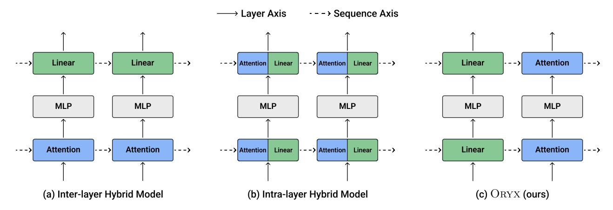
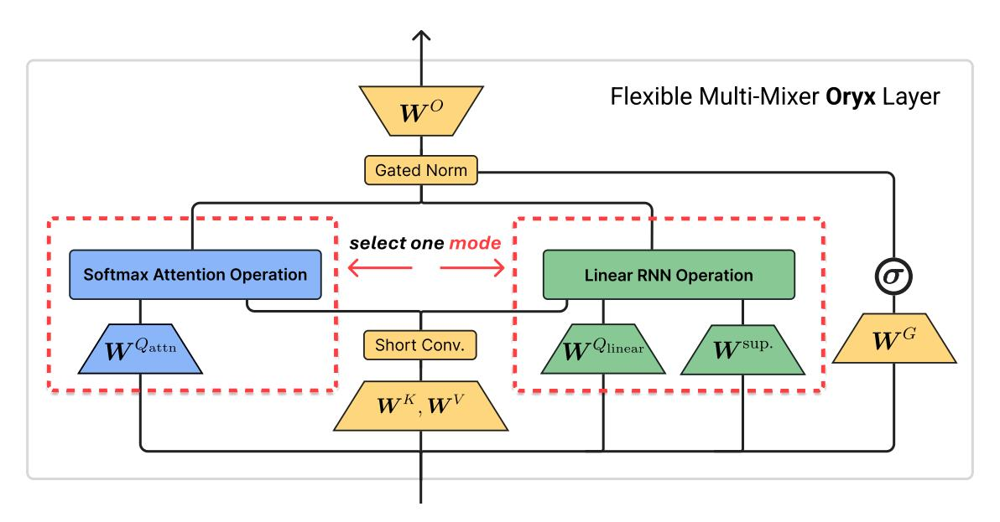
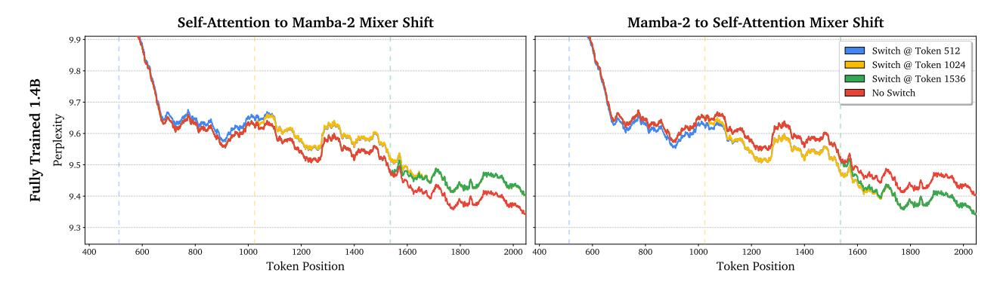
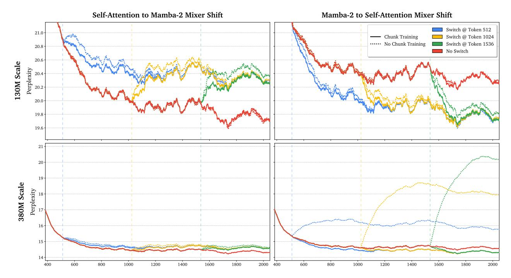
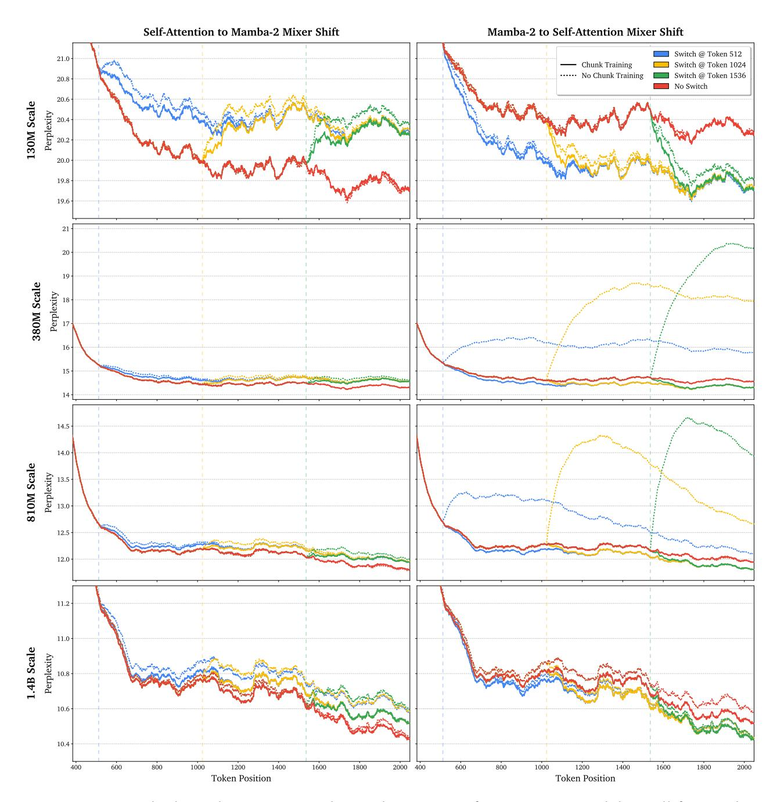
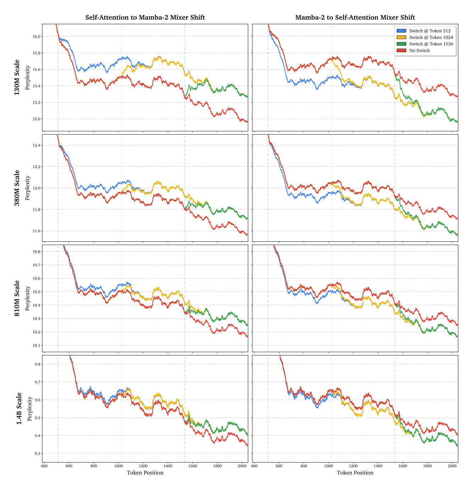
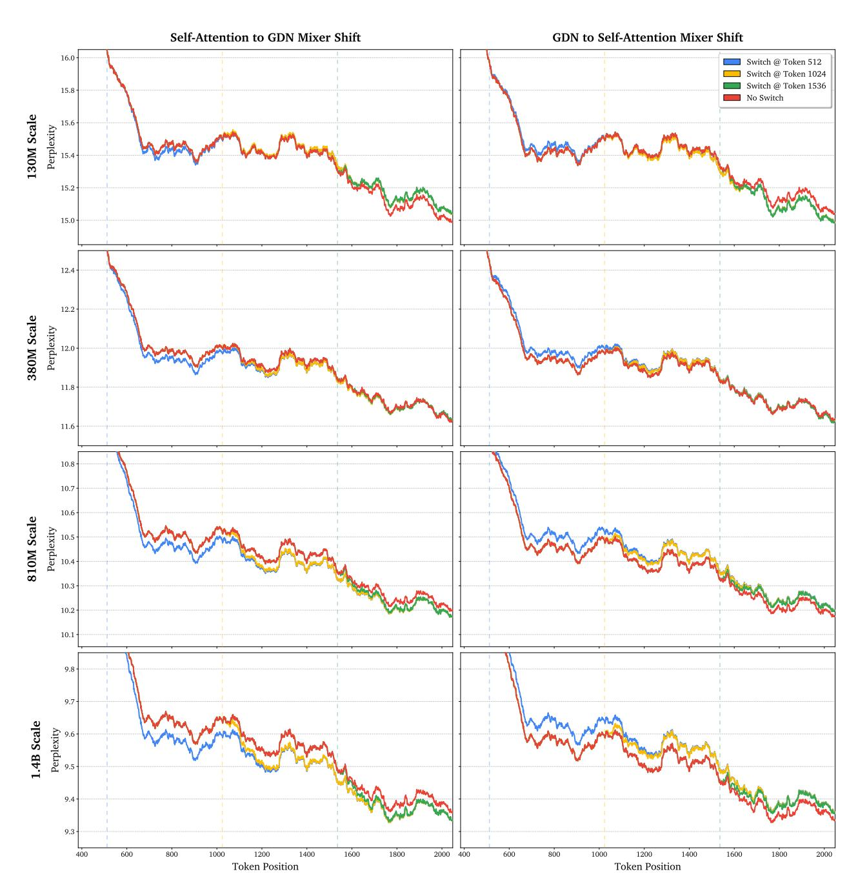
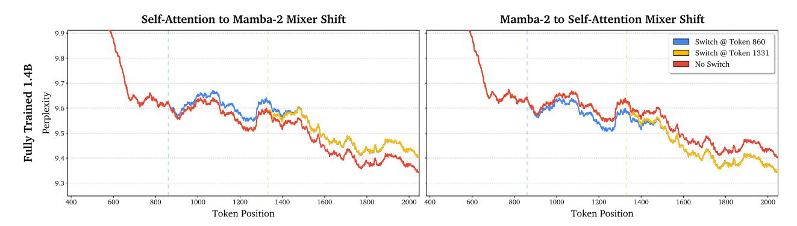
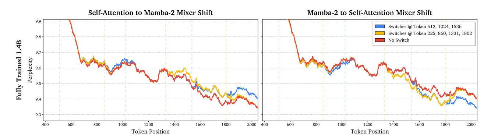
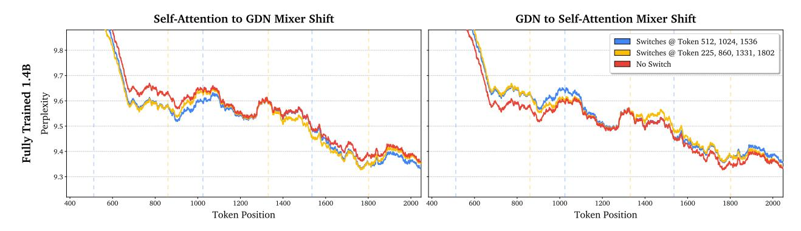

# **Multi-Mixer Models: Flexible Sequence Modeling with Shared Representations**

**Kevin Y. Li**1,\***, Asher Trockman**<sup>2</sup> **, Ananda Theertha Suresh**<sup>2</sup> **and Ziteng Sun**<sup>2</sup> <sup>1</sup>Carnegie Mellon University, <sup>2</sup>Google Research, \*Work done while the author was at Google Research.

**Softmax attention is the cornerstone of modern large language models. However, its memory requirements scale linearly with sequence length, and its compute requirements scale quadratically. Linear recurrent models, such as linear attention and state space models, have become widely studied as alternatives to softmax attention due to their linear compute and constant memory requirements. While these sub-quadratic token mixing methods (mixers) achieve promising efficiency gains and competitive results on a wide range of benchmarks, current linear recurrent models still lag behind on tasks that require long-context retrieval or in-context learning. A growing body of work studies hybrid architectures that attempt to mitigate these trade-offs by statically interleaving or merging attention and recurrent blocks. In this work, we explore a new axis of developing hybrid models: across the token sequence. We propose Oryx, a hybrid model that can, throughout a sequence, flexibly switch between different mixers, e.g., quadratic attention, for rich context utilization, and linear recurrences, for efficient generation. Oryx ties at least 90% of its parameters across mixers, enabling attention and recurrent modes to operate over shared internal representations. We validate our design with Mamba-2 and Gated DeltaNet variants, up to 1.4B models. Under fixed token budgets and a mixed-training strategy, Oryx achieves comparable or better performance than its single-mixer baselines. At the 1.4B scale, all instances of Oryx outperform their respective baselines by at least 0.7 percentage points on averaged language modeling tasks. On retrieval tasks, Oryx achieves performance comparable to the Transformer baseline even when processing only a tiny fraction (**<**10%) of the tokens in the attention mode. These results suggest that attention and linear recurrent models can share internal representations, and motivate sequence-axis hybridization as a promising direction.**

## **1. Introduction**

The Transformer architecture and its core softmax attention mechanism remain the dominant foundation for modern large language models (LLMs). However, softmax attention maintains a key-value (KV) cache of all previous tokens and queries the full cache at each step, incurring quadratic compute and linear memory requirements in sequence length. These costs have motivated the recent proliferation of sub-quadratic alternatives, in particular, linear recurrent models, such as linear attention [\(Katharopoulos et al.,](#page-14-0) [2020;](#page-14-0) [Yang et al.,](#page-17-0) [2025a\)](#page-17-0) and state-space models (SSMs) [\(Dao and Gu,](#page-12-0) [2024;](#page-12-0) [Gu and Dao,](#page-13-0) [2024\)](#page-13-0).[1](#page-0-0) These linear models are characterized by their constant-size recurrent state, which is updated after each token, and linearly-scaling compute. While they have demonstrated promising results in many settings, pure recurrent approaches still lag behind on tasks that require strong retrieval or in-context learning abilities [\(Arora et al.,](#page-12-1) [2025a;](#page-12-1) [Waleffe et al.,](#page-17-1) [2024\)](#page-17-1). Such trade-offs have motivated the development and deployment of hybrid architectures, which combine these linear layers with softmax attention to balance performance and efficiency [\(Kimi Team et al.,](#page-14-1) [2025;](#page-14-1) [NVIDIA et al.,](#page-15-0) [2025;](#page-15-0) [Qwen Team,](#page-16-0) [2025;](#page-16-0) [Waleffe et al.,](#page-17-1) [2024\)](#page-17-1).

Existing hybrid models fall under two main paradigms: inter-layer designs, which interleave softmax attention and linear layers, and intra-layer designs, which fuse the output of attention and linear

<span id="page-0-0"></span><sup>1</sup> In this work, we use attention to refer to the canonical quadratic softmax attention mechanism, and use linear to refer to the general class of linear recurrent mechanisms.

<span id="page-1-0"></span>

Figure 1 | Comparison of different hybrid architectures. (a) Inter-layer hybrid models interleave different mixers along the layer axis; (b) Intra-layer hybrid models fuse different mixers within a single layer; (c) Oryx is a sequence-axis hybrid model that can switch between different mixers across the sequence, allowing different segments of the input to be processed by varying mechanisms.

mechanisms within a single layer or block. For both, the computational cost per token and capabilities are largely defined by the predetermined architecture. In practice, however, the required modeling capabilities and desired trade-off vary by task: retrieval tasks may benefit from richer attention-based context utilization, whereas standard language generation tasks may be adequately served by linear computation. This suggests a complementary form of hybridization: instead of choosing a fixed mixture of mechanisms, *can a model operate with different mixers throughout the sequence?*

In this work, we propose Oryx, a sequence-axis hybrid architecture that supports operating in *both* quadratic-attention and linear-recurrent regimes throughout a sequence (Figure [1\)](#page-1-0), trained by a chunked mixed-mode strategy that enables flexible switching during deployment (Section [3\)](#page-3-0). A key challenge in supporting mode switching is that attention and recurrent mixers parameterize and update their state differently. To bridge these mechanisms, Oryx layers maintain a KV cache and a linear recurrent state, updating both jointly at each timestep with key-value pairs obtained from shared weights across mixer types. Thus, both mechanisms update states from a shared representation space, avoiding separate state-update features for each mixer. Consequently, when the mixer mechanism switches, the new selected mixer can continue from a compatible state accumulated over all preceding tokens. This selection flexibility during inference could enable compute allocation at the prompt or token level. For example, reasoning traces could be generated with the linear mixer for lower-latency, and the answer could use the attention mode for better retrieval and summarization.

We instantiate this design with Mamba-2 [\(Dao and Gu,](#page-12-0) [2024\)](#page-12-0) and Gated DeltaNet (GDN) [\(Yang et al.,](#page-17-0) [2025a\)](#page-17-0) as the linear mixer, with both variants *sharing more than* 90% *of parameters across mixer modes*. Although our experimental validation focuses on Mamba-2 and GDN, we underscore that our overall design is not specific to these choices and can extend to other mixers that admit comparable key-value associations. Our multi-mixer models can switch between attention and linear sequence processing while incurring little to no degradation in output quality (Figure [3\)](#page-8-0), and *under matched parameters and training token budgets*, Oryx remains competitive with pure softmax attention, Mamba-2, and GDN baselines on language modeling performance across scale. At the 1.4B scale, both attention and linear modes of Mamba-2 and GDN variants of Oryx outperform their respective baselines by *more than* 0.7 percentage points on average across downstream language modeling evaluations (Table [1\)](#page-6-0). On a variety of real-world retrieval tasks and synthetic retrieval tasks, Oryx is able to achieve comparable performance compared to the Transformer baseline with <10% of the tokens processed in the attention mode. Using this mixed-inference mode, Oryx *significantly surpasses the*

linear baselines by a margin of at least 8.6 percentage points on real-world retrieval tasks and at least 38.6 percentage points on needle-in-a-haystack (NIAH) tests (Table 3), demonstrating that ORYX is a promising method for improving the retrieval capabilities of linear models. Our findings suggest that attention and linear recurrent mechanisms can share similar representations despite differing largely in methodology, opening new opportunities to study their interplay.

We first introduce preliminary background on sequence mixers and their connections in Section 2. We use their commonality to motivate the design of the multi-mixer ORYX block in Section 3 and highlight the main architectural components. Section 4 evaluates the language modeling and mode-switching ability of the ORYX model and ablates core design choices.

#### <span id="page-2-0"></span>2. Preliminaries

**Notation.** We use the term **mixer** to denote a transformation that mixes information along a particular axis of the input. A **sequence mixer** (e.g., softmax attention) mixes information across the sequence dimension, whereas a **channel mixer** (e.g., an MLP) mixes across the feature or channel dimension. We focus on sequence mixer designs in this paper and use the term mixer to refer to sequence mixer unless otherwise specified. We denote scalars by non-bold symbols (e.g., a), vectors by bold lowercase symbols (e.g., q), and matrices by bold uppercase symbols (e.g., X, W). Subscripts index the first axis by default, while superscripts are reserved for identifiers.

Shared Key-Value Association View. While softmax attention (Vaswani et al., 2017) and modern linear models, e.g., state-space models (Dao and Gu, 2024), linear attention (Katharopoulos et al., 2020), and fast-weight programmers (Schlag et al., 2021; Yang et al., 2025a), differ in how they store and update their state, they can all be unified under the associative memory view (Liu et al., 2024; Wang et al., 2025). Under this view, each mechanism maintains a memory of key-value associations and uses queries to retrieve relevant values from that memory. Their core representations, namely the queries, keys, and values, are obtained through linear projections of the input, parameterized by weight matrices  $W^Q$ ,  $W^K$ , and  $W^V$ . For input  $x \in \mathbb{R}^{1 \times D}$ , we have

$$q = xW^Q$$
,  $k = xW^K$ ,  $v = xW^V$ ,

where  $\{W^Q, W^K\} \in \mathbb{R}^{D \times D_k}, W^V \in \mathbb{R}^{D \times D_v}$ . For input sequence  $X := [x_1; x_2; \dots; x_T] \in \mathbb{R}^{T \times D}$ , we use  $Q = [q_1; q_2; \dots; q_T]$  to denote all queries, and define K and V similarly. This viewpoint provides the basis for the tied-projection design in Section 3.

**Softmax Attention.** For causal softmax attention, the output  $o_t \in \mathbb{R}^{1 \times D_v}$  at timestep t is a weighted aggregation of past values  $V_{\leq t}$  according to the softmax-normalized similarity between the current query  $q_t$  and past keys  $K_{\leq t}$ : softmax $(q_t K_{\leq t}^\top) V_{\leq t}$ . In parallel form, it is expressed as

$$O = \text{Mixer}_{\text{attention}}(Q, K, V) := \text{softmax}(L^{U} + (QK^{T}))V,$$

where  $L^U \in \mathbb{R}^{T \times T}$ ,  $L^U_{ij} = -\infty \cdot \mathbb{I}[i < j]$  is the causal mask. Its state, the KV cache, stores the key and value vectors  $k_t, v_t$  from all previous time steps and therefore grows linearly with sequence length. The mixer output O is passed through the output projection  $W^O \in \mathbb{R}^{D_v \times D}$  to get the final block output in the original input dimension,  $Y = OW^O$ . As this output projection step is present in other models, we will ignore it for clarity from this point onward.

<span id="page-2-1"></span><sup>&</sup>lt;sup>2</sup> We ignore positional encodings and other complementary components, e.g., head structure, head dimension normalization, for clarity.

**Linear Recurrent Neural Networks (RNNs).** In contrast to softmax attention, linear RNNs, which encompass linear attention variants and modern state space models (SSMs), are grounded in their recurrent structure. A key characteristic of these models is their fixed-size states, which enable runtime and memory efficiency. Despite not having an explicit cache of key-value pairs, the states *are* updated with key-value associations at each timestep. In general, a structured transition matrix  $A_t \in \mathbb{R}^{D_k \times D_k}$  adjusts the prior state  $S_{t-1} \in \mathbb{R}^{D_k \times D_v}$  while the current key-value interaction is incorporated via an outer-product. The output is determined using a simple readout with the current query.

$$S_t = A_t S_{t-1} + k_t^{\mathsf{T}} v_t, \qquad o_t = q_t S_t,$$

Thus, its state and output can still be expressed through query, key, and value representations.

**Mamba-2.** The discretized Mamba-2 SSM (Dao and Gu, 2024) is one instantiation of a linear RNN that uses a scalar times identity transition,  $A_t = \alpha_t I$ , where  $\alpha_t$  is an input-dependent decay factor. <sup>3</sup> Its parallel form relies on decay-based lower-triangular mask Γ applied with a Hadamard product ( $\circ$ ), which draws connections to attention variants and highlights the value retrieval mechanism.

$$O = \operatorname{Mixer}_{\operatorname{Mamba-2}}(Q, K, V, X) := \left(\Gamma \circ \left(QK^{\top}\right)\right)V, \quad \Gamma = \begin{bmatrix} 1 & & \\ \alpha_2 & 1 & \\ \alpha_3\alpha_2 & \alpha_3 & 1 \\ \vdots & & \ddots \end{bmatrix}$$

**Gated DeltaNet.** Fast-weight programmers (Schlag et al., 2021; Yang et al., 2025b), such as Gated DeltaNet (Yang et al., 2025a), can also be viewed under this lens. While the memory is queried the same way, the gated delta update rule enables a more expressive state update mechanism

$$S_t = (\alpha_t (I - \beta_t \mathbf{k}_t^{\mathsf{T}} \mathbf{k}_t)) S_{t-1} + \beta_t \mathbf{k}_t^{\mathsf{T}} \mathbf{v}_t, \quad \mathbf{o}_t = \mathbf{q}_t S_t,$$

where  $\alpha_t$ ,  $\beta_t$  are both data-dependent scalars. Like other sub-quadratic alternatives, it also retains a parallel representation. Reusing the decay mask  $\Gamma$  from the Mamba-2 formulation, we have

$$O = \operatorname{Mixer}_{\operatorname{GDN}}(Q, K, V; \Gamma, \boldsymbol{\beta}) := \left(\Gamma \circ \left(QK^{\top}\right)\right) \left[I + \operatorname{strictLower}\left(\operatorname{diag}(\boldsymbol{\beta})\left(\Gamma \circ \left(KK^{\top}\right)\right)\right)\right]^{-1} \operatorname{diag}(\boldsymbol{\beta})V.$$

While these sequence mixers differ in how they store (e.g., KV cache or fixed state), normalize (e.g., softmax, decay mask), and update (e.g., delta rule) key-value associations, their common query-key-value interaction structure provides a useful lens for connecting softmax attention and linear models. This connection motivates the design of our ORYX block in Section 3, where tied projections are used to update both attention and recurrent states from shared representations.

## <span id="page-3-0"></span>3. Designing the Multi-Mixer ORYX Shared Block

In this section, we describe the sequence-mixing ORYX shared block that supports operating in both softmax attention and linear recurrent mechanisms. The resulting block maintains compatible attention and recurrent states and includes architectural components core to the modeling abilities of each mechanism while sharing most of its parameters across mixers (Figure 2). We instantiate the linear mixer as Mamba-2 and Gated DeltaNet (GDN) for concreteness, but our design choices *can* be applied with other linear models with similar query-key-value interactions.

<span id="page-3-1"></span><sup>&</sup>lt;sup>3</sup> In Mamba-2, queries, keys, and values are referred to as C, B, x respectively, but we utilize attention terminology to draw similarities. We also ignore the discretization parameters and the tied nature of  $\alpha_t$  and  $v_t$  in this section for clarity.

<span id="page-4-0"></span>

Figure 2 | General Oryx block. The block shares the core representations between softmax attention and a linear recurrent mechanism through tied key-value projections and uses additional components critical to the linear mechanism's performance, e.g., the short convolution and gate. During a forward pass, the shared key-value representation updates both the KV cache and linear state, allowing either the softmax attention mixer or linear mixer to be chosen as the mode of operation at each timestep.

**Shared Key-Values and Mixer-Specific Queries.** Motivated by the key-value associative memory view (Section [2\)](#page-2-0), Oryx ties the key and value projections across mixer modes, enabling one set of representations, calculated from one forward pass, to update both the attention KV cache and linear recurrent state. While the query projections can also be shared, our empirical results suggest that tying all three core representations across mixers hinders model performance (see details in Section [4.3\)](#page-9-0), and thus, we use unique weights for each mixer's query projection for stronger performance. We conjecture that the differences in their state update and output rules may require different query vectors to extract mode-specific crucial information, a hypothesis supported by empirical results.

**Incorporating Additional Linear Model Components.** Oryx incorporates the short convolution, multiplicative gate, and pre-output projection normalization — common components in current linear models — to retain these important inductive biases. In our implementation, the short convolution is applied to only the shared keys and values before they are passed into the selected Mixer; the queries are not convolved due to being mixer-specific.

For a selected mixer mode ∈ {attention, Mamba-2, GDN}, the block computes[4](#page-4-1)

$$O = \operatorname{Mixer}_{M}(XW^{Q_{M}}, XW^{K}, XW^{V}, X; W^{\sup}),$$

where sup. denotes the additional mixer-specific supporting parameters, either data-dependent or independent, such as discretization or delta-rule parameters. The mixer output is gated element-wise and normalized before the final shared output projection

$$Y = \text{GatedRMSNorm} \left( O, \sigma(XW^G) \right) W^O,$$

where is an activation function, usually SiLU [\(Hendrycks and Gimpel,](#page-13-1) [2016\)](#page-13-1), and ∈ ℝ× is the shared gate projection. The exact normalization and supporting parameters depend on the linear

<span id="page-4-1"></span><sup>4</sup> Rotary embeddings, the short convolution, etc., are abstracted away in the Mixer class. Section [B](#page-18-0) details the exact architecture for each Oryx variant.

mechanism used; we detail the specifics of our variants in Section B. Most parameters, including  $W^K$ ,  $W^V$ ,  $W^G$ , and  $W^O$ , are shared across mixers. Thus, these shared representations can be calculated with one shared forward pass. The general block structure is visualized in Figure 2, and an abstracted version of the pseudocode can be found at Listing 1.

Maintaining Compatible States and Head Structures. At each timestep, ORYX computes shared key and value representations and uses them to update both the attention KV cache and linear recurrent state. While the selected mixer determines the block output, the joint update allows both states to retain the same token history. We note that while both mixer states are maintained, only the updated state of the selected mixer is needed for output computation. However, one issue is that different mixers often use differing head structures. For instance, modern Transformers use attention in a multi-head (MHA) or grouped-query head (GQA) structure, while Mamba-2 adopts a multi-value (MVA) structure. To enable the effective sharing of weight projections, we use the same head structure across mixers, matching that of attention, i.e., MHA in our experiments. Despite this constraint applied on the linear mixers, we find that they remain empirically effective for modeling.

**Chunked Mixed-Mode Training.** To enable robust mode switching capabilities at inference time, we train ORYX with chunked mixed-mode training (see ablation in Section 4.3). Each training sequence is partitioned into fixed-length chunks, e.g., of 128 tokens, and each chunk is randomly assigned a mixer mode, e.g., attention or linear mode. All ORYX blocks use the same chunk assignment, and our experiments find that a 1:3 attention-to-linear chunk training ratio balances the performance.

## <span id="page-5-0"></span>4. Empirical Results and Properties of ORYX

We evaluate the empirical performance and capabilities of ORYX in the following section. Section 4.1 discusses the language modeling (Section 4.1.1) and retrieval (Section 4.1.2) performance of our models when operating using only one mixer mode. Section 4.2 then explores the mode switching capabilities of the model, and Section 4.3 ablates architectural and training design choices.

**ORYX Setup.** Our model follows the Transformer++ setup originating from Touvron et al. (2023) and detailed in Gu and Dao (2024), which includes interleaved SwiGLU MLPs. We use ORYX-TM to denote a self-attention (Transformer)/Mamba-2 shared-block model, and ORYX-TG to denote a self-attention/GDN shared-block model. We set the dimensions of the query, key, and value to be equal, i.e.,  $D_k = D_v$  following standard Transformer convention; however, we fix the head dimension  $D_{k,v} = 128$  across all scales to preserve the recurrent state size. As the gate increases the active parameters, the resulting mixer-to-MLP parameter ratio increases from the baselines Transformer's 4:8 to 5:8. As the MLPs and most sequence-mixer projections are shared across mixers, more than 90% of the weights are jointly used across modes.<sup>5</sup>

**Baseline Setup.** Transformer baselines follow the Transformer++ architecture of Touvron et al. (2023) and head structure of Brown et al. (2020). Mamba-2 baselines interleave Mamba-2 blocks, using  $D_k = 128$ ,  $D_v = 64$  and expansion factor of 2, with SwiGLU MLPs at a 6:6 parameter ratio. Gated DeltaNet baselines similarly interleave GDN blocks, using  $D_k = 128$ ,  $D_v = 256$ , with MLPs at the same 6:6 ratio. To parameter-match models, we increase the MLP widths of the baselines to compensate for the gate in Order blocks (the short convolution leads to a negligible increase).

**Experimental Setup.** We pretrained models at four different scales, each with 100B tokens of FineWeb-Edu (Lozhkov et al., 2024) using the GPT-2 tokenizer (Radford et al., 2019) at 2K context length. A cosine scheduler was used with 10% of total steps allocated to warmup, and AdamW (Loshchilov

<span id="page-5-1"></span><sup>&</sup>lt;sup>5</sup> The percentage calculation excludes the embedding in the total parameter count.

<span id="page-6-0"></span>Table 1 | Downstream language modeling evaluations on parameter-matched models trained with 100B FineWeb-Edu tokens. We compare baseline models, Oryx-TM (Transformer/Mamba-2), and Oryx-TG (Transformer/Gated DeltaNet) at each parameter scale. Best results for each size are **bolded**, and second best are underlined. The Oryx results reported below use the same mixer for the entire model and sequence. Under a fixed training token budget, both modes of our dual mixer Oryx model achieve comparable or better performances than that of single mixer baselines.

|      | Family   | Mixer                                    | LAMB.<br>ppl ↓       | LAMB.<br>acc ↑       | HellaS.<br>acc_n ↑   | PIQA<br>acc ↑        | Arc-E<br>acc ↑       | Arc-C<br>acc_n ↑     | WinoGr.<br>acc ↑     | OBQA<br>acc ↑        | Avg.<br>acc ↑        |
|------|----------|------------------------------------------|----------------------|----------------------|----------------------|----------------------|----------------------|----------------------|----------------------|----------------------|----------------------|
|      | Baseline | Transformer<br>Mamba-2<br>Gated DeltaNet | 42.6<br>41.5<br>36.5 | 32.3<br>29.9<br>32.2 | 39.2<br>40.0<br>40.5 | 66.8<br>67.1<br>68.4 | 58.4<br>60.0<br>62.7 | 28.9<br>27.9<br>28.7 | 51.1<br>52.6<br>51.6 | 19.4<br>22.8<br>22.0 | 42.3<br>42.9<br>43.7 |
| 130M | Oryx-TM  | Transformer<br>Mamba-2                   | 38.2<br>40.3         | 34.3<br>31.1         | 39.3<br>39.8         | 67.7<br>67.4         | 58.7<br>59.0         | 28.1<br>29.0         | 54.0<br>53.7         | 22.4<br>23.2         | 43.5<br>43.3         |
|      | Oryx-TG  | Transformer<br>Gated DeltaNet            | 39.3<br>39.0         | 32.7<br>31.5         | 39.9<br>40.4         | 67.3<br>67.1         | 59.7<br>59.3         | 28.6<br>27.9         | 50.9<br>48.6         | 21.4<br>20.8         | 42.9<br>42.2         |
|      | Baseline | Transformer<br>Mamba-2<br>Gated DeltaNet | 19.5<br>18.3<br>16.5 | 41.1<br>41.3<br>42.4 | 51.0<br>51.8<br>51.4 | 70.8<br>72.1<br>71.2 | 68.2<br>68.5<br>68.6 | 33.6<br>35.2<br>34.6 | 55.7<br>56.6<br>55.3 | 23.8<br>27.0<br>27.2 | 49.2<br>50.4<br>50.1 |
| 380M | Oryx-TM  | Transformer<br>Mamba-2                   | 17.8<br>18.5         | 41.9<br>42.3         | 51.2<br>51.0         | 71.2<br>71.3         | 71.0<br>70.5         | 35.1<br>36.3         | 57.0<br>57.1         | 26.8<br>28.0         | 50.6<br>50.9         |
|      | Oryx-TG  | Transformer<br>Gated DeltaNet            | 19.4<br>18.1         | 40.5<br>40.4         | 51.3<br>51.5         | 71.6<br>71.3         | 67.1<br>68.6         | 33.8<br>34.8         | 55.9<br>57.5         | 24.4<br>25.6         | 49.2<br>50.0         |
|      | Baseline | Transformer<br>Mamba-2<br>Gated DeltaNet | 13.6<br>13.4<br>12.1 | 46.2<br>45.6<br>47.4 | 57.0<br>58.2<br>58.3 | 73.1<br>72.7<br>72.5 | 71.3<br>72.8<br>73.3 | 37.3<br>40.1<br>39.8 | 58.3<br>56.0<br>58.6 | 28.6<br>31.2<br>29.6 | 53.1<br>53.8<br>54.2 |
| 810M | Oryx-TM  | Transformer<br>Mamba-2                   | 12.5<br>11.9         | 48.0<br>48.2         | 58.0<br>57.9         | 73.6<br>73.9         | 73.7<br>73.7         | 39.4<br>39.0         | 59.1<br>59.6         | 31.0<br>30.6         | 54.7<br>54.7         |
|      | Oryx-TG  | Transformer<br>Gated DeltaNet            | 13.4<br>12.8         | 46.2<br>45.8         | 58.1<br>58.4         | 72.8<br>73.1         | 71.5<br>72.4         | 37.5<br>38.5         | 58.5<br>59.4         | 27.8<br>30.8         | 53.2<br>54.0         |
|      | Baseline | Transformer<br>Mamba-2<br>Gated DeltaNet | 11.4<br>11.2<br>10.6 | 49.9<br>48.6<br>49.9 | 60.6<br>60.9<br>61.9 | 74.1<br>74.7<br>75.0 | 73.6<br>74.5<br>75.0 | 42.1<br>42.7<br>42.2 | 58.0<br>58.1<br>60.9 | 31.2<br>30.4<br>31.4 | 55.6<br>55.7<br>56.6 |
| 1.4B | Oryx-TM  | Transformer<br>Mamba-2                   | 11.1<br>10.5         | 50.2<br>50.4         | 61.3<br>62.1         | 75.0<br>75.2         | 75.7<br>75.3         | 42.0<br>43.6         | 58.0<br>58.5         | 31.6<br>31.2         | 56.3<br>56.6         |
|      | Oryx-TG  | Transformer<br>Gated DeltaNet            | 10.9<br>10.6         | 49.9<br>50.0         | 61.8<br>62.1         | 74.9<br>75.1         | 75.4<br>76.2         | 41.7<br>43.1         | 59.8<br>62.0         | 31.8<br>32.2         | 56.5<br>57.3         |

[and Hutter,](#page-14-4) [2019\)](#page-14-4) with = (0.9, 0.95) and 0.1 weight decay was used as the optimizer. For baselines, peak learning rate was set to 5× that of [Brown et al.](#page-12-2) [\(2020\)](#page-12-2), following [Dao and Gu](#page-12-0) [\(2024\)](#page-12-0). A 10× factor was used for Oryx models. We find the increase improves both mixer performances while preserving training stability, potentially mitigating reduced mixer-specific gradients from chunkedtraining and different optimization landscapes induced by tied representations. Training used bfloat16 mixed precision and a global batch size of 1M tokens for 1B models, and 0.5M for the rest.

**Evaluation Setup.** The language modeling abilities of models were evaluated with a suite of standard commonsense reasoning and language understanding tasks: LAMBADA [\(Paperno et al.,](#page-16-4) [2016;](#page-16-4) [Radford](#page-16-3) [et al.,](#page-16-3) [2019\)](#page-16-3), HellaSwag [\(Zellers et al.,](#page-17-5) [2019\)](#page-17-5), PIQA [\(Bisk et al.,](#page-12-3) [2019\)](#page-12-3), Arc-Easy and Challenge [\(Clark](#page-12-4) [et al.,](#page-12-4) [2018\)](#page-12-4), WinoGrande [\(Sakaguchi et al.,](#page-16-5) [2019\)](#page-16-5), and OpenbookQA [\(Mihaylov et al.,](#page-15-1) [2018\)](#page-15-1). We also measured the retrieval capabilities of the 1.4B models on both synthetic needle-in-the-haystack (NIAH)

Table 2 | Retrieval results for 1.4B baseline and Oryx models on real-world and synthetic retrieval tasks at 2K context length. Results reported below use the same mixer for the entire model and sequence. Oryx-TM denotes Transformer/Mamba-2 shared blocks, and Oryx-TG, Transformer/Gated DeltaNet. The isolated modes of Oryx remain comparable in to their corresponding baselines.

|                    | Real-World Retrieval |              |       |      |      | Synthetic Retrieval |      |      |        |        |        |      |
|--------------------|----------------------|--------------|-------|------|------|---------------------|------|------|--------|--------|--------|------|
| Family             | Mixer                | SWDE         | SQuAD | FDA  | TQA  | NQ                  | DROP | Avg. | NIAH-1 | NIAH-2 | NIAH-3 | Avg. |
| Baseline           |                      | 42.3         | 42.8  | 55.2 | 65.9 | 26.7                | 22.9 | 42.6 | 99.0   | 90.4   | 95.0   | 94.8 |
| Oryx-TM            | Transformer          | 50.1<br>44.5 | 41.7  | 57.6 | 63.9 | 28.3                | 22.5 | 44.0 | 99.8   | 99.4   | 81.6   | 93.6 |
| Oryx-TG            |                      |              | 41.2  | 46.4 | 64.8 | 27.8                | 21.7 | 41.1 | 99.4   | 98.6   | 99.4   | 99.1 |
| Baseline           |                      | 20.6         | 36.1  | 21.0 | 61.7 | 22.4                | 20.3 | 30.3 | 90.4   | 15.8   | 33.2   | 46.5 |
| Mamba-2<br>Oryx-TM |                      | 22.2         | 36.4  | 19.4 | 63.7 | 21.8                | 22.3 | 31.0 | 50.8   | 17.0   | 41.0   | 36.3 |
| Baseline           | Gated DeltaNet       | 27.4         | 36.4  | 24.2 | 63.3 | 23.8                | 21.6 | 32.8 | 99.4   | 39.6   | 32.6   | 57.2 |
| Oryx-TG            |                      | 29.3         | 37.9  | 18.2 | 64.0 | 23.5                | 22.0 | 32.5 | 99.4   | 60.2   | 82.8   | 80.8 |

tasks [\(Hsieh et al.,](#page-13-2) [2024\)](#page-13-2) and real-world retrieval tasks in cloze format [\(Arora et al.,](#page-12-5) [2024,](#page-12-5) [2025a\)](#page-12-1): SWDE [\(Arora et al.,](#page-12-6) [2025b;](#page-12-6) [Lockard et al.,](#page-14-5) [2019\)](#page-14-5), SQuAD [\(Rajpurkar et al.,](#page-16-6) [2018\)](#page-16-6), FDA [\(Arora et al.,](#page-12-6) [2025b\)](#page-12-6), TriviaQA (TQA) [\(Joshi et al.,](#page-14-6) [2017\)](#page-14-6), NQ [\(Kwiatkowski et al.,](#page-14-7) [2019\)](#page-14-7), and DROP [\(Dua et al.,](#page-12-7) [2019\)](#page-12-7). A context length of 2K was used for all retrieval tasks.

#### <span id="page-7-1"></span><span id="page-7-0"></span>**4.1. Language Modeling and Retrieval with Individual Mixer Modes**

## *4.1.1. Language Modeling Performance of Individual Mixers*

Table [1](#page-6-0) reports each Oryx model's performance when using one of its mixer modes in isolation, i.e., either softmax attention or linear mechanism used for the entire sequence, to determine whether each mode remains useful on its own. Across scales, Oryx modes remain competitive with their corresponding single-mixer baselines *despite* being trained for the same number of tokens. At the 1.4B scale, both attention and linear modes of Oryx-TG and Oryx-TM outperform the baselines by at least 0.7 percentage points on average. Notably, despite these tasks being evaluated "out-of-distribution" — the mode switching training does not explicitly train the entire model with all chunks assigned to the same mixer — the models are still able to generalize to this edge case (the probability that a sample is processed entirely by the linear mechanism is (3/4) <sup>16</sup> ≈ 1% and (1/4) <sup>16</sup> ≈ 2.3 × 10−8% for softmax attention). These results suggest that sharing key-value representations and tying the majority of weights do *not* prevent either mixer from learning effective standalone behavior.

#### <span id="page-7-2"></span>*4.1.2. Retrieval Capabilities of Individual Mixers*

The single-mode retrieval results show that Oryx generally preserves the retrieval capabilities of its constituent mixers when using the same mixer for the entire sequence. Both Mamba-2 and GDN variants achieve comparable real-world retrieval performance except for the GDN variant on the FDA dataset, which requires extracting information from unstructured data. Notably, the GDN mode of Oryx-TG *substantially* improves NIAH performance over its baseline, achieving more than 2× the accuracy on NIAH-3 and more than 1.5× the accuracy on NIAH-2. We emphasize that these results on the linear mechanisms were achieved despite using only half and two-thirds of the total state size of the respective Mamba-2 and GDN baselines, which suggests that shared-block model and training can improve downstream capabilities.[6](#page-7-4)

#### <span id="page-7-3"></span>**4.2. Flexible Mode Switching during Inference**

While Oryx can be deployed in an attention-only or linear-only mode, our chunk-level mode switching mechanism enables a new axis of exploring hybrid models. The models can flexibly change between

<span id="page-7-4"></span><sup>6</sup> The total recurrent state size of Mamba-2 is 2model, GDN is 1.5model, and Oryx is model.

<span id="page-8-0"></span>

Figure 3 | Smoothed token-level perplexity across token position for pretrained 1.4B ORYX-TM model trained with chunked mixed-mode training. After switching from softmax attention to Mamba-2 and vice versa at different positions, perplexity rapidly approaches the corresponding no-switch baseline, indicating that the mixers share compatible representations.

<span id="page-8-1"></span>Table 3 | Cross-mode retrieval results for 1.4B baseline and ORYX models on real-world and synthetic retrieval tasks at 2K context length, grouped by the mixer used for prompt prefill and generation (**Prompt + Gen**). Baselines use the same mixer for the entire sequence, while ORYX use a different mixer for prefilling the context (**Context**) than for the prompt prefill and generation. The ORYX modes can remain comparable to baselines despite switching modes, suggesting that the underlying representations required for retrieval are preserved across modes.

|                 |          |                | Real-World Retrieval |       |      |      |      | Synthetic Retrieval |      |        |        |        |      |
|-----------------|----------|----------------|----------------------|-------|------|------|------|---------------------|------|--------|--------|--------|------|
| Prompt + Gen    | Family   | Context        | SWDE                 | SQuAD | FDA  | TQA  | NQ   | DROP                | Avg. | NIAH-1 | NIAH-2 | NIAH-3 | Avg. |
| _               | Baseline | Transformer    | 42.3                 | 42.8  | 55.2 | 65.9 | 26.7 | 22.9                | 42.6 | 99.0   | 90.4   | 95.0   | 94.8 |
| Transformer     | Oryx-TM  | Mamba-2        | 50.9                 | 40.9  | 56.4 | 64.5 | 28.2 | 22.4                | 43.9 | 99.8   | 97.6   | 58.0   | 85.1 |
|                 | Oryx-TG  | Gated DeltaNet | 46.1                 | 41.1  | 47.9 | 64.1 | 28.0 | 20.9                | 41.4 | 99.0   | 97.6   | 95.8   | 97.5 |
| Mamba-2         | Baseline | Mamba-2        | 20.6                 | 36.1  | 21.0 | 61.7 | 22.4 | 20.3                | 30.4 | 90.4   | 15.8   | 33.2   | 46.5 |
| Widiliba-2      | Oryx-TM  | Transformer    | 21.8                 | 37.1  | 17.8 | 63.2 | 21.3 | 21.6                | 30.5 | 44.6   | 14.6   | 51.0   | 36.7 |
| Gated DeltaNet  | Baseline | Gated DeltaNet | 27.4                 | 36.4  | 24.2 | 63.3 | 23.8 | 21.6                | 32.8 | 99.4   | 39.6   | 32.6   | 57.2 |
| Galeu Dellaivel | Oryx-TG  | Transformer    | 29.5                 | 38.2  | 17.1 | 63.9 | 24.0 | 21.2                | 32.3 | 99.4   | 73.6   | 88.2   | 87.1 |

mixers during prefill with little to no degradation in perplexity as demonstrated in Figure 3. In the pretrained ORYX-TM 1.4B model, after a switch, the perplexity rapidly approaches that of the corresponding no-switch baseline in the selected mode. The results in Section D display the same behaviors for non-chunk-aligned switch boundaries and multiple switches for both TM and TG models, demonstrating the ability of various mixers to share internal representations across sequences.

We further evaluate the mode switching ability on retrieval tasks by splitting each sample into a context segment (Context) and a prompt/generation segment (Prompt + Gen), then processing the two segments with different modes. For synthetic NIAH tasks, the context consists of the haystack, and the prompt consists of the needle query. For real-world tasks, because the boundary between context and prompt is less distinct due to the cloze format, we designate the first 97.5% of tokens as the context and the remaining tokens as the prompt. Table 3 shows that mode-switching often preserves the retrieval performance of the target prompt/generation mixer, especially on real-world retrieval tasks. We highlight that both ORYX models are able to prefill with the linear mode and generate with softmax attention, achieving comparable results to the Transformer baseline and significantly surpassing their linear baselines. In particular, with mixed inference mode, ORYX-TM achieves 13.5 percentage points higher on average for real-world retrieval tasks, and 38.6 percentage points higher for NIAH tests. For ORYX-TG, the numbers are 8.6 and 40.3, respectively. We note that synthetic evaluations are more sensitive to switching direction and mixer choice, particularly the Transformer-

to-Mamba-2 setting. These results suggest that exact retrieval may stress the compatibility of shared representations more strongly than real-world retrieval for certain model configurations.

This new capability may enable use cases such as models that vary mechanisms depending on the task, e.g., softmax attention for retrieval-heavy questions, or paradigms where large portions of thinking traces are generated with the linear mixer and verified with the attention one. We note that models that deploy with mode switching enabled will require the storage of both the KV cache and linear RNN state, but memory costs would be dominated by that of the KV cache at longer context lengths.

#### <span id="page-9-0"></span>**4.3. Architecture and Training Ablations**

In the following section, we ablate the architectural and training choices that enable the strong performance and mode switching abilities of Oryx models. We explore the impact of the mixerspecific query and additional linear model components on performance and the importance of the chunked mixed-mode training on mode-switching capabilities. Ablations are conducted at the 350M scale, unless specified otherwise, with the standard training regime as the final models except trained to Chinchilla scaling law token count (20× tokens-to-parameter ratio) [\(Hoffmann et al.,](#page-13-3) [2022\)](#page-13-3). When ablating our Oryx architecture, we utilize sequence mixed-mode training, where an entire sequence is assigned to only one mixer instead of our final chunked mixed-mode training, as both training regimes result in comparable pretraining loss and findings are consistent under both.

**Mixer-Specific Queries.** The final shared Oryx block uses mixer-specific query projections while sharing key and value projections across mixer modes. While query weights can be shared across mixers, which would reduce the total parameter count, it would not reduce the active parameter count and empirically degrades performance (Table [4a\)](#page-10-0). Thus, we can conclude that attention and recurrent mixers can share the state updating representations, i.e., the key and values, but benefit from separate readout components, i.e., the query, due to their differences in state parameterization. We find similar mechanism-specific design requirements for Oryx-TG. For instance, SiLU activations after the short convolution are important, and the query-key normalization should only be applied to the GDN components (Section [B\)](#page-18-0).

**Additional Architectural Components.** Our ablations find that the usage of the short convolution is critical for both softmax attention and the linear model performance, while adding the gate further improves perplexity (Table [4b\)](#page-10-0). In contrast, applying element-wise gating without the short convolution hurts both performances, underscoring the complex interactions between components that arise when designing shared blocks. Because Oryx uses separate queries for each mixer and supports mode switching during inference, we apply the short convolution only to the shared keys and values. Notably, when these components, normalization, convolution, and gate, are added to the Transformer baseline, the language modeling performance does not improve (Table [5a\)](#page-10-1). Thus, the strong Oryx results observed are unlikely to be caused solely by the addition of these components, but rather by the interaction of the various inductive biases when sharing core representations.

**Chunked Mixed-Mode Training.** Our chunk-level mixed-mode training regime is critical in enabling robust mode switching for our Oryx model. As an alternative, we train our models with a sequence-level mixed-mode scheme where an entire training sequence is processed by only one mixer. While these models achieve comparable pretraining losses to chunk-level (Table [5b\)](#page-10-1), the mode switching capability does *not consistently* manifest. The sequence-level trained models seem to possess mode switching capabilities from softmax attention to Mamba-2, but suffer from massive perplexity degradation when shifting from Mamba-2 to softmax attention at certain scales. Figure [4](#page-10-2) displays the smoothed perplexities at each token position for the 125M and 350M models trained

<span id="page-10-0"></span>Table 4 | **Left:** Untied, or disjoint, query weights outperform shared query weights for both types of RMS normalization, and default RMSNorm outperforms grouped RMSNorm. **Right:** Adding both an element-wise gate and short convolution on the key and values of a disjoint query model leads to the best performance. Model parameter counts are matched across variants; gated models increase the parameter count in the mixer block, so the MLP width is increased in non-gated models to compensate.

| Query    | RMSNorm            | Attn ppl↓      | Mamba-2 ppl↓   | Conv? | Gate?  | Attn ppl↓      | Mamba-2 ppl↓   |
|----------|--------------------|----------------|----------------|-------|--------|----------------|----------------|
| Shared   | Default<br>Grouped | 16.10<br>17.73 | 16.00<br>17.77 | 1     | ✓<br>× | 15.09<br>15.35 | 15.28<br>15.36 |
| Disjoint | Default<br>Grouped | 15.93<br>17.47 | 15.82<br>17.57 | ×     | ✓<br>X | 16.67<br>15.91 | 16.59<br>15.78 |

<span id="page-10-1"></span>Table 5 | **Left:** Additional architecture components added to fully pretrained, parameter-matched Transformer baselines do not benefit downstream language modeling performance. **Right:** The performance of chunked mixed-mode training is comparable to sequence mixed-mode training but results in stronger, more robust mode switching abilities, highlighted in Figure 3 and Figure 4.

| Transformer 1.4B     | Avg LM acc ↑ |
|----------------------|--------------|
| Baseline             | 55.6         |
| + Norm               | 55.4         |
| + Norm + Conv + Gate | 55.6         |

| Training            | Attn ppl↓ | Mamba-2 ppl↓ |
|---------------------|-----------|--------------|
| Sequence Assignment | 15.09     | 15.28        |
| Chunk Assignment    | 15.08     | 15.27        |

<span id="page-10-2"></span>

Figure 4 | Smoothed perplexity across token index position for Oryx-TM models trained with and without chunk-level switching. Models trained without mode chunk switching perform slightly worse after switching mixers and can suffer from strong degradation in some cases.

with and without chunk switching, and Section D discusses further. Our ablation suggests that the mixer transitions induced by the chunk-based training encourages the representations to remain more compatible throughout a sequence as compared to sequence-based training.

We note that chunked mixed-mode training incurs an increase in computational overhead compared to sequence-level mixed training. While softmax attention strictly forgoes the quadratic cost of calculating outputs for unselected sequence chunks, the linear RNN must roll its recurrent state forward across all chunks to preserve output correctness, resulting in a fixed linear compute cost. We analyze general compute usage in Section [C](#page-19-0) and leave overhead reduction for future work.

## **5. Related Work**

While some methodologies have been introduced that can change the computational pathway for a given input, e.g., context-dependent segmentation for tokenization [\(Hwang et al.,](#page-14-8) [2025\)](#page-14-8), there is comparatively little prior work that is directly motivated by the prospect of using different sequence mixers throughout generation or prefill. Our method, to the best of our knowledge, is among the first to study the flexible switching of sequence mixers in an autoregressive language modeling setting. Concurrent work HAM [\(Lufkin et al.,](#page-15-2) [2026\)](#page-15-2) combines a linear RNN with attention by using the linear model to compress the full sequence while reserving the KV cache for certain routed tokens, resulting in linear RNN and sparse attention hybrid. TransMamba [\(Li et al.,](#page-14-9) [2025\)](#page-14-9) processes a sequence with a mixture of softmax attention and Mamba-2 with shared weights, but has a predetermined, fixed switch location at each layer. This constraint prevents the flexible usage of various mixers depending on the sequence context, which is further compounded by their unidirectional switch, i.e., only from softmax attention to Mamba once. Recent SLA2 [\(Zhang et al.,](#page-17-6) [2026\)](#page-17-6) also enables mixer-choice through a learned router but is formulated as sparse-linear attention for video diffusion rather than flexible switching for autoregressive prefill or generation. Our work provides a general framework for mixer selection in autoregressive language modeling and can serve as a basis for objectives such as learned routing or learned sparsity. We further cover related works in Section [A.](#page-18-1)

## **6. Discussion and Conclusion**

In our work, we introduce Oryx, a multi-mixer architecture that enables sequence-axis hybridization where different mixer mechanisms can be utilized across a sequence. Oryx maintains shared representations across the softmax attention and linear mechanism through tied projections, and achieves strong language modeling performance, preserves retrieval capabilities, and supports mode switching during prefill and generation. One consideration to highlight is that our design requires the model to keep and update both the KV cache and state memory at each timestep throughout generation if mode switching is used, but for longer context, the memory cost is dominated by the KV cache. Reducing the overhead of maintaining multiple states remains an important direction.

Our results suggest several extensions for developing sequence-level hybrid models. While our current work relies on static assignment, there exist many approaches to learnable mode-switching, e.g., using RL to train routers that dynamically route tokens using FLOPs saved as the reward. In addition, because the Oryx design can naturally incorporate other sequence mixers, certain layers that share similar head structures to softmax attention or can utilize its KV cache, e.g., 2-simplicial attention [\(Roy](#page-16-7) [et al.,](#page-16-7) [2025\)](#page-16-7), may further improve performance. Finally, the training dynamics of our multi-mixer models remain largely unexplored and may be vastly different than that of standard models. As the number of mixers or model scale increases, it remains to be seen whether techniques, such as discriminative learning rates or specialized training objectives, may become more important.

More broadly, the sequence-axis hybrid paradigm *opens a new design space* for adaptive compute. For instance, linear recurrent modes could serve as efficient drafters for speculative decoding or could rapidly generate the longer intermediate reasoning traces prior to fully synthesizing the answer with quadratic attention. Beyond these applications, our work suggests that the representations learned by different mechanisms can overlap and be used jointly, raising crucial questions of when and how different models develop compatible understandings and representations.

# **References**

- <span id="page-12-5"></span>S. Arora, A. Timalsina, A. Singhal, B. Spector, S. Eyuboglu, X. Zhao, A. Rao, A. Rudra, and C. Ré. Just read twice: closing the recall gap for recurrent language models, 2024. URL [https://arxiv.](https://arxiv.org/abs/2407.05483) [org/abs/2407.05483](https://arxiv.org/abs/2407.05483).
- <span id="page-12-1"></span>S. Arora, S. Eyuboglu, M. Zhang, A. Timalsina, S. Alberti, D. Zinsley, J. Zou, A. Rudra, and C. Ré. Simple linear attention language models balance the recall-throughput tradeoff, 2025a. URL <https://arxiv.org/abs/2402.18668>.
- <span id="page-12-6"></span>S. Arora, B. Yang, S. Eyuboglu, A. Narayan, A. Hojel, I. Trummer, and C. Ré. Language models enable simple systems for generating structured views of heterogeneous data lakes, 2025b. URL <https://arxiv.org/abs/2304.09433>.
- <span id="page-12-10"></span>A. Behrouz, P. Zhong, and V. Mirrokni. Titans: Learning to memorize at test time, 2024. URL <https://arxiv.org/abs/2501.00663>.
- <span id="page-12-8"></span>I. Beltagy, M. E. Peters, and A. Cohan. Longformer: The long-document transformer, 2020. URL <https://arxiv.org/abs/2004.05150>.
- <span id="page-12-3"></span>Y. Bisk, R. Zellers, R. L. Bras, J. Gao, and Y. Choi. Piqa: Reasoning about physical commonsense in natural language, 2019. URL <https://arxiv.org/abs/1911.11641>.
- <span id="page-12-2"></span>T. B. Brown, B. Mann, N. Ryder, M. Subbiah, J. Kaplan, P. Dhariwal, A. Neelakantan, P. Shyam, G. Sastry, A. Askell, S. Agarwal, A. Herbert-Voss, G. Krueger, T. Henighan, R. Child, A. Ramesh, D. M. Ziegler, J. Wu, C. Winter, C. Hesse, M. Chen, E. Sigler, M. Litwin, S. Gray, B. Chess, J. Clark, C. Berner, S. McCandlish, A. Radford, I. Sutskever, and D. Amodei. Language models are few-shot learners, 2020. URL <https://arxiv.org/abs/2005.14165>.
- <span id="page-12-9"></span>K. Choromanski, V. Likhosherstov, D. Dohan, X. Song, A. Gane, T. Sarlos, P. Hawkins, J. Davis, A. Mohiuddin, L. Kaiser, D. Belanger, L. Colwell, and A. Weller. Rethinking attention with performers, 2022. URL <https://arxiv.org/abs/2009.14794>.
- <span id="page-12-4"></span>P. Clark, I. Cowhey, O. Etzioni, T. Khot, A. Sabharwal, C. Schoenick, and O. Tafjord. Think you have solved question answering? try arc, the ai2 reasoning challenge, 2018. URL [https://arxiv.](https://arxiv.org/abs/1803.05457) [org/abs/1803.05457](https://arxiv.org/abs/1803.05457).
- <span id="page-12-0"></span>T. Dao and A. Gu. Transformers are ssms: Generalized models and efficient algorithms through structured state space duality, 2024. URL <https://arxiv.org/abs/2405.21060>.
- <span id="page-12-14"></span>T. Dao, D. Y. Fu, S. Ermon, A. Rudra, and C. Ré. Flashattention: Fast and memory-efficient exact attention with io-awareness, 2022. URL <https://arxiv.org/abs/2205.14135>.
- <span id="page-12-11"></span>X. Dong, Y. Fu, S. Diao, W. Byeon, Z. Chen, A. S. Mahabaleshwarkar, S.-Y. Liu, M. V. Keirsbilck, M.-H. Chen, Y. Suhara, Y. Lin, J. Kautz, and P. Molchanov. Hymba: A hybrid-head architecture for small language models, 2024. URL <https://arxiv.org/abs/2411.13676>.
- <span id="page-12-13"></span>J. Du, W. Sun, D. Lan, J. Hu, and Y. Cheng. Mom: Linear sequence modeling with mixture-of-memories, 2025. URL <https://arxiv.org/abs/2502.13685>.
- <span id="page-12-7"></span>D. Dua, Y. Wang, P. Dasigi, G. Stanovsky, S. Singh, and M. Gardner. Drop: A reading comprehension benchmark requiring discrete reasoning over paragraphs, 2019. URL [https://arxiv.org/abs/](https://arxiv.org/abs/1903.00161) [1903.00161](https://arxiv.org/abs/1903.00161).
- <span id="page-12-12"></span>Y. Fang, W. Yu, S. Zhong, Q. Ye, X. Xiong, and L. Wei. Artificial hippocampus networks for efficient long-context modeling, 2025. URL <https://arxiv.org/abs/2510.07318>.

<span id="page-13-8"></span>W. Fedus, B. Zoph, and N. Shazeer. Switch transformers: Scaling to trillion parameter models with simple and efficient sparsity, 2022. URL <https://arxiv.org/abs/2101.03961>.

<span id="page-13-7"></span>Gemma Team, A. Kamath, J. Ferret, S. Pathak, N. Vieillard, R. Merhej, S. Perrin, T. Matejovicova, A. Ramé, M. Rivière, L. Rouillard, T. Mesnard, G. Cideron, J. bastien Grill, S. Ramos, E. Yvinec, M. Casbon, E. Pot, I. Penchev, G. Liu, F. Visin, K. Kenealy, L. Beyer, X. Zhai, A. Tsitsulin, R. Busa-Fekete, A. Feng, N. Sachdeva, B. Coleman, Y. Gao, B. Mustafa, I. Barr, E. Parisotto, D. Tian, M. Eyal, C. Cherry, J.-T. Peter, D. Sinopalnikov, S. Bhupatiraju, R. Agarwal, M. Kazemi, D. Malkin, R. Kumar, D. Vilar, I. Brusilovsky, J. Luo, A. Steiner, A. Friesen, A. Sharma, A. Sharma, A. M. Gilady, A. Goedeckemeyer, A. Saade, A. Feng, A. Kolesnikov, A. Bendebury, A. Abdagic, A. Vadi, A. György, A. S. Pinto, A. Das, A. Bapna, A. Miech, A. Yang, A. Paterson, A. Shenoy, A. Chakrabarti, B. Piot, B. Wu, B. Shahriari, B. Petrini, C. Chen, C. L. Lan, C. A. Choquette-Choo, C. Carey, C. Brick, D. Deutsch, D. Eisenbud, D. Cattle, D. Cheng, D. Paparas, D. S. Sreepathihalli, D. Reid, D. Tran, D. Zelle, E. Noland, E. Huizenga, E. Kharitonov, F. Liu, G. Amirkhanyan, G. Cameron, H. Hashemi, H. Klimczak-Plucińska, H. Singh, H. Mehta, H. T. Lehri, H. Hazimeh, I. Ballantyne, I. Szpektor, I. Nardini, J. Pouget-Abadie, J. Chan, J. Stanton, J. Wieting, J. Lai, J. Orbay, J. Fernandez, J. Newlan, J. yeong Ji, J. Singh, K. Black, K. Yu, K. Hui, K. Vodrahalli, K. Greff, L. Qiu, M. Valentine, M. Coelho, M. Ritter, M. Hoffman, M. Watson, M. Chaturvedi, M. Moynihan, M. Ma, N. Babar, N. Noy, N. Byrd, N. Roy, N. Momchev, N. Chauhan, N. Sachdeva, O. Bunyan, P. Botarda, P. Caron, P. K. Rubenstein, P. Culliton, P. Schmid, P. G. Sessa, P. Xu, P. Stanczyk, P. Tafti, R. Shivanna, R. Wu, R. Pan, R. Rokni, R. Willoughby, R. Vallu, R. Mullins, S. Jerome, S. Smoot, S. Girgin, S. Iqbal, S. Reddy, S. Sheth, S. Põder, S. Bhatnagar, S. R. Panyam, S. Eiger, S. Zhang, T. Liu, T. Yacovone, T. Liechty, U. Kalra, U. Evci, V. Misra, V. Roseberry, V. Feinberg, V. Kolesnikov, W. Han, W. Kwon, X. Chen, Y. Chow, Y. Zhu, Z. Wei, Z. Egyed, V. Cotruta, M. Giang, P. Kirk, A. Rao, K. Black, N. Babar, J. Lo, E. Moreira, L. G. Martins, O. Sanseviero, L. Gonzalez, Z. Gleicher, T. Warkentin, V. Mirrokni, E. Senter, E. Collins, J. Barral, Z. Ghahramani, R. Hadsell, Y. Matias, D. Sculley, S. Petrov, N. Fiedel, N. Shazeer, O. Vinyals, J. Dean, D. Hassabis, K. Kavukcuoglu, C. Farabet, E. Buchatskaya, J.-B. Alayrac, R. Anil, Dmitry, Lepikhin, S. Borgeaud, O. Bachem, A. Joulin, A. Andreev, C. Hardin, R. Dadashi, and L. Hussenot. Gemma 3 technical report, 2025. URL <https://arxiv.org/abs/2503.19786>.

- <span id="page-13-0"></span>A. Gu and T. Dao. Mamba: Linear-time sequence modeling with selective state spaces, 2024. URL <https://arxiv.org/abs/2312.00752>.
- <span id="page-13-6"></span>A. Gu, K. Goel, and C. Ré. Efficiently modeling long sequences with structured state spaces, 2022. URL <https://arxiv.org/abs/2111.00396>.
- <span id="page-13-1"></span>D. Hendrycks and K. Gimpel. Gaussian error linear units (gelus), 2016. URL [https://arxiv.org/](https://arxiv.org/abs/1606.08415) [abs/1606.08415](https://arxiv.org/abs/1606.08415).
- <span id="page-13-3"></span>J. Hoffmann, S. Borgeaud, A. Mensch, E. Buchatskaya, T. Cai, E. Rutherford, D. de Las Casas, L. A. Hendricks, J. Welbl, A. Clark, T. Hennigan, E. Noland, K. Millican, G. van den Driessche, B. Damoc, A. Guy, S. Osindero, K. Simonyan, E. Elsen, J. W. Rae, O. Vinyals, and L. Sifre. Training computeoptimal large language models, 2022. URL <https://arxiv.org/abs/2203.15556>.
- <span id="page-13-2"></span>C.-P. Hsieh, S. Sun, S. Kriman, S. Acharya, D. Rekesh, F. Jia, Y. Zhang, and B. Ginsburg. Ruler: What's the real context size of your long-context language models?, 2024. URL [https://arxiv.org/](https://arxiv.org/abs/2404.06654) [abs/2404.06654](https://arxiv.org/abs/2404.06654).
- <span id="page-13-5"></span>J. Hu, Y. Pan, J. Du, D. Lan, X. Tang, Q. Wen, Y. Liang, and W. Sun. Comba: Improving bilinear rnns with closed-loop control, 2025. URL <https://arxiv.org/abs/2506.02475>.
- <span id="page-13-4"></span>W. Hua, Z. Dai, H. Liu, and Q. V. Le. Transformer quality in linear time, 2022. URL [https:](https://arxiv.org/abs/2202.10447) [//arxiv.org/abs/2202.10447](https://arxiv.org/abs/2202.10447).

- <span id="page-14-8"></span>S. Hwang, B. Wang, and A. Gu. Dynamic chunking for end-to-end hierarchical sequence modeling, 2025. URL <https://arxiv.org/abs/2507.07955>.
- <span id="page-14-10"></span>IBM Research. Granite 4.0 models documentation. [https://www.ibm.com/granite/docs/](https://www.ibm.com/granite/docs/models/granite) [models/granite](https://www.ibm.com/granite/docs/models/granite), 2025. Accessed: 2025-02-06.
- <span id="page-14-11"></span>K. Irie, M. Yau, and S. J. Gershman. Blending complementary memory systems in hybrid quadraticlinear transformers, 2025. URL <https://arxiv.org/abs/2506.00744>.
- <span id="page-14-6"></span>M. Joshi, E. Choi, D. S. Weld, and L. Zettlemoyer. Triviaqa: A large scale distantly supervised challenge dataset for reading comprehension, 2017. URL <https://arxiv.org/abs/1705.03551>.
- <span id="page-14-0"></span>A. Katharopoulos, A. Vyas, N. Pappas, and F. Fleuret. Transformers are rnns: Fast autoregressive transformers with linear attention, 2020. URL <https://arxiv.org/abs/2006.16236>.
- <span id="page-14-1"></span>Kimi Team, Y. Zhang, Z. Lin, X. Yao, J. Hu, F. Meng, C. Liu, X. Men, S. Yang, Z. Li, W. Li, E. Lu, W. Liu, Y. Chen, W. Xu, L. Yu, Y. Wang, Y. Fan, L. Zhong, E. Yuan, D. Zhang, Y. Zhang, T. Y. Liu, H. Wang, S. Fang, W. He, S. Liu, Y. Li, J. Su, J. Qiu, B. Pang, J. Yan, Z. Jiang, W. Huang, B. Yin, J. You, C. Wei, Z. Wang, C. Hong, Y. Chen, G. Chen, Y. Wang, H. Zheng, F. Wang, Y. Liu, M. Dong, Z. Zhang, S. Pan, W. Wu, Y. Wu, L. Guan, J. Tao, G. Fu, X. Xu, Y. Wang, G. Lai, Y. Wu, X. Zhou, Z. Yang, and Y. Du. Kimi linear: An expressive, efficient attention architecture, 2025. URL <https://arxiv.org/abs/2510.26692>.
- <span id="page-14-7"></span>T. Kwiatkowski, J. Palomaki, O. Redfield, M. Collins, A. Parikh, C. Alberti, D. Epstein, I. Polosukhin, J. Devlin, K. Lee, K. Toutanova, L. Jones, M. Kelcey, M.-W. Chang, A. M. Dai, J. Uszkoreit, Q. Le, and S. Petrov. Natural questions: A benchmark for question answering research. *Transactions of the Association for Computational Linguistics*, 7:452–466, 2019. doi: 10.1162/tacl\_a\_00276. URL <https://aclanthology.org/Q19-1026/>.
- <span id="page-14-13"></span>A. Lahoti, K. Y. Li, B. Chen, C. Wang, A. Bick, J. Z. Kolter, T. Dao, and A. Gu. Mamba-3: Improved sequence modeling using state space principles, 2026. URL [https://arxiv.org/abs/2603.](https://arxiv.org/abs/2603.15569) [15569](https://arxiv.org/abs/2603.15569).
- <span id="page-14-9"></span>Y. Li, R. Xie, Z. Yang, X. Sun, S. Li, W. Han, Z. Kang, Y. Cheng, C. Xu, D. Wang, and J. Jiang. Transmamba: Flexibly switching between transformer and mamba, 2025. URL [https://arxiv.](https://arxiv.org/abs/2503.24067) [org/abs/2503.24067](https://arxiv.org/abs/2503.24067).
- <span id="page-14-12"></span>X. V. Lin, A. Shrivastava, L. Luo, S. Iyer, M. Lewis, G. Ghosh, L. Zettlemoyer, and A. Aghajanyan. Moma: Efficient early-fusion pre-training with mixture of modality-aware experts, 2024. URL <https://arxiv.org/abs/2407.21770>.
- <span id="page-14-2"></span>B. Liu, R. Wang, L. Wu, Y. Feng, P. Stone, and Q. Liu. Longhorn: State space models are amortized online learners, 2024. URL <https://arxiv.org/abs/2407.14207>.
- <span id="page-14-5"></span>C. Lockard, P. Shiralkar, and X. L. Dong. OpenCeres: When open information extraction meets the semi-structured web. In J. Burstein, C. Doran, and T. Solorio, editors, *Proceedings of the 2019 Conference of the North American Chapter of the Association for Computational Linguistics: Human Language Technologies, Volume 1 (Long and Short Papers)*, pages 3047–3056, Minneapolis, Minnesota, June 2019. Association for Computational Linguistics. doi: 10.18653/v1/N19-1309. URL <https://aclanthology.org/N19-1309/>.
- <span id="page-14-4"></span>I. Loshchilov and F. Hutter. Decoupled weight decay regularization, 2019. URL [https://arxiv.](https://arxiv.org/abs/1711.05101) [org/abs/1711.05101](https://arxiv.org/abs/1711.05101).
- <span id="page-14-3"></span>A. Lozhkov, L. Ben Allal, L. von Werra, and T. Wolf. Fineweb-edu: the finest collection of educational content, 2024. URL <https://huggingface.co/datasets/HuggingFaceFW/fineweb-edu>.

- <span id="page-15-2"></span>L. Lufkin, T. Figliolia, B. Millidge, and K. Krishnamurthy. Hybrid associative memories, 2026. URL <https://arxiv.org/abs/2603.22325>.
- <span id="page-15-1"></span>T. Mihaylov, P. Clark, T. Khot, and A. Sabharwal. Can a suit of armor conduct electricity? a new dataset for open book question answering, 2018. URL <https://arxiv.org/abs/1809.02789>.

<span id="page-15-0"></span>NVIDIA, :, A. Blakeman, A. Grattafiori, A. Basant, A. Gupta, A. Khattar, A. Renduchintala, A. Vavre, A. Shukla, A. Bercovich, A. Ficek, A. Shaposhnikov, A. Kondratenko, A. Bukharin, A. Milesi, A. Taghibakhshi, A. Liu, A. Barton, A. S. Mahabaleshwarkar, A. Klein, A. Zuker, A. Geifman, A. Shen, A. Bhiwandiwalla, A. Tao, A. Agrusa, A. Verma, A. Guan, A. Mandarwal, A. Mehta, A. Aithal, A. Poojary, A. Ahamed, A. Mishra, A. K. Thekkumpate, A. Dattagupta, B. Zhu, B. Sadeghi, B. Simkin, B. Lanir, B. Schifferer, B. Nushi, B. Kartal, B. D. Rouhani, B. Ginsburg, B. Norick, B. Soubasis, B. Kisacanin, B. Yu, B. Catanzaro, C. del Mundo, C. Hwang, C. Wang, C.-P. Hsieh, C. Zhang, C. Yu, C. Mungekar, C. Patel, C. Alexiuk, C. Parisien, C. Neale, C. Meurillon, D. Mosk-Aoyama, D. Su, D. Corneil, D. Afrimi, D. Lo, D. Rohrer, D. Serebrenik, D. Gitman, D. Levy, D. Stosic, D. Mosallanezhad, D. Narayanan, D. Nathawani, D. Rekesh, D. Yared, D. Kakwani, D. Ahn, D. Riach, D. Stosic, E. Minasyan, E. Lin, E. Long, E. P. Long, E. Segal, E. Lantz, E. Evans, E. Ning, E. Chung, E. Harper, E. Tramel, E. Galinkin, E. Pounds, E. Briones, E. Bakhturina, E. Tsykunov, F. Ladhak, F. Wang, F. Jia, F. Soares, F. Chen, F. Galko, F. Sun, F. Siino, G. H. Agam, G. Ajjanagadde, G. Bhatt, G. Prasad, G. Armstrong, G. Shen, G. Batmaz, G. Nalbandyan, H. Qian, H. Sharma, H. Ross, H. Ngo, H. Hum, H. Sahota, H. Wang, H. Soni, H. Upadhyay, H. Mao, H. C. Nguyen, H. Q. Nguyen, I. Cunningham, I. Galil, I. Shahaf, I. Gitman, I. Loshchilov, I. Schen, I. Levy, I. Moshkov, I. Golan, I. Putterman, J. Kautz, J. P. Scowcroft, J. Casper, J. Mitra, J. Glick, J. Chen, J. Oliver, J. Zhang, J. Zeng, J. Lou, J. Zhang, J. Choi, J. Huang, J. Conway, J. Guman, J. Kamalu, J. Greco, J. Cohen, J. Jennings, J. Daw, J. V. Vialard, J. Yi, J. Parmar, K. Xu, K. Zhu, K. Briski, K. Cheung, K. Luna, K. Wyss, K. Santhanam, K. Shih, K. Kong, K. Bhardwaj, K. Shankar, K. C. Puvvada, K. Pawelec, K. Anik, L. McAfee, L. Sleiman, L. Derczynski, L. Ding, L. Wei, L. Liebenwein, L. Vega, M. Grover, M. V. Segbroeck, M. R. de Melo, M. Nazemi, M. N. Sreedhar, M. Kilaru, M. Ashkenazi, M. Romeijn, M. Chochowski, M. Cai, M. Kliegl, M. Moosaei, M. Kulka, M. Novikov, M. Samadi, M. Corpuz, M. Wang, M. Price, M. Andersch, M. Boone, M. Evans, M. Martinez, M. Khona, M. Chrzanowski, M. Lee, M. Dabbah, M. Shoeybi, M. Patwary, N. Mulepati, N. Nabwani, N. Hereth, N. Assaf, N. Habibi, N. Zmora, N. Haber, N. Sessions, N. Bhatia, N. Jukar, N. Pope, N. Ludwig, N. Tajbakhsh, N. Ailon, N. Juluru, N. Sharma, O. Hrinchuk, O. Kuchaiev, O. Delalleau, O. Olabiyi, O. U. Argov, O. Puny, O. Tropp, O. Xie, P. Chadha, P. Shamis, P. Gibbons, P. Molchanov, P. Morkisz, P. Dykas, P. Jin, P. Xu, P. Januszewski, P. P. Thombre, P. Varshney, P. Gundecha, P. Tredak, Q. Miao, Q. Wan, R. K. Mahabadi, R. Garg, R. El-Yaniv, R. Zilberstein, R. Shafipour, R. Harang, R. Izzo, R. Shahbazyan, R. Garg, R. Borkar, R. Gala, R. Islam, R. Hesse, R. Waleffe, R. Watve, R. Koren, R. Zhang, R. Hewett, R. J. Hewett, R. Prenger, R. Timbrook, S. Mahdavi, S. Modi, S. Kriman, S. Lim, S. Kariyappa, S. Satheesh, S. Kaji, S. Pasumarthi, S. Muralidharan, S. Narentharen, S. Narenthiran, S. Bak, S. Kashirsky, S. Poulos, S. Mor, S. Ramasamy, S. Acharya, S. Ghosh, S. T. Sreenivas, S. Thomas, S. Fan, S. Gopal, S. Prabhumoye, S. Pachori, S. Toshniwal, S. Ding, S. Singh, S. Sun, S. Ithape, S. Majumdar, S. Singhal, S. Sergienko, S. Alborghetti, S. Ge, S. D. Devare, S. K. Barua, S. Panguluri, S. Gupta, S. Priyadarshi, S. N. Akter, T. Bui, T.-D. Ene, T. Kong, T. Do, T. Blankevoort, T. Moon, T. Balough, T. Asida, T. B. Natan, T. Ronen, T. Konuk, T. Vashishth, U. Karpas, U. De, V. Noorozi, V. Noroozi, V. Srinivasan, V. Elango, V. Cui, V. Korthikanti, V. Rao, V. Kurin, V. Lavrukhin, V. Anisimov, W. Jiang, W. U. Ahmad, W. Du, W. Ping, W. Zhou, W. Jennings, W. Zhang, W. Prazuch, X. Ren, Y. Karnati, Y. Choi, Y. Meyer, Y.-F. Wu, Y. Zhang, Y. Qin, Y. Lin, Y. Geifman, Y. Fu, Y. Subara, Y. Suhara, Y. Gao, Z. Moshe, Z. Dong, Z. Zhu, Z. Liu, Z. Chen, and Z. Yan. Nvidia nemotron 3: Efficient and open intelligence, 2025. URL <https://arxiv.org/abs/2512.20856>.

<span id="page-15-3"></span>OpenAI, :, S. Agarwal, L. Ahmad, J. Ai, S. Altman, A. Applebaum, E. Arbus, R. K. Arora, Y. Bai, B. Baker,

- H. Bao, B. Barak, A. Bennett, T. Bertao, N. Brett, E. Brevdo, G. Brockman, S. Bubeck, C. Chang, K. Chen, M. Chen, E. Cheung, A. Clark, D. Cook, M. Dukhan, C. Dvorak, K. Fives, V. Fomenko, T. Garipov, K. Georgiev, M. Glaese, T. Gogineni, A. Goucher, L. Gross, K. G. Guzman, J. Hallman, J. Hehir, J. Heidecke, A. Helyar, H. Hu, R. Huet, J. Huh, S. Jain, Z. Johnson, C. Koch, I. Kofman, D. Kundel, J. Kwon, V. Kyrylov, E. Y. Le, G. Leclerc, J. P. Lennon, S. Lessans, M. Lezcano-Casado, Y. Li, Z. Li, J. Lin, J. Liss, Lily, Liu, J. Liu, K. Lu, C. Lu, Z. Martinovic, L. McCallum, J. McGrath, S. McKinney, A. McLaughlin, S. Mei, S. Mostovoy, T. Mu, G. Myles, A. Neitz, A. Nichol, J. Pachocki, A. Paino, D. Palmie, A. Pantuliano, G. Parascandolo, J. Park, L. Pathak, C. Paz, L. Peran, D. Pimenov, M. Pokrass, E. Proehl, H. Qiu, G. Raila, F. Raso, H. Ren, K. Richardson, D. Robinson, B. Rotsted, H. Salman, S. Sanjeev, M. Schwarzer, D. Sculley, H. Sikchi, K. Simon, K. Singhal, Y. Song, D. Stuckey, Z. Sun, P. Tillet, S. Toizer, F. Tsimpourlas, N. Vyas, E. Wallace, X. Wang, M. Wang, O. Watkins, K. Weil, A. Wendling, K. Whinnery, C. Whitney, H. Wong, L. Yang, Y. Yang, M. Yasunaga, K. Ying, W. Zaremba, W. Zhan, C. Zhang, B. Zhang, E. Zhang, and S. Zhao. gpt-oss-120b & gpt-oss-20b Model Card, 2025. URL <https://arxiv.org/abs/2508.10925>.
- <span id="page-16-4"></span>D. Paperno, G. Kruszewski, A. Lazaridou, Q. N. Pham, R. Bernardi, S. Pezzelle, M. Baroni, G. Boleda, and R. Fernández. The lambada dataset: Word prediction requiring a broad discourse context, 2016. URL <https://arxiv.org/abs/1606.06031>.
- <span id="page-16-8"></span>H. Peng, N. Pappas, D. Yogatama, R. Schwartz, N. A. Smith, and L. Kong. Random feature attention, 2021. URL <https://arxiv.org/abs/2103.02143>.
- <span id="page-16-0"></span>Qwen Team. Qwen3 technical report, 2025. URL <https://arxiv.org/abs/2505.09388>.
- <span id="page-16-3"></span>A. Radford, J. Wu, R. Child, D. Luan, D. Amodei, and I. Sutskever. Language models are unsupervised multitask learners, 2019. URL <https://api.semanticscholar.org/CorpusID:160025533>.
- <span id="page-16-6"></span>P. Rajpurkar, R. Jia, and P. Liang. Know what you don't know: Unanswerable questions for squad, 2018.
- <span id="page-16-7"></span>A. Roy, T. Chou, S. S. Duvvuri, S. Chen, J. Yu, X. Wang, M. Zaheer, and R. Anil. Fast and simplex: 2-simplicial attention in triton, 2025. URL <https://arxiv.org/abs/2507.02754>.
- <span id="page-16-5"></span>K. Sakaguchi, R. L. Bras, C. Bhagavatula, and Y. Choi. Winogrande: An adversarial winograd schema challenge at scale, 2019. URL <https://arxiv.org/abs/1907.10641>.
- <span id="page-16-1"></span>I. Schlag, K. Irie, and J. Schmidhuber. Linear transformers are secretly fast weight programmers, 2021. URL <https://arxiv.org/abs/2102.11174>.
- <span id="page-16-11"></span>N. Shazeer, A. Mirhoseini, K. Maziarz, A. Davis, Q. Le, G. Hinton, and J. Dean. Outrageously large neural networks: The sparsely-gated mixture-of-experts layer, 2017. URL [https://arxiv.org/](https://arxiv.org/abs/1701.06538) [abs/1701.06538](https://arxiv.org/abs/1701.06538).
- <span id="page-16-12"></span>J. Shi and B. Wu. Wonderful matrices: Combining for a more efficient and effective foundation model architecture, 2024. URL <https://arxiv.org/abs/2412.11834>.
- <span id="page-16-9"></span>J. T. H. Smith, A. Warrington, and S. W. Linderman. Simplified state space layers for sequence modeling, 2023. URL <https://arxiv.org/abs/2208.04933>.
- <span id="page-16-10"></span>A. Tandon, K. Dalal, X. Li, D. Koceja, M. Rød, S. Buchanan, X. Wang, J. Leskovec, S. Koyejo, T. Hashimoto, C. Guestrin, J. McCaleb, Y. Choi, and Y. Sun. End-to-end test-time training for long context, 2025. URL <https://arxiv.org/abs/2512.23675>.
- <span id="page-16-2"></span>H. Touvron, T. Lavril, G. Izacard, X. Martinet, M.-A. Lachaux, T. Lacroix, B. Rozière, N. Goyal, E. Hambro, F. Azhar, A. Rodriguez, A. Joulin, E. Grave, and G. Lample. Llama: Open and efficient foundation language models, 2023. URL <https://arxiv.org/abs/2302.13971>.

- <span id="page-17-8"></span>A. Trockman, H. Harutyunyan, J. Z. Kolter, S. Kumar, and S. Bhojanapalli. Mimetic initialization helps state space models learn to recall. *arXiv preprint arXiv:2410.11135*, 2024.
- <span id="page-17-2"></span>A. Vaswani, N. Shazeer, N. Parmar, J. Uszkoreit, L. Jones, A. N. Gomez, L. Kaiser, and I. Polosukhin. Attention is all you need, 2017. URL <https://arxiv.org/abs/1706.03762>.
- <span id="page-17-1"></span>R. Waleffe, W. Byeon, D. Riach, B. Norick, V. Korthikanti, T. Dao, A. Gu, A. Hatamizadeh, S. Singh, D. Narayanan, G. Kulshreshtha, V. Singh, J. Casper, J. Kautz, M. Shoeybi, and B. Catanzaro. An empirical study of mamba-based language models, 2024. URL [https://arxiv.org/abs/2406.](https://arxiv.org/abs/2406.07887) [07887](https://arxiv.org/abs/2406.07887).
- <span id="page-17-3"></span>K. A. Wang, J. Shi, and E. B. Fox. Test-time regression: a unifying framework for designing sequence models with associative memory, 2025. URL <https://arxiv.org/abs/2501.12352>.
- <span id="page-17-11"></span>L. Wang, H. Gao, C. Zhao, X. Sun, and D. Dai. Auxiliary-loss-free load balancing strategy for mixtureof-experts, 2024. URL <https://arxiv.org/abs/2408.15664>.
- <span id="page-17-12"></span>X. Wu, S. Huang, W. Wang, and F. Wei. Multi-head mixture-of-experts, 2024. URL [https://arxiv.](https://arxiv.org/abs/2404.15045) [org/abs/2404.15045](https://arxiv.org/abs/2404.15045).
- <span id="page-17-14"></span>Y. Wu and K. He. Group normalization, 2018. URL <https://arxiv.org/abs/1803.08494>.
- <span id="page-17-7"></span>Y. Xiong, Z. Zeng, R. Chakraborty, M. Tan, G. Fung, Y. Li, and V. Singh. Nyströmformer: A nyströmbased algorithm for approximating self-attention, 2021. URL [https://arxiv.org/abs/2102.](https://arxiv.org/abs/2102.03902) [03902](https://arxiv.org/abs/2102.03902).
- <span id="page-17-15"></span>S. Yang, B. Wang, Y. Shen, R. Panda, and Y. Kim. Gated linear attention transformers with hardwareefficient training, 2024. URL <https://arxiv.org/abs/2312.06635>.
- <span id="page-17-0"></span>S. Yang, J. Kautz, and A. Hatamizadeh. Gated delta networks: Improving mamba2 with delta rule, 2025a. URL <https://arxiv.org/abs/2412.06464>.
- <span id="page-17-4"></span>S. Yang, B. Wang, Y. Zhang, Y. Shen, and Y. Kim. Parallelizing linear transformers with the delta rule over sequence length, 2025b. URL <https://arxiv.org/abs/2406.06484>.
- <span id="page-17-10"></span>J. Yuan, H. Gao, D. Dai, J. Luo, L. Zhao, Z. Zhang, Z. Xie, Y. X. Wei, L. Wang, Z. Xiao, Y. Wang, C. Ruan, M. Zhang, W. Liang, and W. Zeng. Native sparse attention: Hardware-aligned and natively trainable sparse attention, 2025. URL <https://arxiv.org/abs/2502.11089>.
- <span id="page-17-5"></span>R. Zellers, A. Holtzman, Y. Bisk, A. Farhadi, and Y. Choi. Hellaswag: Can a machine really finish your sentence?, 2019. URL <https://arxiv.org/abs/1905.07830>.
- <span id="page-17-6"></span>J. Zhang, H. Wang, K. Jiang, K. Zheng, Y. Jiang, I. Stoica, J. Chen, J. Zhu, and J. E. Gonzalez. Sla2: Sparse-linear attention with learnable routing and qat, 2026. URL [https://arxiv.org/abs/](https://arxiv.org/abs/2602.12675) [2602.12675](https://arxiv.org/abs/2602.12675).
- <span id="page-17-9"></span>T. Zhang, S. Bi, Y. Hong, K. Zhang, F. Luan, S. Yang, K. Sunkavalli, W. T. Freeman, and H. Tan. Test-time training done right, 2025. URL <https://arxiv.org/abs/2505.23884>.
- <span id="page-17-13"></span>X. Zhang, Y. Shen, Z. Huang, J. Zhou, W. Rong, and Z. Xiong. Mixture of attention heads: Selecting attention heads per token, 2022. URL <https://arxiv.org/abs/2210.05144>.

# <span id="page-18-1"></span>**A. Additional Related Work**

**Linear Layers.** There has been a growing body of work focused on mitigating the memory and compute requirements of the softmax attention mechanism. These alternatives either aim to approximate the softmax attention mechanism [\(Beltagy et al.,](#page-12-8) [2020;](#page-12-8) [Choromanski et al.,](#page-12-9) [2022;](#page-12-9) [Hua et al.,](#page-13-4) [2022;](#page-13-4) [Katharopoulos et al.,](#page-14-0) [2020;](#page-14-0) [Peng et al.,](#page-16-8) [2021;](#page-16-8) [Xiong et al.,](#page-17-7) [2021\)](#page-17-7) or are inspired by other mechanisms. Many recent linear attention style models can be viewed as fast weight programmers [\(Hu et al.,](#page-13-5) [2025;](#page-13-5) [Schlag et al.,](#page-16-1) [2021;](#page-16-1) [Yang et al.,](#page-17-0) [2025a](#page-17-0)[,b\)](#page-17-4), and the traditional state-space model (SSM) from control theory has also influenced many popular works [\(Dao and Gu,](#page-12-0) [2024;](#page-12-0) [Gu and Dao,](#page-13-0) [2024;](#page-13-0) [Gu et al.,](#page-13-6) [2022;](#page-13-6) [Smith et al.,](#page-16-9) [2023\)](#page-16-9). [Trockman et al.](#page-17-8) [\(2024\)](#page-17-8) showed that initializing such SSM layers to mimic attention layers improves performance on recall tasks, hinting at representational compatibility between the two layer types. Beyond linear attention and SSMs, test-time training (TTT) layers redefine the state as adjustable model weights during inference instead of an external tensor [\(Behrouz et al.,](#page-12-10) [2024;](#page-12-10) [Tandon et al.,](#page-16-10) [2025;](#page-16-10) [Zhang et al.,](#page-17-9) [2025\)](#page-17-9). While these models do reduce the overall overhead needed for training and deployment, there exists a fundamental trade-off: the fixed-state size of linear RNNs forces lossy compression. This weakness becomes apparent in retrieval or in-context learning heavy tasks [\(Arora et al.,](#page-12-1) [2025a;](#page-12-1) [Waleffe et al.,](#page-17-1) [2024\)](#page-17-1).

**Hybrid Models.** Given efficiency benefits and strong modeling capabilities, linear layers are increasingly incorporated alongside standard softmax attention within hybrid models to mitigate this weakness [\(Gemma Team et al.,](#page-13-7) [2025;](#page-13-7) [IBM Research,](#page-14-10) [2025;](#page-14-10) [Kimi Team et al.,](#page-14-1) [2025;](#page-14-1) [NVIDIA et al.,](#page-15-0) [2025;](#page-15-0) [OpenAI et al.,](#page-15-3) [2025;](#page-15-3) [Qwen Team,](#page-16-0) [2025\)](#page-16-0). Current hybrid model design can mainly be split into two approaches: inter-layer and intra-layer. The majority of current hybrid models follow the inter-layer format where different mixer mechanisms are interleaved on a layer basis where each layer only utilizes a single sequence mixer, e.g., three Mamba layers followed by one softmax attention layer. Intra-layer designs integrate different types of mixer within a single layer or block. For instance, Hymba [\(Dong et al.,](#page-12-11) [2024\)](#page-12-11) utilizes sliding-window softmax attention and Mamba-2 in parallel within the same layer while maintaining completely separate parameters for both mixers prior to merging their outputs. [Fang et al.](#page-12-12) [\(2025\)](#page-12-12); [Irie et al.](#page-14-11) [\(2025\)](#page-14-11) utilize linear models as a mechanism to retain information discarded from the context of sliding-window, and thus can also be viewed as a variant of intra-layer hybrid models. Native Sparse Attention enables some sequence-level adaptivity by selecting the context processed by its attention pathways, but its per-token compute budget is largely fixed based on the configured sparsity pattern [\(Yuan et al.,](#page-17-10) [2025\)](#page-17-10). More broadly, most current hybrid models either use a static mixture of mixer types or restrict adaptivity to routing among attention pathways, dedicating a "fixed" architecture to each token, which can be computationally inefficient given the heterogeneous nature of sequences and queries. In contrast, Oryx enables the sequence mixing mechanism to be determined at each timestep.

<span id="page-18-0"></span>**Routing Mechanisms.** The potential and usage of the Oryx block has parallels with routing-based layers and mechanisms. While the mixer selection was chosen manually in our paper, the ability to utilize both mechanisms freely enables the ability for a token to decide the selected mixer, similar to current mixture-of-expert routing [\(Fedus et al.,](#page-13-8) [2022;](#page-13-8) [Shazeer et al.,](#page-16-11) [2017;](#page-16-11) [Wang et al.,](#page-17-11) [2024\)](#page-17-11). While general MoE layers typically utilize homogeneous experts, [Lin et al.](#page-14-12) [\(2024\)](#page-14-12) partitions experts based on modality, similar to how our approach partitions the sequence mixer based on quadratic versus linear mechanisms. Beyond channel mixers, i.e., MLPs, routing has also enabled the selection of certain attention heads within the sequence mixer [\(Wu et al.,](#page-17-12) [2024;](#page-17-12) [Zhang et al.,](#page-17-13) [2022\)](#page-17-13). With the popularization of linear models with fixed-size states, methods have been proposed that route tokens to specific states to prevent overwriting of past information in other states [\(Du et al.,](#page-12-13) [2025\)](#page-12-13).

# **B. Oryx Architecture Details and Additional Ablations**

**Mamba-2 Oryx.** The RMSNorm used in the Mamba-2 variant of the Oryx block uses vanilla RMSNorm applied after the element-wise gating, following [Dao and Gu](#page-12-0) [\(2024\)](#page-12-0). We find that Group-Norm [\(Wu and He,](#page-17-14) [2018\)](#page-17-14), used in Hymba [\(Dong et al.,](#page-12-11) [2024\)](#page-12-11), harms the shared block's Mamba-2 performance, but find that GroupNorm can be utilized if the Mamba-2 mixer were replaced with one that operates well with GroupNorm, e.g., Gated DeltaNet [\(Yang et al.,](#page-17-0) [2025a\)](#page-17-0). Unlike standard Mamba blocks, we also remove the activations after the convolution to maintain better consistency with the standard Transformer design, and find this does not significantly impact performance. In addition, we find that applying the RoPE positional embedding globally to queries and to the shared key empirically helps both mixers' performance (Table [6\)](#page-19-1). Notably, integrating RoPE for both mixers improves Mamba-2's perplexity more significantly than it does for self-attention. While it is unclear why this is the case, this finding may be attributed to the beneficial nature of operating with complex SSMs [\(Lahoti et al.,](#page-14-13) [2026\)](#page-14-13) or incorporating direct positional encoding information rather than the decay's indirect information [\(Shi and Wu,](#page-16-12) [2024\)](#page-16-12).

<span id="page-19-1"></span>Table 6 | Applying RoPE to both self-attention and Mamba queries and keys improves performance compared to applying it solely to self-attention. This holds true regardless of whether a short convolution is used on the key-value components.

| Conv? | RoPE Applied | Attn ppl ↓ | Mamba-2 ppl ↓ |
|-------|--------------|------------|---------------|
| ✓     | Both         | 15.54      | 15.54         |
|       | Attn         | 15.59      | 15.70         |
| ✗     | Both         | 15.85      | 15.94         |
|       | Attn         | 16.05      | 16.03         |

**GDN Oryx.** Following [\(Yang et al.,](#page-17-0) [2025a\)](#page-17-0), the pre-output projection norm uses the pre-gate, GroupNorm design. GDN requires the L2 normalization of queries and keys, which we find empirically hurts the performance of the attention mode significantly when applied (Table [7\)](#page-19-2). Thus, we only apply L2 normalization to the queries and keys passed into the GDN mixer. Unlike the Mamba-2 variant of Oryx, the post-short convolution activation is important for modeling and retrieval performance, thus we add the standard SiLU activation to both mixers' queries and the shared keys and values (Table [8\)](#page-20-1). Furthermore, rotary embeddings are only applied to the attention mixer's query and keys, as the application to GDN hurts retrieval performance. The mixer-specific application of the architectural components, such as the embeddings and norms, can be subsumed by the mixer kernels with little loss in efficiency, as the main projection still shared, but we leave the implementation for future work.

<span id="page-19-2"></span>Table 7 | GDN requires L2 norm applied to its query and key, but we find not normalizing those of the attention mixer leads to the best results.

| L2 Norm on Attn | Attn ppl ↓ | GDN ppl ↓ |
|-----------------|------------|-----------|
| Query + Key     | 28.68      | 16.16     |
| Key             | 15.18      | 15.32     |
| None            | 15.08      | 15.06     |

#### <span id="page-19-0"></span>**B.1. Pseudocode**

<span id="page-20-1"></span>Table 8 | **Left:** SiLU activation on the keys and values is critical for performance. While applying RoPE only in the attention mixer performs similar to that of applying RoPE in both attention and GDN for pretraining loss, it performs better on retrieval-based tasks. **Right:** Using attention-only RoPE, we find that applying the SiLU activation on the queries for both attention and GDN leads to strong performance and better retrieval than other configurations.

| RoPE Applied | Shared KV Act. | Attn ppl ↓ | GDN ppl ↓ |
|--------------|----------------|------------|-----------|
| Both         | SiLU           | 15.08      | 15.06     |
|              | Id.            | 15.21      | 15.30     |
| Attn         | SiLU           | 15.09      | 15.07     |
|              | Id.            | 15.23      | 15.29     |

| Attn Q act. | GDN Q act. | Attn ppl ↓ | GDN ppl ↓ |
|-------------|------------|------------|-----------|
| SiLU        | SiLU       | 15.09      | 15.07     |
|             | Id.        | 15.31      | 15.28     |
| Id.         | SiLU       | 15.04      | 15.06     |
|             | Id.        | 15.23      | 15.26     |

Sample implementations can be found for GatedRMSNorm*[a](#page-20-2)* and ShortConv*[b](#page-20-3)* .

<span id="page-20-0"></span>Listing 1 | Abstracted pseudocode for the Mamba-2 variant of the Oryx shared block. We omit chunk-based mixed-mode forwarding, the joint state update, and implementation details for clarity and focus on the general representations and components.

```
# Learnable parameters/modules:
# W_K, W_V, W_G, W_O, W_Q_attn, W_Q_mamba, W_sup_mamba
# ShortConv, GatedRMSNorm
def OryxBlock(X, mode):
    K = X @ W_K
    V = X @ W_V
    G = SiLU(X @ W_G)
    K, V = ShortConv(K, V)
    if mode == "attention":
        Q = RoPE(X @ W_Q_attn)
        O = SoftmaxAttention(
            Q=Q,
            K=RoPE(K),
            V=V,
        )
    elif mode == "mamba2":
        Q = RoPE(X @ W_Q_mamba)
        O = Mamba2Mixer(
            x=V,
            B=RoPE(K),
            C=Q,
            params=W_sup_mamba,
        )
    Y = GatedRMSNorm(input=O, gate=G) @ W_O
    return Y
```

<span id="page-20-3"></span><span id="page-20-2"></span>*<sup>a</sup>* [https://github.com/state-spaces/mamba/blob/main/mamba\\_ssm/ops/triton/layernorm\\_gated.py](https://github.com/state-spaces/mamba/blob/main/mamba_ssm/ops/triton/layernorm_gated.py) *<sup>b</sup>* <https://github.com/Dao-AILab/causal-conv1d>

## C. General FLOPs Analysis

In this section, we provide a general FLOPs analysis of a forward pass of the ORYX sequence mixer algorithm and compare it against softmax attention and the Mamba-2 recurrent mechanism. The analysis is intended to compare asymptotic costs of the base sequence-mixing operation under a simplified chunked implementation, thus, we omit the compute associated with the weight projections and additional components, e.g., gate, and hardware-specific effects. As a refresher, modern recurrent linear models utilize a chunk forward algorithm during training or prefill, in which the total sequence length T is partitioned into chunks of size C and the outputs and states are calculated in parallel. Thus, Q is partitioned into  $[Q_1; \cdots; Q_{T/C}]$  where  $Q_i \in \mathbb{R}^{C \times D_k}$ , and the same is applied to K, V. The comprehensive algorithm can be found at Dao and Gu (2024); Yang et al. (2024).

**Linear RNN (Mamba-2) FLOPs count.** The forward pass of a chunked linear RNN can generally be decomposed into four steps. We mainly consider the large matrix multiplication operations and ignore smaller element-wise multiplication operations.

- 1. **Chunk state:** Here, each chunk *i* computes its contribution to the recurrent state  $S_i \in \mathbb{R}^{D_k \times D_v}$  via  $K_i^{\mathsf{T}} V_i$  which results in  $2CD_k D_v$  FLOPs per chunk and  $2TD_k D_v$  for the entire sequence.
- 2. **State passing:** The chunk states are updated to incorporate prior state information via a scan on the T/C total states of size  $D_k \times D_\nu$ . This results in approximately  $2TD_kD_\nu/C$  FLOPs.
- 3. **Intra-chunk output:** Here, the output from the intra-chunk interactions are calculated via  $(L_i \circ Q_i K_i^{\top}) V_i$  which results in  $2C^2 D_k + 2C^2 D_v$  per chunk, when ignoring the mask. The total FLOPs for all chunks are then  $2TCD_k + 2TCD_v$ .
- 4. **Inter-chunk output:** Finally, the output from the cumulative prior hidden states must be calculated and added to the output arising from the intra-chunk calculations. Here, the  $Q_iS_{i-1}$  calculation results in  $2CD_kD_v$  per chunk and  $2TD_kD_v$  in total. The summation of the inter-chunk and intra-chunk outputs results in TP FLOPs, which is negligible, thus ignored.

In total, the overall compute required for a single forward pass is approximately  $4TD_kD_v + 2TC(D_k + D_v) + 2TD_kD_v/C$  which can be simplified to  $8TC^2 + 2TC \approx 8TC^2$  when assuming  $C = D_k = D_v$ .

**Softmax Attention FLOPs count.** The standard causal softmax attention mechanism computes the quadratic interactions among the sequence constrained by a causal mask. While hardware-aware implementations exist (Dao et al., 2022), they do not decrease the overall FLOPs count. Similar to above, we ignore operations such as softmax and mainly focus on matmuls for clarity. For the score computation  $QK^{T}$ , as only T(T+1)/2 pairs are valid due to causality, the total FLOPs required is  $T(T+1)D_k$ . The aggregation of V follows the same argument, resulting in a  $T(T+1)D_v$  FLOPs. Thus, the total FLOPs required is  $T(T+1)(D_k+D_v)$  which is around  $2T^2C$  when assuming  $C=D_k=D_v$ .

**ORYX FLOPs count.** As ORYX uses shared key-value representations to update both the attention KV cache and linear state, the linear state needs to be updated at all instances. However, because the mixer selection determines the output, the FLOPs required for generating the output depends on  $\delta$  which we will assign as the probability that a chunk is routed to the linear mechanism. Thus, we can consider the three aspects of ORYX's compute.

- 1. **Constant linear state update:** All chunks of the sequence need to update the state, resulting in  $2TD_kD_v + 2TD_kD_v/C$  total FLOPs when accounting for the chunk state and state passing portions of the linear model.
- 2. **Linear output:** As only  $\delta$  chunks are assigned to the linear mixer and thus require computation, the overall number of FLOPs used is approximately  $\delta(2TCD_k + 2TCD_v + 2TD_kD_v)$  when accounting for the intra- and inter-chunk operations.

3. **Attention output:** Here, we make the assumption that the routing  $\delta$  selects chunks uniformly at random to help with analysis. Under this simplifying condition, the computation cost in expectation is  $(1 - \delta)T(T + 1)(D_k + D_v)$ .

When combined, the total compute required for an ORYX forward pass is  $2TD_kD_v + 2TD_kD_v/C + \delta(2TCD_k + 2TCD_v + 2TD_kD_v) + (1-\delta)T(T+1)(D_k+D_v)$  which is approximately  $2TC^2(1+3\delta) + 2(1-\delta)T^2C$  when assuming  $C = D_k = D_v$  and ignoring lower order terms.

**Compute Tradeoff.** When comparing the general FLOPs usage of ORYX and pure attention, ORYX uses fewer FLOPs when  $(1-\delta)+(1+3\delta)C/T<1$ . Rearranging, we find that in general, if  $T>(\frac{1}{\delta}+3)C$ , the shared block utilizes less compute than pure attention. This result is intuitive as a large  $\delta$  would reduce the majority of the quadratic attention compute required, while a small  $\delta$  would require most of the attention computation plus the recurrent state overhead. In our one-to-three attention-to-linear split setting with C=128, the ORYX block would utilize less FLOPs than that of softmax attention if the context length were 2048 ( $T=2048 \geq 555$ ).

## <span id="page-22-0"></span>D. Additional Mode Switching Results

For instance, ORYX-TM models trained with sequence-level switching display the ability to freely switch from softmax-attention to Mamba-2 processing and vice versa without performance degradation at the 125M and 1.4B scale. However, the 350M and 760M models can only switch from softmax-attention to Mamba-2 without issue: switching from Mamba-2 to softmax-attention leads to notable performance degradations as measured by a spike in token-index perplexity. We display the perplexity of all Chinchilla-token trained models in Figure 5.

The cause of this divergence remains unclear, although our ablations suggest this is not an architectural issue. Reducing learning rate mitigates the divergence and increasing training does not solve the issue. We hypothesize this is due to the switch from softmax-attention to Mamba-2 involves switching from a more expressive to less expressive mixer which is easier than vice versa, which is why we see the ability appear naturally more often.

We find that chunked mixed-mode training enables switching at all scales (Figure 6), switching at non-chunk boundaries, i.e., non-multiples of 128 (Figure 8), and multiple switches within a single sequence (Figure 9).

<span id="page-23-0"></span>

Figure  $5 \mid$  Smoothed perplexity across token index position for Oryx-TM models at all four scales trained with and without chunk-level switching.

<span id="page-24-0"></span>

Figure 6 | Smoothed perplexity across token index position for all chunked mixed-mode ORYX-TM models across scale.



Figure 7 | Smoothed perplexity across token index position for all chunked mixed-mode pretrained ORYX-TG models across scale.

<span id="page-26-0"></span>

Figure 8 | Smoothed perplexity across token index position at non-chunk boundaries for chunked mixed-mode pretrained ORYX-TM 1.4B model.

<span id="page-26-1"></span>

Figure 9 | Smoothed perplexity across token index position for multiple switches for chunked mixed-mode pretrained ORYX-TM 1.4B model.



Figure 10 | Smoothed perplexity across token index position for multiple switches for chunked mixed-mode pretrained ORYX-TG 1.4B model.