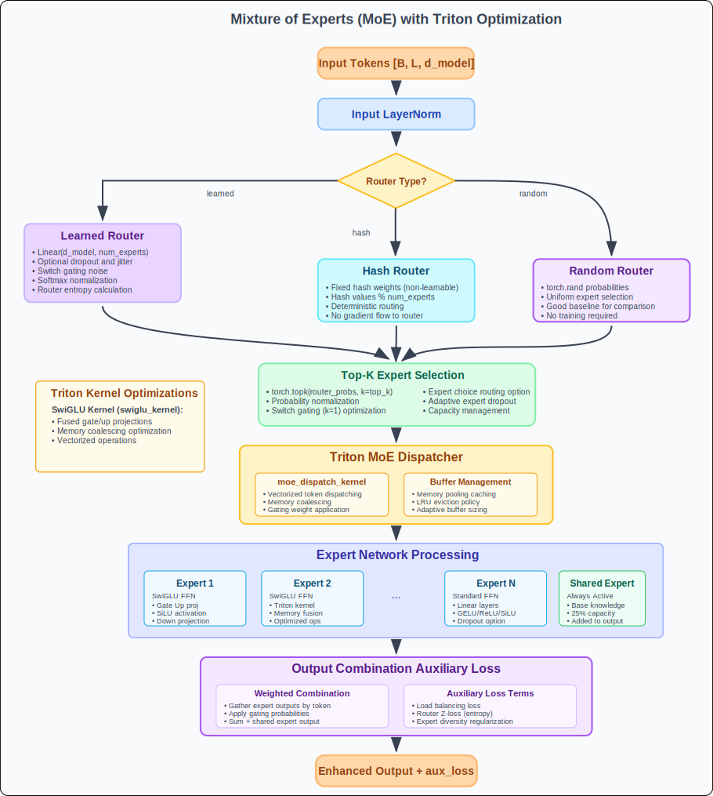

# MoE Guide

ForeBlocks integrates Mixture-of-Experts into the transformer feedforward path through `MoEFeedForwardDMoE`.

You typically do not instantiate this block directly. Instead, you enable MoE through transformer constructor arguments.

Related docs:

- [Documentation Overview](overview.md)
- [Getting Started](getting-started.md)
- [Transformer](transformer.md)
- [Custom Blocks](custom_blocks.md)



## How MoE is enabled

```python
from foreblocks import TransformerEncoder, TransformerDecoder

encoder = TransformerEncoder(
    input_size=8,
    d_model=256,
    nhead=8,
    num_layers=4,
    use_moe=True,
    num_experts=8,
    top_k=2,
)

decoder = TransformerDecoder(
    input_size=1,
    output_size=1,
    d_model=256,
    nhead=8,
    num_layers=4,
    use_moe=True,
    num_experts=8,
    top_k=2,
)
```

At the transformer layer level, the FFN block switches from dense feedforward to the dMoE-style routed block.

## Mental model

The current implementation splits experts into two groups:

- routed experts
- optional shared experts

The router assigns tokens to routed experts, while shared experts can provide a dense path that is combined with the routed result.

## Core MoE controls

### Routing capacity

- `use_moe`
- `num_experts`
- `num_shared`
- `top_k`
- `moe_capacity_factor`
- `routing_mode`: `token_choice` or `expert_choice`

### Router type

Supported router families in the implementation include:

- `noisy_topk`
- `adaptive_noisy_topk`
- `linear`
- `st_topk`
- `continuous_topk`
- `relaxed_sort_topk`
- `perturb_and_pick_topk`
- `hash_topk`
- `multi_hash_topk`

### Router behavior

- `router_temperature`
- `router_perturb_noise`
- `router_hash_num_hashes`
- `router_hash_num_buckets`
- `router_hash_bucket_size`
- `expert_choice_tokens_per_expert`

### Expert structure

- `use_swiglu`
- `dropout`
- `expert_dropout`
- `d_ff_shared`
- `shared_combine`: `add` or `concat`

### Training and scaling

- `use_gradient_checkpointing`
- `moe_aux_lambda`
- `z_loss_weight`

## Important implementation note about balancing

The current code still exposes `load_balance_weight`, but the classic dense load-balancing auxiliary loss is intentionally removed in the implementation. Expert utilization is handled primarily through router expert-bias adaptation.

So in practice:

- `z_loss_weight` is still meaningful
- `moe_aux_lambda` still scales the transformer-level accumulated auxiliary loss
- `load_balance_weight` is not the main balancing mechanism in the current implementation

That means the first tuning knobs should be:

- router type
- `top_k`
- `routing_mode`
- `z_loss_weight`
- capacity

not load-balance loss weight

## Routing modes

### `token_choice`

This is the default path.

- each token chooses its top experts
- dispatch capacity pruning is applied afterwards
- usually the best place to start

### `expert_choice`

In this mode experts choose tokens instead of tokens choosing experts.

Use it when:

- you want more explicit expert-side control over token allocation
- token-choice routing collapses into a small subset of experts

Current caveat:

- `routing_mode="expert_choice"` does not support `router_type="adaptive_noisy_topk"`

## Shared experts

The block supports optional shared experts through:

- `num_shared`
- `d_ff_shared`
- `shared_combine`

This is useful when you want:

- a stable dense pathway in addition to sparse routing
- less aggressive specialization
- a fallback shared representation

`shared_combine="add"` is simpler and cheaper. `shared_combine="concat"` is more expressive but increases projection cost.

## Recommended presets

### Stable baseline

```python
encoder = TransformerEncoder(
    input_size=8,
    d_model=256,
    nhead=8,
    num_layers=4,
    use_moe=True,
    num_experts=8,
    num_shared=1,
    top_k=2,
    router_type="noisy_topk",
    routing_mode="token_choice",
    z_loss_weight=1e-3,
    moe_aux_lambda=1.0,
)
```

### Efficiency-oriented

```python
encoder = TransformerEncoder(
    input_size=8,
    d_model=192,
    nhead=6,
    num_layers=3,
    use_moe=True,
    num_experts=6,
    num_shared=1,
    top_k=1,
    router_type="linear",
    routing_mode="token_choice",
)
```

### Higher-capacity experimental setup

```python
encoder = TransformerEncoder(
    input_size=8,
    d_model=384,
    nhead=8,
    num_layers=6,
    use_moe=True,
    num_experts=16,
    num_shared=2,
    top_k=2,
    routing_mode="expert_choice",
    moe_capacity_factor=1.5,
    z_loss_weight=1e-3,
    use_gradient_checkpointing=True,
)
```

## Advanced features in the current implementation

### Adaptive top-k

`adaptive_noisy_topk` can vary the effective number of experts selected per token.

This path also tracks per-token `k` statistics and supports a REINFORCE-style adaptive-k loss internally.

### Hash routers

`hash_topk` and `multi_hash_topk` are available when you want routing diversity without a standard learned dense router over all experts.

### Grouped expert kernel path

The implementation can use grouped expert kernels and fused top-k routing in favorable runtime conditions.

You usually do not need to tune these first. They are lower-level performance details rather than primary modeling controls.

### MTP heads inside MoE

The MoE block supports optional multi-token-prediction heads:

- `mtp_num_heads`
- `mtp_loss_weight`

This is an advanced decoder-side path and should be treated as research functionality, not a default production setting.

## Integration with `ForecastingModel`

```python
from foreblocks import ForecastingModel

model = ForecastingModel(
    encoder=encoder,
    decoder=decoder,
    forecasting_strategy="transformer_seq2seq",
    model_type="transformer",
    target_len=24,
    output_size=1,
)
```

## Recommended tuning order

1. Start with `num_experts=8`, `num_shared=1`, `top_k=2`, `router_type="noisy_topk"`.
2. Decide whether `token_choice` is sufficient before trying `expert_choice`.
3. Tune `z_loss_weight` if router logits become unstable.
4. Adjust `moe_capacity_factor` if too many tokens are dropped by capacity pruning.
5. Scale expert count only after the routing pattern is healthy.

## Troubleshooting

- Few experts appear active: first try a different router or routing mode; do not assume `load_balance_weight` will fix it in the current implementation.
- Training is unstable: reduce `top_k`, lower router noise, and keep `z_loss_weight` nonzero.
- High memory usage: reduce `num_experts`, `d_model`, or enable gradient checkpointing.
- Slow inference: prefer fewer experts, smaller `top_k`, and simpler routers while benchmarking.
- `adaptive_noisy_topk` with expert choice errors: that combination is intentionally unsupported.
